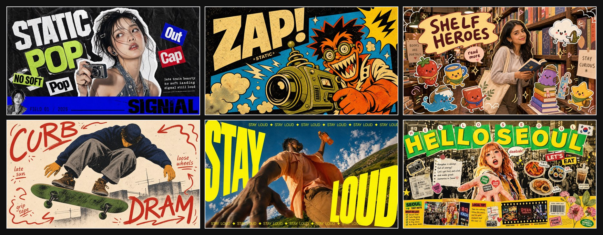
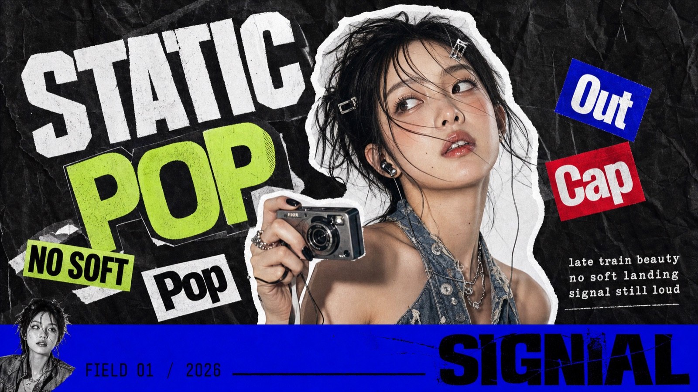
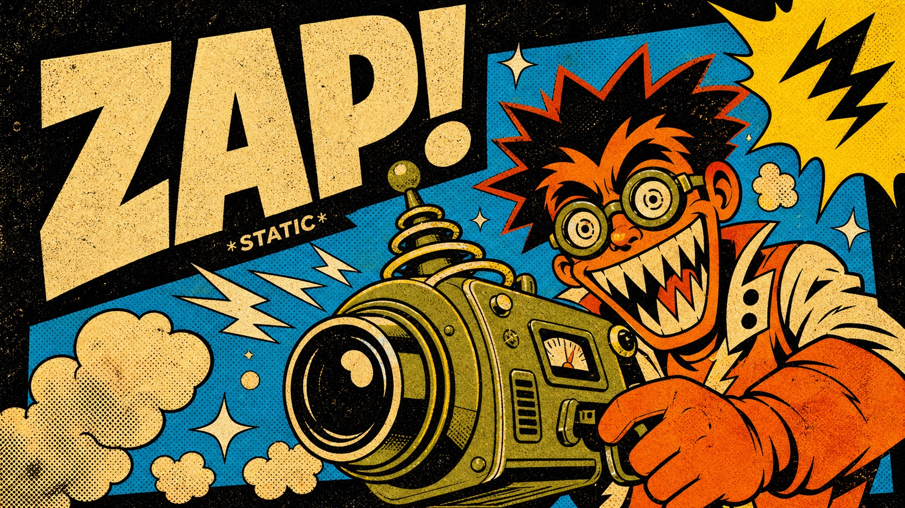
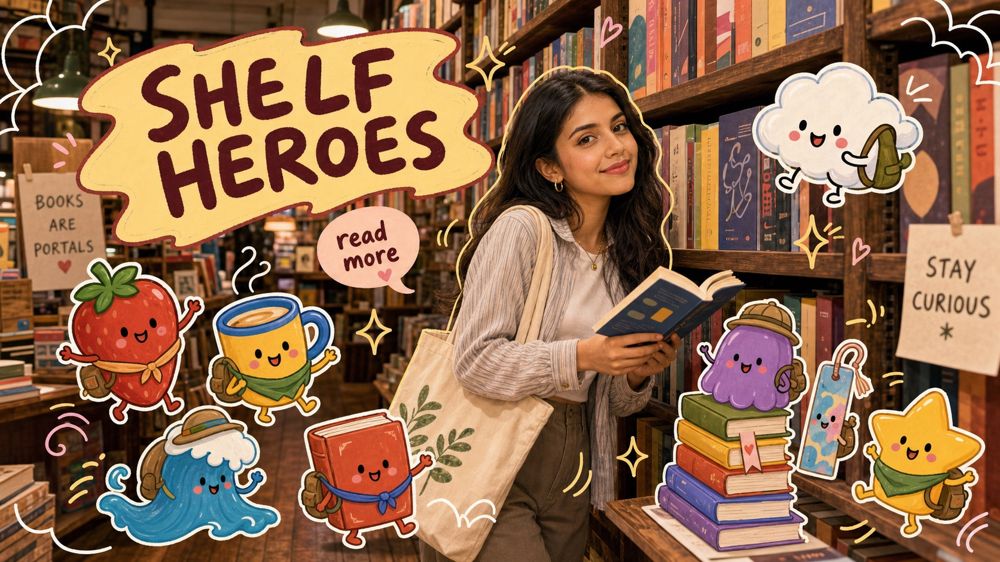
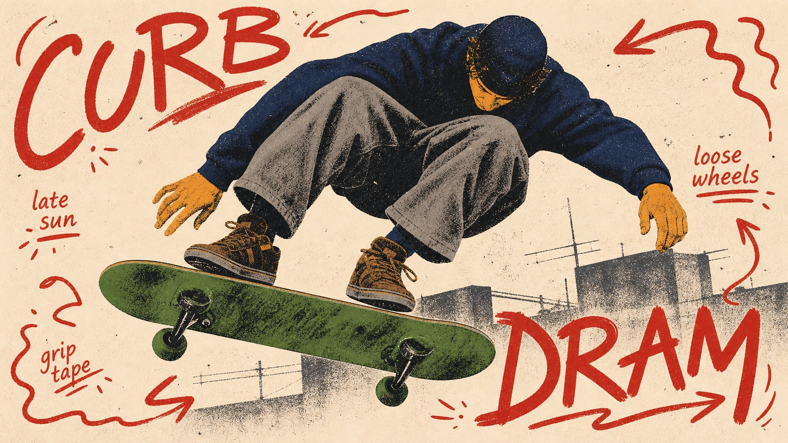
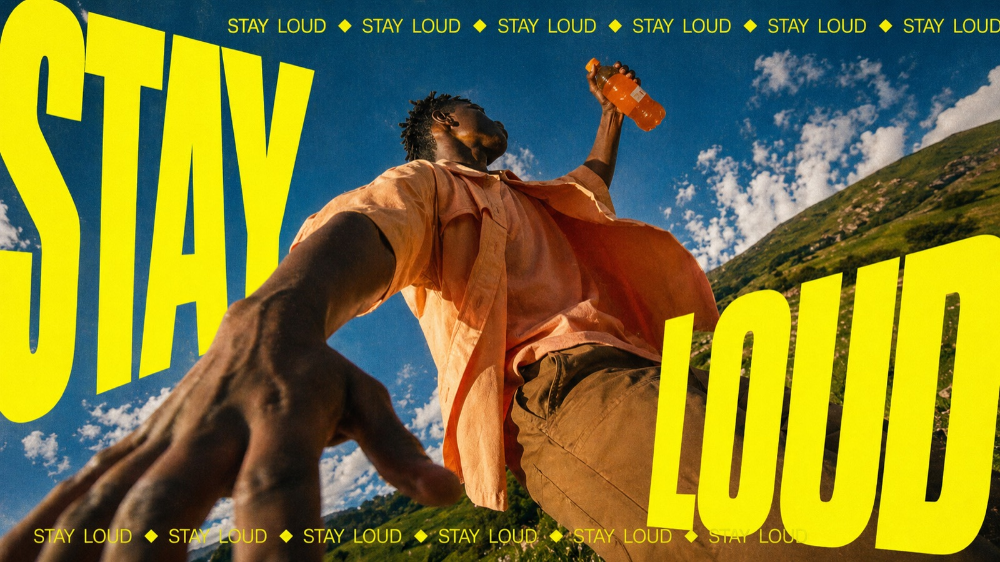
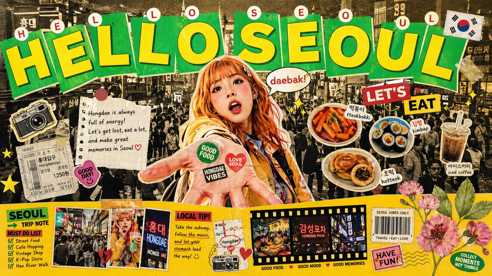

<h1 align="center">AI Visual Prompt Cookbook</h1>

<p align="center">
  
</p>

<p align="center">
  <a href="README.md">English</a> |
  <a href="README.zh-CN.md">简体中文</a> |
  <a href="README.zh-TW.md">繁體中文</a> |
  日本語 |
  <a href="README.ko.md">한국어</a> |
  <a href="README.id.md">Bahasa Indonesia</a>
</p>

<p align="center">
  
  
  
  
</p>

<p align="center">
  <strong>JSON をコピーすれば、ひとつのスタイルが手に入ります。</strong> <code>style.json</code> を ChatGPT、Claude、Nano Banana Pro、または任意の LLM 画像生成ワークフローに入れ、変数だけを差し替えれば、視覚システムを保ったまま使えます。
</p>

<p align="center">
  AI 画像生成向けの、すぐ使えるビジュアルプロンプトスタイル集です。各スタイルは再利用しやすい <code>style.json</code> と、横長・縦長のプレビュー画像で整理されています。
</p>

<p align="center">
  Curated by <a href="https://x.com/VigoCreativeAI">@VigoCreativeAI</a>, structured with assistance from OpenAI Codex. 新しいスタイルを追うには、このリポジトリを Star してください。
</p>

## クイックリンク

| カテゴリ | 向いている用途 | まず見るスタイル |
| --- | --- | --- |
| 写真 + ドゥードル | SNS風スナップ、ライフスタイル写真、遊びのあるステッカー表現 | [Playful Mascot Doodle Snapshot](styles/playful-mascot-doodle-snapshot-style), [Subway Doodle Photo Hybrid](styles/subway-doodle-photo-hybrid-style) |
| Zine + コラージュ | ファッションポスター、音楽ビジュアル、情報量の多いエディトリアル | [K-pop Apocalypse Ransom Zine](styles/k-pop-apocalypse-ransom-zine-style), [Y2K Grunge Hip-hop Cutout Poster](styles/y2k-grunge-hiphop-cutout-poster-style) |
| タイポグラフィポスター | 大きな見出し、強いキャンペーングラフィック、視覚インパクト | [Impact Burst Halftone Comic Poster](styles/impact-burst-halftone-comic-poster-style), [Neon Kinetic Typographic Poster](styles/neon-kinetic-typographic-poster-style) |
| 旅 + 都市 | 目的地ポスター、ストリートシーン、都市のビジュアル日記 | [Tokyo Kawaii Travel Collage Poster](styles/tokyo-kawaii-travel-collage-poster-style), [Urban Transit Doodle Diary](styles/urban-transit-doodle-diary-style) |
| エディトリアル + ミニマル | すっきりした構図、構造的なレイアウト、落ち着いたアートディレクション | [Soft Analog Future Editorial Poster](styles/soft-analog-future-editorial-poster-style), [Folded Diamond Perspective Type Poster](styles/folded-diamond-perspective-type-poster-style) |

## このプロジェクトについて

多くの AI 画像プロンプトは一回限りの文章になりがちで、再利用や比較、安定した改善が難しいものです。このリポジトリでは、各ビジュアルスタイルを構造化された `style.json` に分解しています。テーマを変えても、同じスタイル構造を保ったまま生成を続けられます。

## 使い方

1. [注目スタイル](#注目スタイル)、[クイックリンク](#クイックリンク)、または [スタイル索引](#スタイル索引) を見る。
2. 気になるスタイルのフォルダを開き、`style.json` をコピーする。
3. ChatGPT、Claude、Nano Banana Pro、または任意の LLM 画像生成ワークフローに JSON 全体を貼り付ける。
4. `variables` の主体、場所、文字、アスペクト比だけを変更する。
5. 最終プロンプトを生成し、画像モデルに送る。

入力例：

```text
この style.json を固定されたビジュアルスタイルとして使ってください。
variables だけを差し替えてください：
SUBJECT = ストリートウェアのプロダクトフォトグラファー
LOCATION = 雨のネオン路地
MAIN_TEXT = NIGHT DROP
ASPECT_RATIO = 16:9
```

## 注目スタイル

この 6 つを見ると、ライブラリ全体の幅がすぐにわかります。すべてのスタイルは、1 つの JSON と 2 枚のプレビュー画像で構成されています。

<table>
<tr>
<td width="33%" valign="top">
<a href="styles/k-pop-apocalypse-ransom-zine-style"></a>
<h3>K-pop Apocalypse Ransom Zine</h3>
<p>切り抜きポートレート、ランサムノート風タイポグラフィ、しわ紙、ステッカーブロック、鮮やかな差し色で構成されたマキシマルなファッション zine コラージュ。</p>
<p><a href="styles/k-pop-apocalypse-ransom-zine-style/style.json"><strong>style.json を開く</strong></a> · <a href="styles/k-pop-apocalypse-ransom-zine-style">フォルダ</a></p>
</td>
<td width="33%" valign="top">
<a href="styles/impact-burst-halftone-comic-poster-style"></a>
<h3>Impact Burst Halftone Comic Poster</h3>
<p>太いインク線、高彩度カラー、大きなインパクト文字、吹き出し、スクリーンプリント粒子を使ったレトロコミック風ポスター。</p>
<p><a href="styles/impact-burst-halftone-comic-poster-style/style.json"><strong>style.json を開く</strong></a> · <a href="styles/impact-burst-halftone-comic-poster-style">フォルダ</a></p>
</td>
<td width="33%" valign="top">
<a href="styles/playful-mascot-doodle-snapshot-style"></a>
<h3>Playful Mascot Doodle Snapshot</h3>
<p>リアルな日常写真に、オリジナルのマスコットステッカー、手描きアウトライン、リボン見出し、スケッチ風装飾を重ねる楽しいポスター表現。</p>
<p><a href="styles/playful-mascot-doodle-snapshot-style/style.json"><strong>style.json を開く</strong></a> · <a href="styles/playful-mascot-doodle-snapshot-style">フォルダ</a></p>
</td>
</tr>
<tr>
<td width="33%" valign="top">
<a href="styles/teenage-skate-scribble-screenprint-poster-style"></a>
<h3>Teenage Skate Scribble Screenprint Poster</h3>
<p>スケート zine 風のポスター。歪んだスケーターの切り抜き、クリーム色の紙面、赤い手書き文字、粗い二色スクリーンプリント感が特徴。</p>
<p><a href="styles/teenage-skate-scribble-screenprint-poster-style/style.json"><strong>style.json を開く</strong></a> · <a href="styles/teenage-skate-scribble-screenprint-poster-style">フォルダ</a></p>
</td>
<td width="33%" valign="top">
<a href="styles/neon-kinetic-typographic-poster-style"></a>
<h3>Neon Kinetic Typographic Poster</h3>
<p>ローアングル写真、歪んだネオン文字、フィルムグレイン、ユースカルチャー的なキャンペーン感を組み合わせたエディトリアルポスター。</p>
<p><a href="styles/neon-kinetic-typographic-poster-style/style.json"><strong>style.json を開く</strong></a> · <a href="styles/neon-kinetic-typographic-poster-style">フォルダ</a></p>
</td>
<td width="33%" valign="top">
<a href="styles/tokyo-kawaii-travel-collage-poster-style"></a>
<h3>Tokyo Kawaii Travel Collage Poster</h3>
<p>目的地タイポグラフィ、かわいいステッカー、漫画吹き出し、切り抜き写真、スクラップブック風レイアウトを使った都市旅行コラージュ。</p>
<p><a href="styles/tokyo-kawaii-travel-collage-poster-style/style.json"><strong>style.json を開く</strong></a> · <a href="styles/tokyo-kawaii-travel-collage-poster-style">フォルダ</a></p>
</td>
</tr>
</table>

## パッケージ構成

```text
styles/<style-slug>/
  style.json          # 機械可読のプロンプトスタイルテンプレート
  preview-16x9.jpg    # 横長プレビュー
  preview-9x16.jpg    # 縦長プレビュー
```

## スタイル索引

| # | スタイル | ファイル |
| --- | --- | --- |
| 1 | [Plush Comic Toy Product Poster](styles/plush-comic-toy-product-poster-style) | [style.json](styles/plush-comic-toy-product-poster-style/style.json) |
| 2 | [Rough Animation Pet Sketch Storyboard](styles/rough-animation-pet-sketch-storyboard-style) | [style.json](styles/rough-animation-pet-sketch-storyboard-style/style.json) |
| 3 | [Tri Color Hardcut Portrait Poster](styles/tri-color-hardcut-portrait-poster-style) | [style.json](styles/tri-color-hardcut-portrait-poster-style/style.json) |
| 4 | [Clean Triptych Travel Vlog Thumbnail](styles/clean-triptych-travel-vlog-thumbnail-style) | [style.json](styles/clean-triptych-travel-vlog-thumbnail-style/style.json) |
| 5 | [Playful Mascot Doodle Snapshot](styles/playful-mascot-doodle-snapshot-style) | [style.json](styles/playful-mascot-doodle-snapshot-style/style.json) |
| 6 | [Teenage Skate Scribble Screenprint Poster](styles/teenage-skate-scribble-screenprint-poster-style) | [style.json](styles/teenage-skate-scribble-screenprint-poster-style/style.json) |
| 7 | [Impact Burst Halftone Comic Poster](styles/impact-burst-halftone-comic-poster-style) | [style.json](styles/impact-burst-halftone-comic-poster-style/style.json) |
| 8 | [Sunburst Fisheye Bubble Type Poster](styles/sunburst-fisheye-bubble-type-poster-style) | [style.json](styles/sunburst-fisheye-bubble-type-poster-style/style.json) |
| 9 | [Backseat Transit Doodle Letter Poster](styles/backseat-transit-doodle-letter-poster-style) | [style.json](styles/backseat-transit-doodle-letter-poster-style/style.json) |
| 10 | [Analog Sticker Diary Portrait Poster](styles/analog-sticker-diary-portrait-poster-style) | [style.json](styles/analog-sticker-diary-portrait-poster-style/style.json) |
| 11 | [Folded Diamond Perspective Type Poster](styles/folded-diamond-perspective-type-poster-style) | [style.json](styles/folded-diamond-perspective-type-poster-style/style.json) |
| 12 | [Gothic Cat Doodle Photo Collage](styles/gothic-cat-doodle-photo-collage-style) | [style.json](styles/gothic-cat-doodle-photo-collage-style/style.json) |
| 13 | [K-pop Apocalypse Ransom Zine](styles/k-pop-apocalypse-ransom-zine-style) | [style.json](styles/k-pop-apocalypse-ransom-zine-style/style.json) |
| 14 | [Metro Doodle Snapshot Diary](styles/metro-doodle-snapshot-diary-style) | [style.json](styles/metro-doodle-snapshot-diary-style/style.json) |
| 15 | [Mountain Trail Monster Doodle Poster](styles/mountain-trail-monster-doodle-poster-style) | [style.json](styles/mountain-trail-monster-doodle-poster-style/style.json) |
| 16 | [Neon Doodle Gallery Snapshot](styles/neon-doodle-gallery-snapshot-style) | [style.json](styles/neon-doodle-gallery-snapshot-style/style.json) |
| 17 | [Neon Kinetic Typographic Poster](styles/neon-kinetic-typographic-poster-style) | [style.json](styles/neon-kinetic-typographic-poster-style/style.json) |
| 18 | [Orange Brush Mascot Action Poster](styles/orange-brush-mascot-action-poster-style) | [style.json](styles/orange-brush-mascot-action-poster-style/style.json) |
| 19 | [Photo Illustration Overlay Poster](styles/photo-illustration-overlay-poster-style) | [style.json](styles/photo-illustration-overlay-poster-style/style.json) |
| 20 | [Plush City Festival Mobile Poster](styles/plush-city-festival-mobile-poster-style) | [style.json](styles/plush-city-festival-mobile-poster-style/style.json) |
| 21 | [Pop Bubble Letter Photo Poster](styles/pop-bubble-letter-photo-poster-style) | [style.json](styles/pop-bubble-letter-photo-poster-style/style.json) |
| 22 | [Soft Analog Future Editorial Poster](styles/soft-analog-future-editorial-poster-style) | [style.json](styles/soft-analog-future-editorial-poster-style/style.json) |
| 23 | [Subway Doodle Photo Hybrid](styles/subway-doodle-photo-hybrid-style) | [style.json](styles/subway-doodle-photo-hybrid-style/style.json) |
| 24 | [Tokyo Kawaii Travel Collage Poster](styles/tokyo-kawaii-travel-collage-poster-style) | [style.json](styles/tokyo-kawaii-travel-collage-poster-style/style.json) |
| 25 | [Urban Transit Doodle Diary](styles/urban-transit-doodle-diary-style) | [style.json](styles/urban-transit-doodle-diary-style/style.json) |
| 26 | [Y2K Grunge Hip-hop Cutout Poster](styles/y2k-grunge-hiphop-cutout-poster-style) | [style.json](styles/y2k-grunge-hiphop-cutout-poster-style/style.json) |

## 公開方針

- 1 つのディレクトリ = 1 つのスタイル
- 新しいスタイルは注目スタイルとスタイル索引の上部に追加
- main ブランチには `style.json` と 2 枚のプレビュー JPG のみを配置
- 完全なギャラリーはこのリポジトリには含めません
- 元の参考画像、透かし、プラットフォームロゴ、QR コード、アカウント情報、非公開プロンプト、未許可のブランド素材は公開しません

## ライセンス

リポジトリ構造とドキュメントは MIT ライセンスです。各 `style.json` には個別のライセンス表記があります。プレビュー画像は視覚参照として含まれています。
