# Vigo_Image_style_prompt

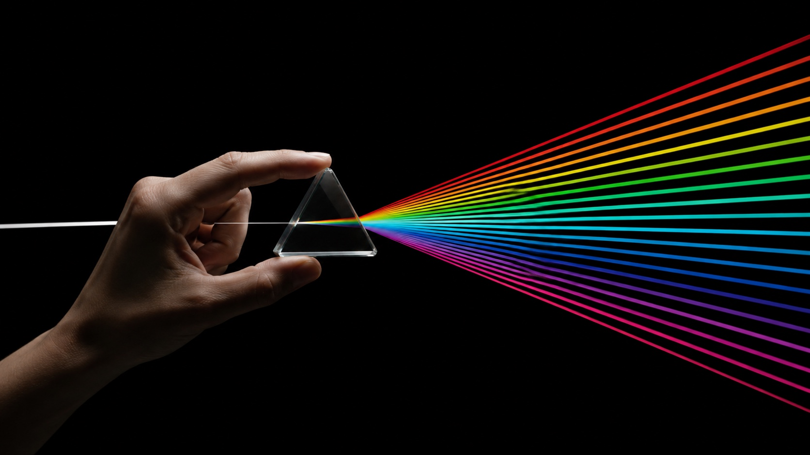

[English](README.md) | 中文

**复制一个 JSON，得到一种风格。** 把一个 `style.json` 放进 ChatGPT、Claude、Nano Banana Pro、即梦或其他 LLM 图像工作流，替换变量，保留完整视觉系统。

这是一个面向 AI 图像生成的可复用视觉提示词风格库：每个风格都被整理成可直接使用的 `style.json`，并配套横竖两张预览图，方便浏览、复制和二次生成。

由 [@VigoCreativeAI](https://x.com/VigoCreativeAI) 策划整理，并在 OpenAI Codex 的协助下结构化。Star 这个仓库可以持续关注新的风格更新。

## 为什么做这个项目

大多数 AI 图像提示词都是一次性的文本块：难复用、难比较，也难稳定迭代。这个项目采用另一种方式：把每一种视觉风格拆解成结构化的 `style.json`，你可以把它放进 ChatGPT、Claude 或其他 LLM 图像生成流程里。换主题时，风格结构仍然保持稳定。

## 快速开始

1. 浏览下面的 [最新风格](#最新风格) 或 [风格索引](#风格索引)。
2. 打开某个风格目录，复制里面的 `style.json`。
3. 把完整 JSON 放进 ChatGPT、Claude、Nano Banana Pro、即梦或其他 LLM 图像工作流。
4. 只修改 `variables` 里的主体、场景、文字和比例。
5. 生成最终图像提示词，再发送给你的图像模型。

示例指令：

```text
把这个 style.json 当作锁定的视觉风格。
只替换 variables：
SUBJECT = 一位街头服装产品摄影师
LOCATION = 雨夜霓虹小巷
MAIN_TEXT = NIGHT DROP
ASPECT_RATIO = 16:9
```

## 文件结构

```text
styles/<style-slug>/
  style.json          # 机器可读的提示词风格模板
  preview-16x9.jpg    # 横屏预览图
  preview-9x16.jpg    # 竖屏预览图
```

## 最新风格

最新上传的风格会排在最前面。每个风格保持轻量：一个 JSON 加两张预览图。

<table>
<tr>
<td width="50%" valign="top">
<a href="styles/playful-mascot-doodle-snapshot-style"></a>
<h3>Playful Mascot Doodle Snapshot</h3>
<p>一种把真实生活社交照片转成轻快贴纸拼贴海报的风格：在摄影场景上叠加原创卡通吉祥物贴纸、手绘描边、丝带标题牌、闪光、螺旋和草稿感装饰符号。</p>
<p><a href="styles/playful-mascot-doodle-snapshot-style/style.json"><strong>打开 style.json</strong></a> · <a href="styles/playful-mascot-doodle-snapshot-style">目录</a> · <a href="styles/playful-mascot-doodle-snapshot-style/preview-9x16.jpg">9:16 预览</a></p>
</td>
<td width="50%" valign="top">
<a href="styles/teenage-skate-scribble-screenprint-poster-style"></a>
<h3>Teenage Skate Scribble Screenprint Poster</h3>
<p>一种复古滑板 zine 海报风格：扭曲的中央滑板人物剪贴、奶油纸张底、松散红色手写边框字、粗粝双色丝网印刷质感，以及海军蓝、灰、绿、赭色的有限街头配色。</p>
<p><a href="styles/teenage-skate-scribble-screenprint-poster-style/style.json"><strong>打开 style.json</strong></a> · <a href="styles/teenage-skate-scribble-screenprint-poster-style">目录</a> · <a href="styles/teenage-skate-scribble-screenprint-poster-style/preview-9x16.jpg">9:16 预览</a></p>
</td>
</tr>
</table>

## 风格索引

1. [Playful Mascot Doodle Snapshot](#playful-mascot-doodle-snapshot)
2. [Teenage Skate Scribble Screenprint Poster](#teenage-skate-scribble-screenprint-poster)
3. [Impact Burst Halftone Comic Poster](#impact-burst-halftone-comic-poster)
4. [Sunburst Fisheye Bubble Type Poster](#sunburst-fisheye-bubble-type-poster)
5. [Backseat Transit Doodle Letter Poster](#backseat-transit-doodle-letter-poster)
6. [Analog Sticker Diary Portrait Poster](#analog-sticker-diary-portrait-poster)
7. [Folded Diamond Perspective Type Poster](#folded-diamond-perspective-type-poster)
8. [Gothic Cat Doodle Photo Collage](#gothic-cat-doodle-photo-collage)
9. [K-pop Apocalypse Ransom Zine](#k-pop-apocalypse-ransom-zine)
10. [Metro Doodle Snapshot Diary](#metro-doodle-snapshot-diary)
11. [Mountain Trail Monster Doodle Poster](#mountain-trail-monster-doodle-poster)
12. [Neon Doodle Gallery Snapshot](#neon-doodle-gallery-snapshot)
13. [Neon Kinetic Typographic Poster](#neon-kinetic-typographic-poster)
14. [Orange Brush Mascot Action Poster](#orange-brush-mascot-action-poster)
15. [Photo Illustration Overlay Poster](#photo-illustration-overlay-poster)
16. [Plush City Festival Mobile Poster](#plush-city-festival-mobile-poster)
17. [Pop Bubble Letter Photo Poster](#pop-bubble-letter-photo-poster)
18. [Soft Analog Future Editorial Poster](#soft-analog-future-editorial-poster)
19. [Subway Doodle Photo Hybrid](#subway-doodle-photo-hybrid)
20. [Tokyo Kawaii Travel Collage Poster](#tokyo-kawaii-travel-collage-poster)
21. [Urban Transit Doodle Diary](#urban-transit-doodle-diary)
22. [Y2K Grunge Hip-hop Cutout Poster](#y2k-grunge-hiphop-cutout-poster)

## 风格目录

### Playful Mascot Doodle Snapshot

<a href="styles/playful-mascot-doodle-snapshot-style"></a>

一种把真实生活社交照片转成轻快贴纸拼贴海报的风格：在摄影场景上叠加原创卡通吉祥物贴纸、手绘描边、丝带标题牌、闪光、螺旋和草稿感装饰符号。

文件：[style.json](styles/playful-mascot-doodle-snapshot-style/style.json) · [16:9 预览](styles/playful-mascot-doodle-snapshot-style/preview-16x9.jpg) · [9:16 预览](styles/playful-mascot-doodle-snapshot-style/preview-9x16.jpg) · [目录](styles/playful-mascot-doodle-snapshot-style)

---

### Teenage Skate Scribble Screenprint Poster

<a href="styles/teenage-skate-scribble-screenprint-poster-style"></a>

一种复古滑板 zine 海报风格：扭曲的中央滑板人物剪贴、奶油纸张底、松散红色手写边框字、粗粝双色丝网印刷质感，以及海军蓝、灰、绿、赭色的有限街头配色。

文件：[style.json](styles/teenage-skate-scribble-screenprint-poster-style/style.json) · [16:9 预览](styles/teenage-skate-scribble-screenprint-poster-style/preview-16x9.jpg) · [9:16 预览](styles/teenage-skate-scribble-screenprint-poster-style/preview-9x16.jpg) · [目录](styles/teenage-skate-scribble-screenprint-poster-style)

---

### Impact Burst Halftone Comic Poster

<a href="styles/impact-burst-halftone-comic-poster-style"></a>

一种响亮的复古漫画海报系统：厚重黑色墨线、扁平高饱和色块、超大冲击字体、夸张插画主体、对角道具、对话爆裂形、烟雾团、半色调网点和做旧丝网印刷颗粒。

文件：[style.json](styles/impact-burst-halftone-comic-poster-style/style.json) · [16:9 预览](styles/impact-burst-halftone-comic-poster-style/preview-16x9.jpg) · [9:16 预览](styles/impact-burst-halftone-comic-poster-style/preview-9x16.jpg) · [目录](styles/impact-burst-halftone-comic-poster-style)

---

### Sunburst Fisheye Bubble Type Poster

<a href="styles/sunburst-fisheye-bubble-type-poster-style">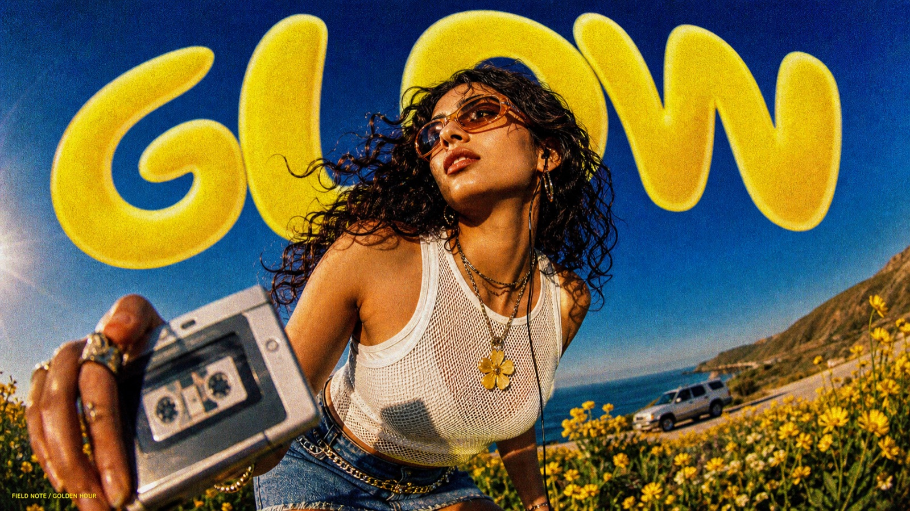</a>

一种超低机位鱼眼夏日生活方式海报风格：近距离摄影主体、饱和钴蓝天空、巨大的拱形柠檬黄色泡泡字体、暖橙色文字阴影、Y2K 配饰和明显的模拟胶片颗粒。

文件：[style.json](styles/sunburst-fisheye-bubble-type-poster-style/style.json) · [16:9 预览](styles/sunburst-fisheye-bubble-type-poster-style/preview-16x9.jpg) · [9:16 预览](styles/sunburst-fisheye-bubble-type-poster-style/preview-9x16.jpg) · [目录](styles/sunburst-fisheye-bubble-type-poster-style)

---

### Backseat Transit Doodle Letter Poster

<a href="styles/backseat-transit-doodle-letter-poster-style">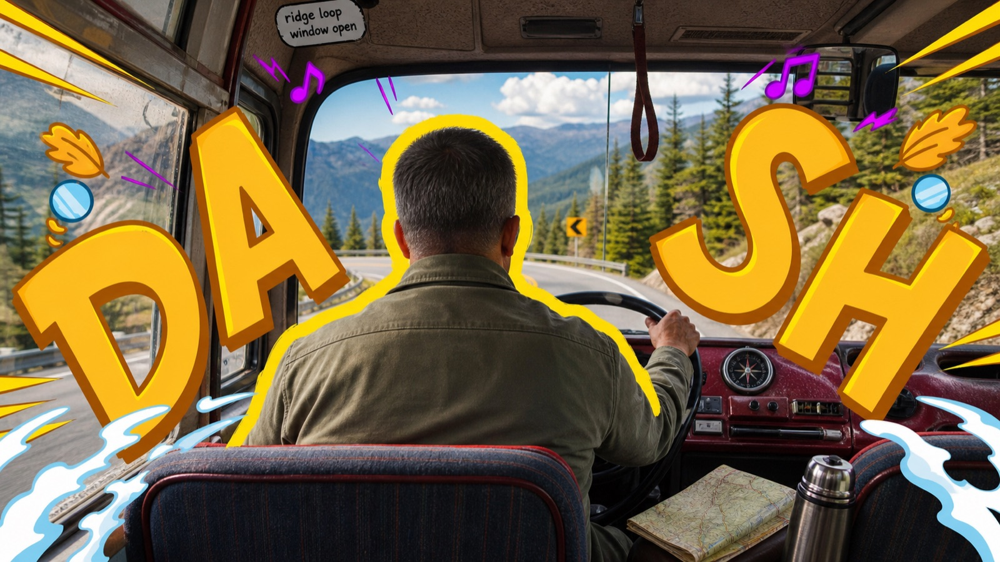</a>

一种把真实乘客视角交通照片转化为高能旅行海报的风格：后视中央人物、电光黄色剪影光晕、巨大的黄橙色手绘字母、漫画放射线、紫色音乐符号、贴纸图标和青白色云朵涂鸦。

文件：[style.json](styles/backseat-transit-doodle-letter-poster-style/style.json) · [16:9 预览](styles/backseat-transit-doodle-letter-poster-style/preview-16x9.jpg) · [9:16 预览](styles/backseat-transit-doodle-letter-poster-style/preview-9x16.jpg) · [目录](styles/backseat-transit-doodle-letter-poster-style)

---

### Analog Sticker Diary Portrait Poster

<a href="styles/analog-sticker-diary-portrait-poster-style">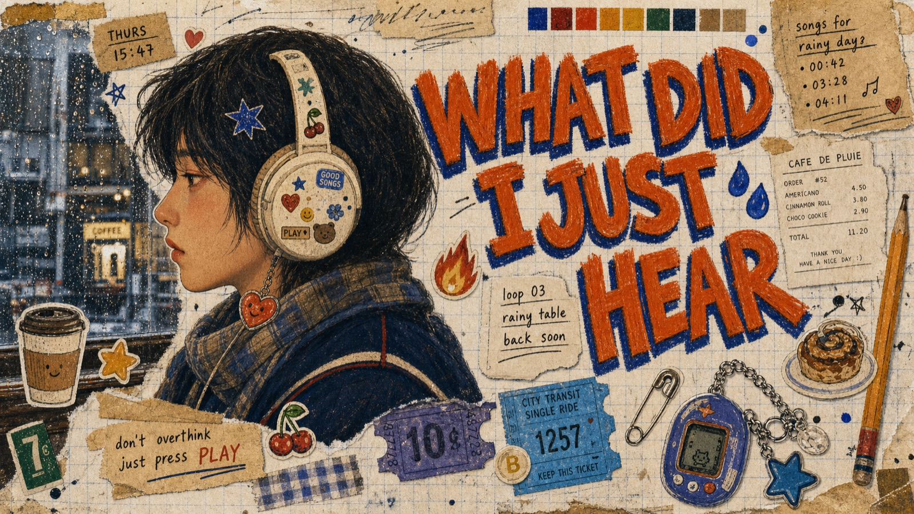</a>

一种怀旧模拟日记拼贴肖像系统：大型侧脸插画人物、奶油色方格纸背景、贴纸化的私人小物、磨损橙色手写字和厚重的扫描印刷质感。

文件：[style.json](styles/analog-sticker-diary-portrait-poster-style/style.json) · [16:9 预览](styles/analog-sticker-diary-portrait-poster-style/preview-16x9.jpg) · [9:16 预览](styles/analog-sticker-diary-portrait-poster-style/preview-9x16.jpg) · [目录](styles/analog-sticker-diary-portrait-poster-style)

---

### Folded Diamond Perspective Type Poster

<a href="styles/folded-diamond-perspective-type-poster-style">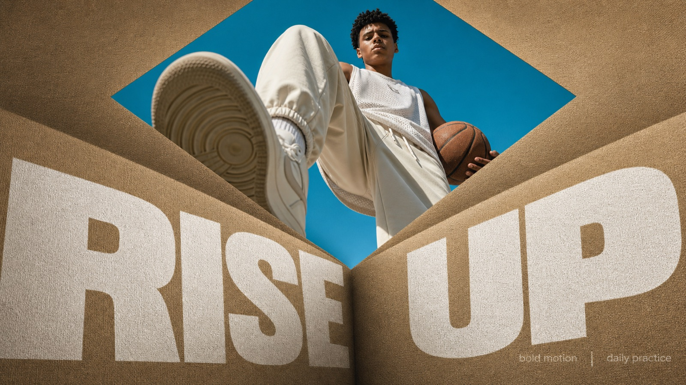</a>

一种大胆的极简编辑海报风格：低机位英雄摄影嵌入菱形开口，折叠的棕褐色纸张或帆布平面，以及印在下方平面上的巨大白色透视字体。

文件：[style.json](styles/folded-diamond-perspective-type-poster-style/style.json) · [16:9 预览](styles/folded-diamond-perspective-type-poster-style/preview-16x9.jpg) · [9:16 预览](styles/folded-diamond-perspective-type-poster-style/preview-9x16.jpg) · [目录](styles/folded-diamond-perspective-type-poster-style)

---

### Gothic Cat Doodle Photo Collage

<a href="styles/gothic-cat-doodle-photo-collage-style">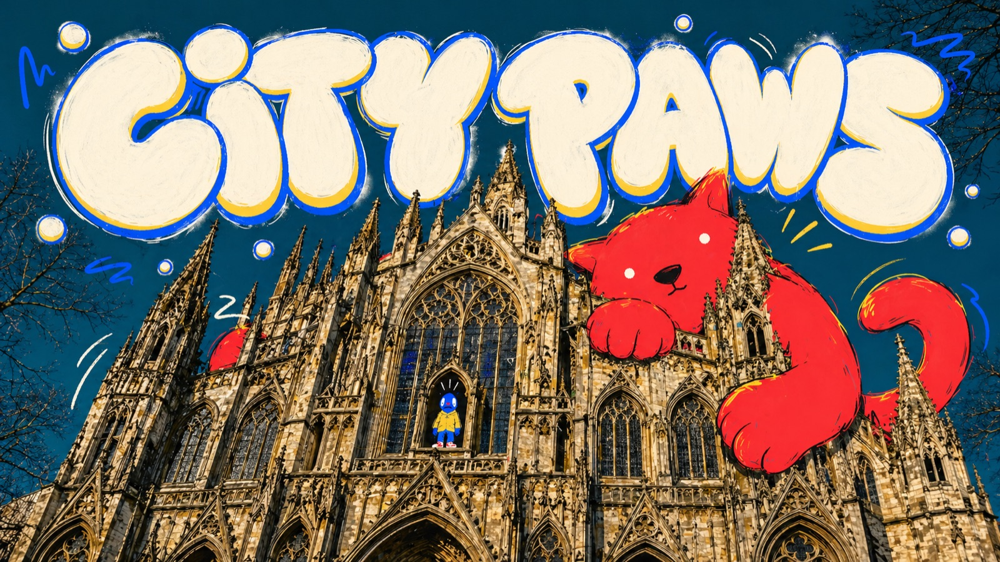</a>

一种玩趣的摄影插画拼贴风格：戏剧化真实建筑摄影、超大扁平卡通生物叠加、圆润手绘标题字和松散马克笔涂鸦。

文件：[style.json](styles/gothic-cat-doodle-photo-collage-style/style.json) · [16:9 预览](styles/gothic-cat-doodle-photo-collage-style/preview-16x9.jpg) · [9:16 预览](styles/gothic-cat-doodle-photo-collage-style/preview-9x16.jpg) · [目录](styles/gothic-cat-doodle-photo-collage-style)

---

### K-pop Apocalypse Ransom Zine

<a href="styles/k-pop-apocalypse-ransom-zine-style"></a>

一种极繁 K-pop 时尚 zine 拼贴风格：中央人物剪贴、揉皱黑白纸张质感、倾斜勒索信式排版、响亮贴纸块、饱和青柠/蓝/红点缀，以及醒目的底部刊头色带。

文件：[style.json](styles/k-pop-apocalypse-ransom-zine-style/style.json) · [16:9 预览](styles/k-pop-apocalypse-ransom-zine-style/preview-16x9.jpg) · [9:16 预览](styles/k-pop-apocalypse-ransom-zine-style/preview-9x16.jpg) · [目录](styles/k-pop-apocalypse-ransom-zine-style)

---

### Metro Doodle Snapshot Diary

<a href="styles/metro-doodle-snapshot-diary-style">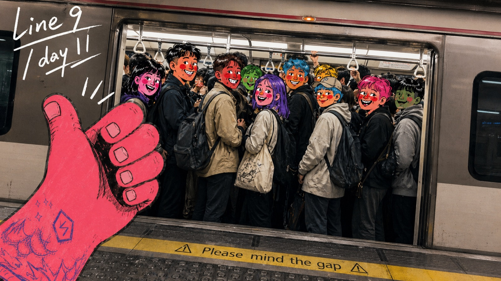</a>

一种手持城市交通照片拼贴风格：真实拥挤的地铁、公交、电车或车站快照，叠加马克笔感卡通涂鸦、超大前景手势、白色手写日记文字和高饱和漫画脸。

文件：[style.json](styles/metro-doodle-snapshot-diary-style/style.json) · [16:9 预览](styles/metro-doodle-snapshot-diary-style/preview-16x9.jpg) · [9:16 预览](styles/metro-doodle-snapshot-diary-style/preview-9x16.jpg) · [目录](styles/metro-doodle-snapshot-diary-style)

---

### Mountain Trail Monster Doodle Poster

<a href="styles/mountain-trail-monster-doodle-poster-style">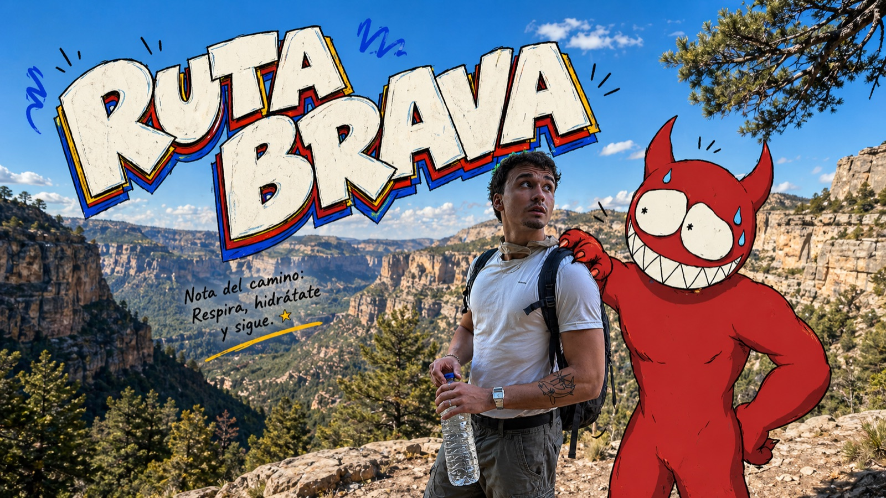</a>

一种把户外徒步随手拍改造成冒险海报的拼贴风格：真实山路照片、扁平手绘怪物伙伴、超大西班牙语漫画字和松散草图标注。

文件：[style.json](styles/mountain-trail-monster-doodle-poster-style/style.json) · [16:9 预览](styles/mountain-trail-monster-doodle-poster-style/preview-16x9.jpg) · [9:16 预览](styles/mountain-trail-monster-doodle-poster-style/preview-9x16.jpg) · [目录](styles/mountain-trail-monster-doodle-poster-style)

---

### Neon Doodle Gallery Snapshot

<a href="styles/neon-doodle-gallery-snapshot-style">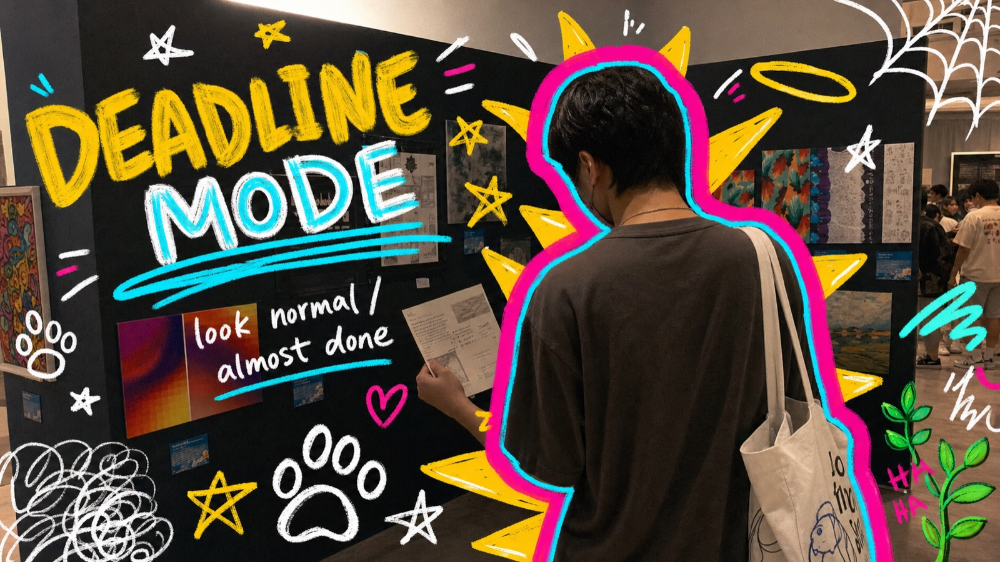</a>

一种手机随拍叠加霓虹数字马克笔涂鸦的风格：热粉和青色人物描边、黄色怪物尖刺、粗糙手写标题、星星、爪印、蛛网角标、涂抹条、光环、植物和学生日记感。

文件：[style.json](styles/neon-doodle-gallery-snapshot-style/style.json) · [16:9 预览](styles/neon-doodle-gallery-snapshot-style/preview-16x9.jpg) · [9:16 预览](styles/neon-doodle-gallery-snapshot-style/preview-9x16.jpg) · [目录](styles/neon-doodle-gallery-snapshot-style)

---

### Neon Kinetic Typographic Poster

<a href="styles/neon-kinetic-typographic-poster-style"></a>

一种戏剧化户外编辑海报风格：低机位生活方式摄影、巨大的变形霓虹字体、胶片颗粒，以及高能青年文化广告视觉。

文件：[style.json](styles/neon-kinetic-typographic-poster-style/style.json) · [16:9 预览](styles/neon-kinetic-typographic-poster-style/preview-16x9.jpg) · [9:16 预览](styles/neon-kinetic-typographic-poster-style/preview-9x16.jpg) · [目录](styles/neon-kinetic-typographic-poster-style)

---

### Orange Brush Mascot Action Poster

<a href="styles/orange-brush-mascot-action-poster-style">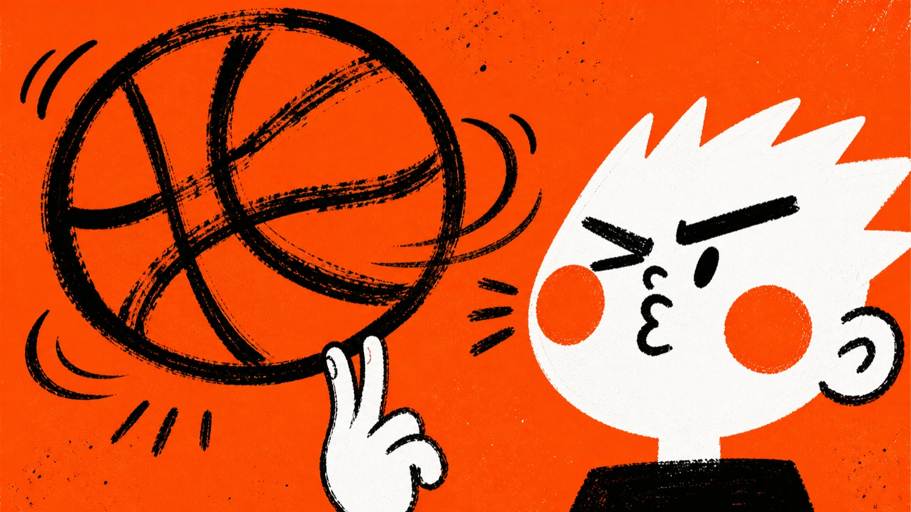</a>

一种稀疏的橙白黑扁平插画系统：白色吉祥物人物、超大道具、粗糙黑色干刷线条、橙色脸颊圆点和丝网印刷纸张颗粒。

文件：[style.json](styles/orange-brush-mascot-action-poster-style/style.json) · [16:9 预览](styles/orange-brush-mascot-action-poster-style/preview-16x9.jpg) · [9:16 预览](styles/orange-brush-mascot-action-poster-style/preview-9x16.jpg) · [目录](styles/orange-brush-mascot-action-poster-style)

---

### Photo Illustration Overlay Poster

<a href="styles/photo-illustration-overlay-poster-style">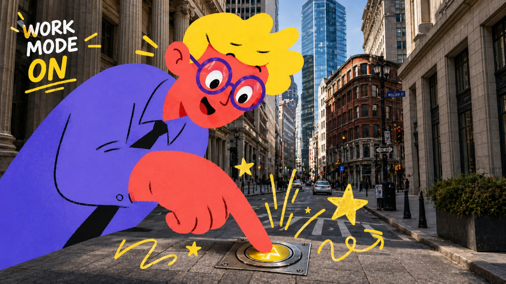</a>

一种真实城市照片叠加高饱和扁平 2D 卡通人物的海报风格，并加入手绘星星、火花、箭头和漫画符号。

文件：[style.json](styles/photo-illustration-overlay-poster-style/style.json) · [16:9 预览](styles/photo-illustration-overlay-poster-style/preview-16x9.jpg) · [9:16 预览](styles/photo-illustration-overlay-poster-style/preview-9x16.jpg) · [目录](styles/photo-illustration-overlay-poster-style)

---

### Plush City Festival Mobile Poster

<a href="styles/plush-city-festival-mobile-poster-style">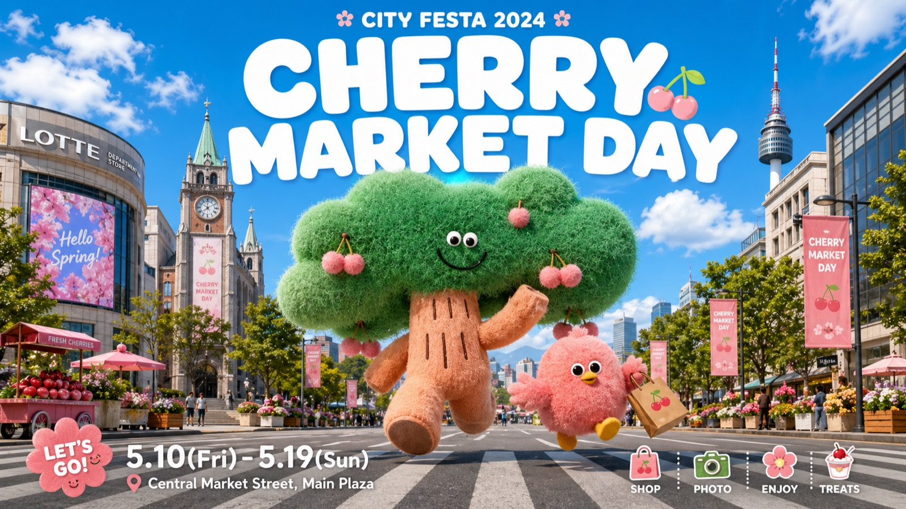</a>

一种明亮的移动端活动海报风格：真实城市地标、柔软毛绒吉祥物、圆角 App 卡片式框架、醒目的白色节日字体、日期地点信息和友好的旅游推广气质。

文件：[style.json](styles/plush-city-festival-mobile-poster-style/style.json) · [16:9 预览](styles/plush-city-festival-mobile-poster-style/preview-16x9.jpg) · [9:16 预览](styles/plush-city-festival-mobile-poster-style/preview-9x16.jpg) · [目录](styles/plush-city-festival-mobile-poster-style)

---

### Pop Bubble Letter Photo Poster

<a href="styles/pop-bubble-letter-photo-poster-style">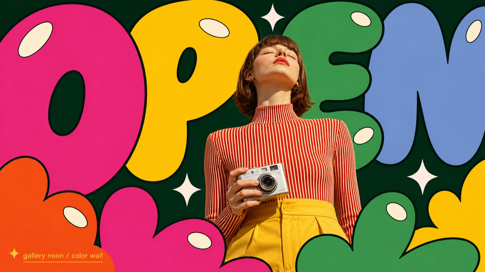</a>

一种有冲击力的摄影插画海报风格：低机位时尚肖像位于中心，周围是超大扁平泡泡字形、糖果色、高对比黑色描边、椭圆高光和清脆闪光符号。

文件：[style.json](styles/pop-bubble-letter-photo-poster-style/style.json) · [16:9 预览](styles/pop-bubble-letter-photo-poster-style/preview-16x9.jpg) · [9:16 预览](styles/pop-bubble-letter-photo-poster-style/preview-9x16.jpg) · [目录](styles/pop-bubble-letter-photo-poster-style)

---

### Soft Analog Future Editorial Poster

<a href="styles/soft-analog-future-editorial-poster-style">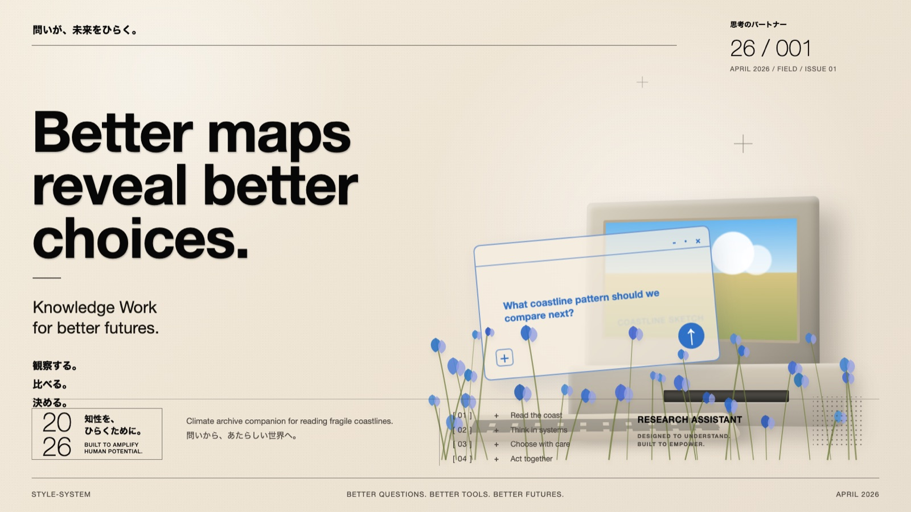</a>

一种安静的模拟未来编辑海报风格：暖奶油纸张、超大黑色 neo-grotesk 字体、严格网格规则、复古科技静物、浅蓝半透明界面面板、植物前景点缀和细小双语信息设计。

文件：[style.json](styles/soft-analog-future-editorial-poster-style/style.json) · [16:9 预览](styles/soft-analog-future-editorial-poster-style/preview-16x9.jpg) · [9:16 预览](styles/soft-analog-future-editorial-poster-style/preview-9x16.jpg) · [目录](styles/soft-analog-future-editorial-poster-style)

---

### Subway Doodle Photo Hybrid

<a href="styles/subway-doodle-photo-hybrid-style">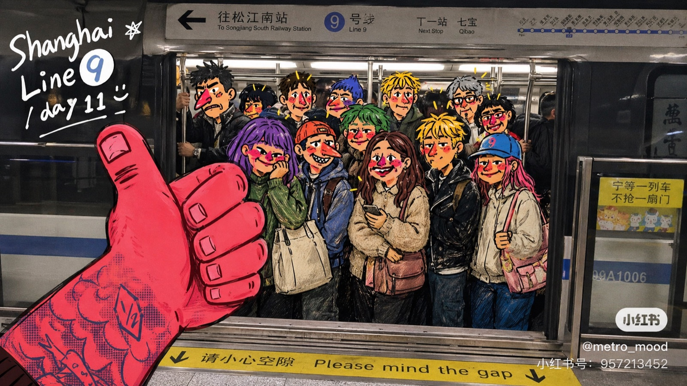</a>

一种手机拍摄的城市交通海报风格：纪实地铁或街头交通摄影，叠加表现性手绘卡通覆盖层、涂鸦人物脸、超大前景手势、手写笔记和社交媒体截图质感。

文件：[style.json](styles/subway-doodle-photo-hybrid-style/style.json) · [16:9 预览](styles/subway-doodle-photo-hybrid-style/preview-16x9.jpg) · [9:16 预览](styles/subway-doodle-photo-hybrid-style/preview-9x16.jpg) · [目录](styles/subway-doodle-photo-hybrid-style)

---

### Tokyo Kawaii Travel Collage Poster

<a href="styles/tokyo-kawaii-travel-collage-poster-style"></a>

一种极繁日式城市旅行拼贴风格：醒目的目的地字体、可爱贴纸元素、漫画对话框、剪贴时尚摄影、半色调城市背景和 scrapbook 编辑版式。

文件：[style.json](styles/tokyo-kawaii-travel-collage-poster-style/style.json) · [16:9 预览](styles/tokyo-kawaii-travel-collage-poster-style/preview-16x9.jpg) · [9:16 预览](styles/tokyo-kawaii-travel-collage-poster-style/preview-9x16.jpg) · [目录](styles/tokyo-kawaii-travel-collage-poster-style)

---

### Urban Transit Doodle Diary

<a href="styles/urban-transit-doodle-diary-style">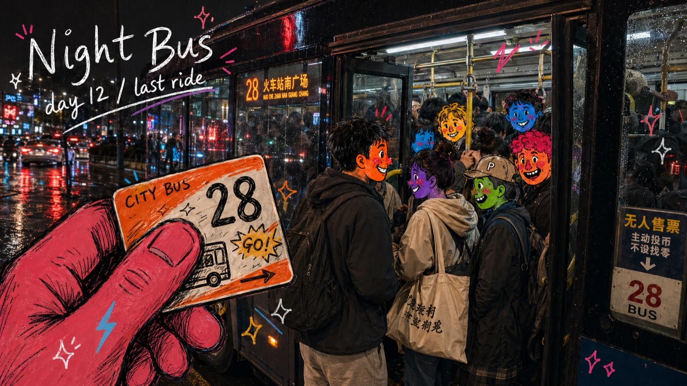</a>

一种把原始城市公共空间快照处理成私人视觉日记的风格：真实照片、粗重手绘漫画覆盖层、手写旅行笔记、饱和卡通脸和大面积前景手势。

文件：[style.json](styles/urban-transit-doodle-diary-style/style.json) · [16:9 预览](styles/urban-transit-doodle-diary-style/preview-16x9.jpg) · [9:16 预览](styles/urban-transit-doodle-diary-style/preview-9x16.jpg) · [目录](styles/urban-transit-doodle-diary-style)

---

### Y2K Grunge Hip-hop Cutout Poster

<a href="styles/y2k-grunge-hiphop-cutout-poster-style">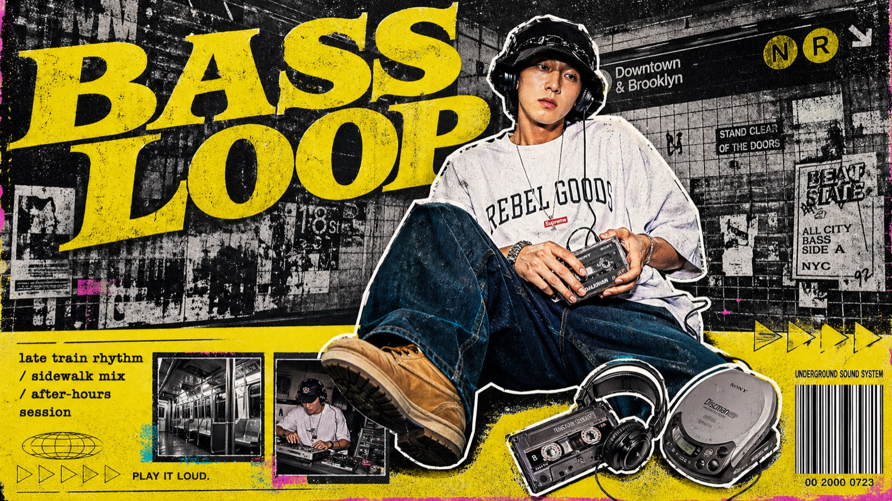</a>

一种 Y2K grunge hip-hop 杂志拼贴海报风格：超大照片剪贴、酸黄色复古字体、粗糙黑白墙面质感、密集编辑页脚信息区和复印机印刷噪点。

文件：[style.json](styles/y2k-grunge-hiphop-cutout-poster-style/style.json) · [16:9 预览](styles/y2k-grunge-hiphop-cutout-poster-style/preview-16x9.jpg) · [9:16 预览](styles/y2k-grunge-hiphop-cutout-poster-style/preview-9x16.jpg) · [目录](styles/y2k-grunge-hiphop-cutout-poster-style)

## 发布规则

- 一个目录 = 一个风格
- 新风格优先出现在最新风格和风格索引顶部
- 主分支只放 `style.json` 和两张预览 JPG
- 完整图库不放在这个仓库里
- 不发布原始参考图、水印图、平台标识、二维码、账号信息、私有提示词，或未经授权的品牌素材

## 许可证

仓库结构和文档采用 MIT。每个 `style.json` 会声明自己的授权方式。预览图仅作为视觉参考随仓库展示。
