<h1 align="center">AI Visual Prompt Cookbook</h1>

<p align="center">
  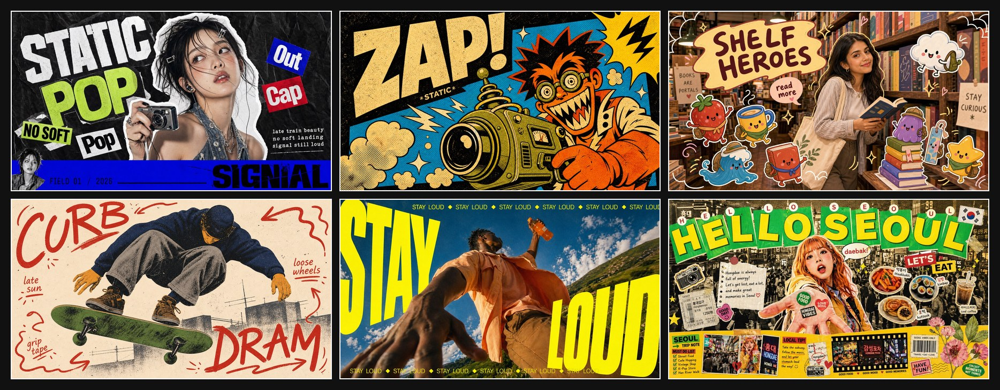
</p>

<p align="center">
  <a href="README.md">English</a> |
  简体中文 |
  <a href="README.zh-TW.md">繁體中文</a> |
  <a href="README.ja.md">日本語</a> |
  <a href="README.ko.md">한국어</a> |
  <a href="README.id.md">Bahasa Indonesia</a>
</p>

<p align="center">
  
  
  
  
</p>

<p align="center">
  <strong>复制一个 JSON，得到一种风格。</strong> 把一个 <code>style.json</code> 放进 ChatGPT、Claude、Nano Banana Pro、即梦或其他 LLM 图像工作流，替换变量，保留完整视觉系统。
</p>

<p align="center">
  这是一个面向 AI 图像生成的可复用视觉提示词风格库：每个风格都被整理成可直接使用的 <code>style.json</code>，并配套横竖两张预览图，方便浏览、复制和二次生成。
</p>

<p align="center">
  由 <a href="https://x.com/VigoCreativeAI">@VigoCreativeAI</a> 策划整理，并在 OpenAI Codex 的协助下结构化。Star 这个仓库可以持续关注新的风格更新。
</p>

<p align="center">
  🖼️ <strong><a href="https://prompts.vigocreativeai.com/site/">在线画廊</a></strong> · 或浏览下方 <a href="#all-styles">All Styles 画廊</a> / <a href="docs/CATALOG.md">完整目录</a>。
</p>

<p align="center">
  💬 用这里的风格做了图？<a href="https://github.com/VigoZhao/AI-Visual-Prompt-Cookbook/discussions/categories/show-and-tell">来 Show and tell 晒一晒</a> · 想要还没有的风格？<a href="https://github.com/VigoZhao/AI-Visual-Prompt-Cookbook/discussions/categories/ideas">在这里许愿</a>
</p>

## 快速入口

| 分类 | 适合做什么 | 先看这些 |
| --- | --- | --- |
| 照片 + 涂鸦 | 社交随拍、生活方式场景、轻快贴纸覆盖层 | [Playful Mascot Doodle Snapshot](styles/playful-mascot-doodle-snapshot-style), [Subway Doodle Photo Hybrid](styles/subway-doodle-photo-hybrid-style) |
| Zine + 拼贴 | 时尚海报、音乐视觉、极繁编辑排版 | [K-pop Apocalypse Ransom Zine](styles/k-pop-apocalypse-ransom-zine-style), [Y2K Grunge Hip-hop Cutout Poster](styles/y2k-grunge-hiphop-cutout-poster-style) |
| 字体海报 | 大标题系统、高冲击广告图、视觉冲击 | [Impact Burst Halftone Comic Poster](styles/impact-burst-halftone-comic-poster-style), [Neon Kinetic Typographic Poster](styles/neon-kinetic-typographic-poster-style) |
| 旅行 + 城市 | 目的地海报、街头场景、城市视觉日记 | [Clean Triptych Travel Vlog Thumbnail](styles/clean-triptych-travel-vlog-thumbnail-style), [Tokyo Kawaii Travel Collage Poster](styles/tokyo-kawaii-travel-collage-poster-style) |
| 编辑 + 极简 | 更干净的构图、结构化版式、安静的艺术指导 | [Tri Color Hardcut Portrait Poster](styles/tri-color-hardcut-portrait-poster-style), [Soft Analog Future Editorial Poster](styles/soft-analog-future-editorial-poster-style) |

## 为什么做这个项目

大多数 AI 图像提示词都是一次性的文本块：难复用、难比较，也难稳定迭代。这个项目采用另一种方式：把每一种视觉风格拆解成结构化的 `style.json`，你可以把它放进 ChatGPT、Claude 或其他 LLM 图像生成流程里。换主题时，风格结构仍然保持稳定。

## 快速开始

1. 浏览 [精选风格](#精选风格)、[快速入口](#快速入口) 或 [All Styles](#all-styles)。
2. 打开某个风格目录，复制里面的 `style.json`。
3. 把完整 JSON 放进 ChatGPT Images 2、Nano Banana Pro 或其他端到端多模态图像模型。
4. 根据 `environment_variables` 里的变量说明填写你的变量值，或直接修改 `examples[*].values` 里的案例值。
5. 生成最终图像。

参见下面的 [Complete Example](#complete-example)，查看完整的输入到输出示例。

### Recommended Image Models

这个工作流最适合端到端多模态图像模型：它们能读取较长的结构化 JSON 提示词，并一步生成最终图像。

- ChatGPT Images 2 (OpenAI, gpt-image-2) — 文字渲染强，支持 2K/4K 输出，可在生成前进行推理
- Nano Banana Pro (Google, Gemini 3 Pro Image) — 支持 4K 输出，多语言文字准确性好，主体一致性强

其他能接受长 JSON 提示词的多模态 LLM 也可能可用，但不是主要推荐。

## Complete Example

### 输入 → 输出演示

这个示例使用 [Mono Noir Type Portrait Poster Style](styles/mono-noir-type-portrait-poster-style/)。

#### Step 1 — The Style

<details>
<summary>prompt_template excerpt</summary>

```text
Create a {ASPECT_RATIO} monochrome editorial poster in the Mono Noir Type Portrait Poster Style. Style fidelity lock: {STYLE_FIDELITY_ANCHORS}. Source content to avoid: {SOURCE_CONTENT_TO_AVOID}. Scene: {SUBJECT} {SUBJECT_ACTION} with {PRODUCT_OR_PROP} in {LOCATION}. Background elements: {BACKGROUND_ELEMENTS}. Wardrobe and styling: {WARDROBE_STYLE}. Composition: one large high-contrast black-and-white photographic subject, close crop, deep charcoal background, sparse negative space, shallow depth of field, serious noir editorial mood. If the aspect ratio is 16:9, make a landscape poster with the subject weighted to the right side and the headline block on the left. If the aspect ratio is 9:16, make a vertical poster with the headline stacked in the upper-left or middle-left field and the subject cropped large on the right or lower-right. Typography: render the exact readable lowercase headline text "{MAIN_TEXT}" as three short left-aligned lines...
```

</details>

#### Step 2 — Your Variables

```text
SUBJECT = a tired architect with silver hair
SUBJECT_ACTION = studying a folded blueprint in a late-night pause
PRODUCT_OR_PROP = a rolled plan tube and a pencil held low
LOCATION = a dim concrete studio after midnight
BACKGROUND_ELEMENTS = soft charcoal wall gradient, blurred drafting table edge, deep empty space
MAIN_TEXT = focus / outlasts / noise.
SECONDARY_TEXT = studio log 02:14
ACCENT_SYMBOL = a tiny white plus
WARDROBE_STYLE = dark work jacket over a plain black shirt
ASPECT_RATIO = 16:9
```

#### Step 3 — The Final Prompt

```text
Create a 16:9 monochrome editorial poster in the Mono Noir Type Portrait Poster Style. Style fidelity lock: black-and-white photographic portrait, deep charcoal background, giant lowercase left-aligned headline, first word in a white label, remaining words in white, high contrast, sparse negative space, close crop. Source content to avoid: no young woman with blunt bangs, no freckles close-up, no discipline beats procrastination text, no copied face or exact source crop. Scene: a tired architect with silver hair studying a folded blueprint in a late-night pause with a rolled plan tube and a pencil held low in a dim concrete studio after midnight. Background elements: soft charcoal wall gradient, blurred drafting table edge, deep empty space. Wardrobe and styling: dark work jacket over a plain black shirt. Composition: one large high-contrast black-and-white photographic subject, close crop, deep charcoal background, sparse negative space, shallow depth of field, serious noir editorial mood. If the aspect ratio is 16:9, make a landscape poster with the subject weighted to the right side and the headline block on the left. If the aspect ratio is 9:16, make a vertical poster with the headline stacked in the upper-left or middle-left field and the subject cropped large on the right or lower-right. Typography: render the exact readable lowercase headline text "focus
outlasts
noise." as three short left-aligned lines with tight leading; put the first headline word as black type inside a crisp white rectangular label, then set the remaining lines in heavy white type directly on the dark background. Add "studio log 02:14" only as tiny unobtrusive white microcopy if it fits. Use a tiny white plus only as a minimal typographic mark. Keep type sharp, flat, square-cornered, and massive. Photo treatment: realistic black-and-white studio photography, strong shadow falloff, visible facial or fabric texture, subtle grain, no color, no illustration, no collage, no extra panels, no logos, no watermark.
```

#### Step 4 — The Result

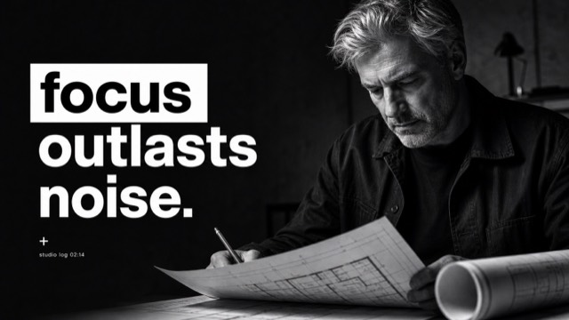

## 复制提示词入口

想先快速试效果？可以打开自动生成的 [Copy Prompt Library](docs/copy-prompts/README.md)，每个风格都有一段可直接复制的简版提示词。完整可复用风格系统仍然保留在各自的 `style.json` 里。

## 精选风格

<!-- BEGIN GENERATED: featured (generated by scripts/generate-readme.py from data/catalog.json; do not edit by hand) -->
先看这 6 个风格。每个风格都保持轻量：一个 JSON 加两张预览图。完整 186 个风格见[在线画廊](https://prompts.vigocreativeai.com/site/)或英文 README 的 [All Styles](README.md#all-styles)。

<!-- HTML table used for rich image+link cells -->

<table>
<tr>
<td width="33%" valign="top">
<a href="styles/acid-parallax">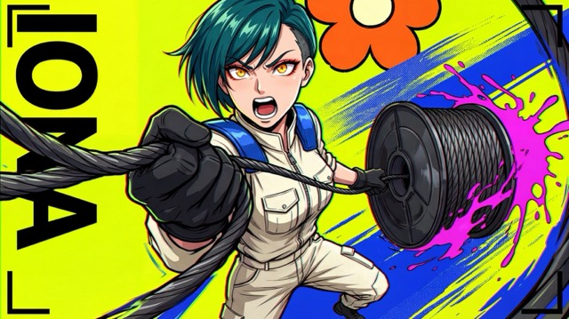</a>
<h3>Acid Parallax</h3>
<p>Adult original-character posters on flat acid-yellow fields with extreme fisheye distortion: frame-breaking black type, wet blue brush gestures, magenta splatter, flat flower shapes and local hand-drawn RGB misregistration build a high-tension structure.</p>
<p><a href="styles/acid-parallax/style.json"><strong>打开 style.json</strong></a> · <a href="docs/copy-prompts/acid-parallax.md">复制提示词</a> · <a href="styles/acid-parallax">目录</a></p>
</td>
<td width="33%" valign="top">
<a href="styles/acid-phase-operatives">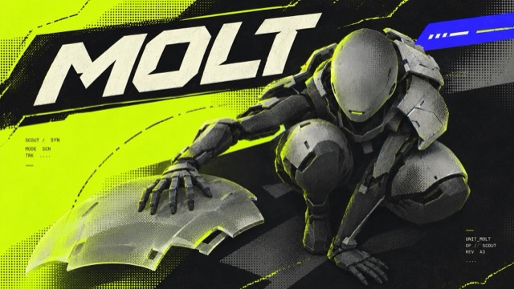</a>
<h3>Acid Phase Operatives</h3>
<p>Sci-fi character key visuals fusing acid fluorescent fields, cool-grey synthetic humans, local coarse halftone dots and diagonally sliced title tracks.</p>
<p><a href="styles/acid-phase-operatives/style.json"><strong>打开 style.json</strong></a> · <a href="docs/copy-prompts/acid-phase-operatives.md">复制提示词</a> · <a href="styles/acid-phase-operatives">目录</a></p>
</td>
<td width="33%" valign="top">
<a href="styles/kinetic-slice">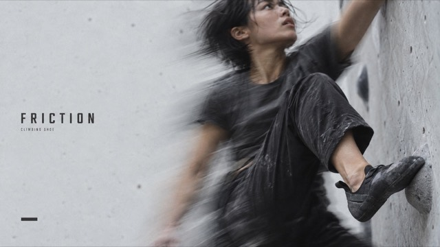</a>
<h3>Kinetic Slice</h3>
<p>Restrained photographic sports-equipment editorials: soft grey daylight, visible film grain, optical body ghosts, quiet fields and small condensed titles.</p>
<p><a href="styles/kinetic-slice/style.json"><strong>打开 style.json</strong></a> · <a href="docs/copy-prompts/kinetic-slice.md">复制提示词</a> · <a href="styles/kinetic-slice">目录</a></p>
</td>
</tr>
<tr>
<td width="33%" valign="top">
<a href="styles/oblique-interval">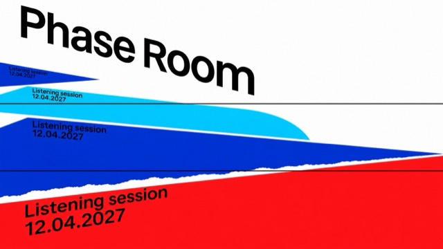</a>
<h3>Oblique Interval</h3>
<p>White-ground cultural posters fusing receding saturated colour panels, sliced arc-cut curves and mobile black grotesk typography; ultramarine and signal red unify four distinct structures.</p>
<p><a href="styles/oblique-interval/style.json"><strong>打开 style.json</strong></a> · <a href="docs/copy-prompts/oblique-interval.md">复制提示词</a> · <a href="styles/oblique-interval">目录</a></p>
</td>
<td width="33%" valign="top">
<a href="styles/nocturne-orbit-manga">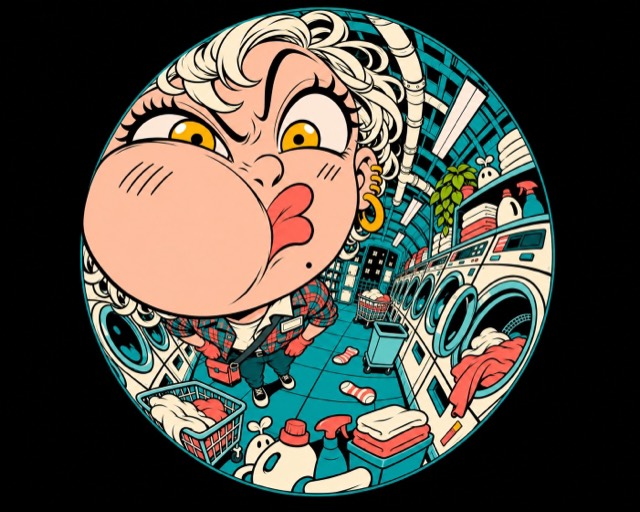</a>
<h3>Nocturne Orbit Manga</h3>
<p>Playful adult night workers seen through an extreme circular fisheye: lens-touching exaggerated faces or hands, densely wrapped workplaces, hard black ink and flat teal/coral/cream cel color.</p>
<p><a href="styles/nocturne-orbit-manga/style.json"><strong>打开 style.json</strong></a> · <a href="docs/copy-prompts/nocturne-orbit-manga.md">复制提示词</a> · <a href="styles/nocturne-orbit-manga">目录</a></p>
</td>
<td width="33%" valign="top">
<a href="styles/toner-riot">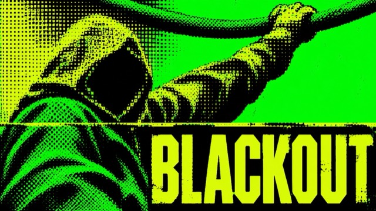</a>
<h3>Toner Riot</h3>
<p>Electric-green character key art crushed into coarse circular screen and acid-lime square dither, with industrial titles and abrupt straight print splices. The image emerges from damaged information, not polished illustration.</p>
<p><a href="styles/toner-riot/style.json"><strong>打开 style.json</strong></a> · <a href="docs/copy-prompts/toner-riot.md">复制提示词</a> · <a href="styles/toner-riot">目录</a></p>
</td>
</tr>
</table>
<!-- END GENERATED: featured -->

## 文件结构

```text
styles/<style-slug>/
  style.json          # 机器可读的提示词风格模板
  preview-16x9.jpg    # 横屏预览图
  preview-9x16.jpg    # 竖屏预览图
```

## style.json v2.1 / v2.2

每个 `style.json` 都是自包含的：把完整文件复制给 LLM，然后根据 `environment_variables` 的变量说明填写新值，或直接改写某个 `examples[*].values` 案例。

- `prompt_template` 是带 `{VARIABLE}` 占位符的可复用风格提示词。
- `environment_variables` 声明模板里可使用的所有变量。
- 较新的风格带有 `"schema_version": "2.2"`，只声明模板真正用到的变量（如 `SUBJECT`、`MAIN_TEXT`、`DESIGN_DIRECTION`）；较早的 v2.1 风格使用固定的 10 个标准变量。
- `examples` 提供可直接改写的案例；每个案例只包含 `case_name` 和 `values`。
- `style_fidelity_anchors` 和 `source_content_to_avoid` 分别说明要保留的风格锚点，以及不能复制的源内容。
- `negative_prompt` 用来排除水印、Logo、直接复刻源图和偏离风格的输出。

仓库不会保存 `prompt_9x16`、`prompt_16x9` 或 `full_prompt` 这类渲染后的完整提示词。它们可以在生成时由 `prompt_template` 和变量值临时推导出来，这样 JSON 更轻，也不容易过期。

校验命令：

```bash
python3 scripts/validate-style-json.py .
```

## All Styles

<!-- BEGIN GENERATED: all-styles (generated by scripts/generate-readme.py from data/catalog.json; do not edit by hand) -->
下面是最新的 9 个风格。全部 186 个风格请看[在线画廊](https://prompts.vigocreativeai.com/site/)、英文 README 的 [All Styles](README.md#all-styles)，或带完整描述的 [docs/CATALOG.md](docs/CATALOG.md)。

<!-- HTML table used for rich image+link cells -->

<table>
<tr>
<td width="33%" valign="top">
<a id="acid-parallax"></a>
<a href="styles/acid-parallax"></a>
<p><strong><a href="styles/acid-parallax">Acid Parallax</a></strong><br>
<em>Acid-yellow fisheye character posters: frame-breaking black type, wet blue brush gestures, magenta splatter, flat flower shapes and hand-drawn RGB misregistration around one adult original character.</em><br>
<a href="styles/acid-parallax/style.json">style.json</a> · <a href="docs/copy-prompts/acid-parallax.md">prompt</a> · <a href="styles/acid-parallax/preview-9x16.jpg">9:16</a></p>
</td>
<td width="33%" valign="top">
<a id="acid-phase-operatives"></a>
<a href="styles/acid-phase-operatives"></a>
<p><strong><a href="styles/acid-phase-operatives">Acid Phase Operatives</a></strong><br>
<em>Sci-fi operative key visuals: acid fluorescent fields, cool-grey synthetic humans, coarse local halftone dots and diagonally sliced title tracks.</em><br>
<a href="styles/acid-phase-operatives/style.json">style.json</a> · <a href="docs/copy-prompts/acid-phase-operatives.md">prompt</a> · <a href="styles/acid-phase-operatives/preview-9x16.jpg">9:16</a></p>
</td>
<td width="33%" valign="top">
<a id="kinetic-slice"></a>
<a href="styles/kinetic-slice"></a>
<p><strong><a href="styles/kinetic-slice">Kinetic Slice</a></strong><br>
<em>Restrained photographic sports-equipment editorials: soft overcast light, film grain, slow-shutter body ghosts around one sharp worn product, 40% quiet grey field and a small condensed title.</em><br>
<a href="styles/kinetic-slice/style.json">style.json</a> · <a href="docs/copy-prompts/kinetic-slice.md">prompt</a> · <a href="styles/kinetic-slice/preview-9x16.jpg">9:16</a></p>
</td>
</tr>
<tr>
<td width="33%" valign="top">
<a id="oblique-interval"></a>
<a href="styles/oblique-interval"></a>
<p><strong><a href="styles/oblique-interval">Oblique Interval</a></strong><br>
<em>White-ground cultural posters with receding saturated colour panels, sliced arc-cut curves and mobile black grotesk type, unified by ultramarine and signal red.</em><br>
<a href="styles/oblique-interval/style.json">style.json</a> · <a href="docs/copy-prompts/oblique-interval.md">prompt</a> · <a href="styles/oblique-interval/preview-9x16.jpg">9:16</a></p>
</td>
<td width="33%" valign="top">
<a id="nocturne-orbit-manga"></a>
<a href="styles/nocturne-orbit-manga"></a>
<p><strong><a href="styles/nocturne-orbit-manga">Nocturne Orbit Manga</a></strong><br>
<em>Playful adult night workers through an extreme circular fisheye: lens-touching faces and hands, densely wrapped workplaces, hard black ink with flat teal, coral and cream cel color.</em><br>
<a href="styles/nocturne-orbit-manga/style.json">style.json</a> · <a href="docs/copy-prompts/nocturne-orbit-manga.md">prompt</a> · <a href="styles/nocturne-orbit-manga/preview-9x16.jpg">9:16</a></p>
</td>
<td width="33%" valign="top">
<a id="toner-riot"></a>
<a href="styles/toner-riot"></a>
<p><strong><a href="styles/toner-riot">Toner Riot</a></strong><br>
<em>Electric-green character key art crushed into coarse round screen and acid-lime square dither, with huge industrial titles and straight print splices.</em><br>
<a href="styles/toner-riot/style.json">style.json</a> · <a href="docs/copy-prompts/toner-riot.md">prompt</a> · <a href="styles/toner-riot/preview-9x16.jpg">9:16</a></p>
</td>
</tr>
<tr>
<td width="33%" valign="top">
<a id="jade-scarlet-panel-press"></a>
<a href="styles/jade-scarlet-panel-press">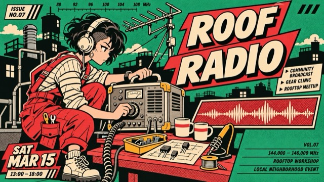</a>
<p><strong><a href="styles/jade-scarlet-panel-press">Jade Scarlet Panel Press</a></strong><br>
<em>Character-led neighborhood bulletin posters: scarlet comic panels and cream outlined capitals cut across jade grounds with black street-print silhouettes in staggered editorial modules.</em><br>
<a href="styles/jade-scarlet-panel-press/style.json">style.json</a> · <a href="docs/copy-prompts/jade-scarlet-panel-press.md">prompt</a> · <a href="styles/jade-scarlet-panel-press/preview-9x16.jpg">9:16</a></p>
</td>
<td width="33%" valign="top">
<a id="sulphur-shift"></a>
<a href="styles/sulphur-shift">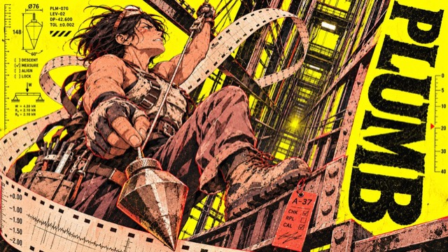</a>
<p><strong><a href="styles/sulphur-shift">Sulphur Shift</a></strong><br>
<em>Sulphur-yellow shift-worker character posters: anime operators, oversized tools and perforated recorder strips colliding with a heavy black slab-serif word in rough riso-like print.</em><br>
<a href="styles/sulphur-shift/style.json">style.json</a> · <a href="docs/copy-prompts/sulphur-shift.md">prompt</a> · <a href="styles/sulphur-shift/preview-9x16.jpg">9:16</a></p>
</td>
<td width="33%" valign="top">
<a id="ink-orbit-club"></a>
<a href="styles/ink-orbit-club">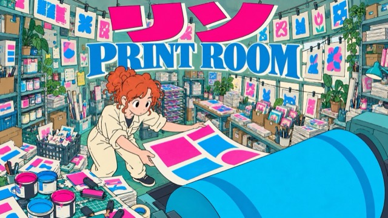</a>
<p><strong><a href="styles/ink-orbit-club">Ink Orbit Club</a></strong><br>
<em>Flat, naive hand-inked maker posters in dense fisheye workshops: cold teal and grey-green rooms, fluorescent pink katakana and bold blue serif mastheads.</em><br>
<a href="styles/ink-orbit-club/style.json">style.json</a> · <a href="docs/copy-prompts/ink-orbit-club.md">prompt</a> · <a href="styles/ink-orbit-club/preview-9x16.jpg">9:16</a></p>
</td>
</tr>
</table>
<!-- END GENERATED: all-styles -->

## 发布规则

- 一个目录 = 一种风格
- 新风格会优先出现在精选风格和 All Styles 画廊中，完整描述同步添加到 [docs/CATALOG.md](docs/CATALOG.md)
- main 分支只放每个风格的 `style.json` 和两张预览 JPG
- 完整图库不放在这个仓库里
- 不发布原始参考图、水印、平台标识、二维码、账号信息、私有提示词，或未经授权的品牌素材

## Contributing

提交新风格时，请遵循 [CONTRIBUTING.md](CONTRIBUTING.md) 中的公开包结构、校验规则和 PR checklist。

## 许可证

代码、脚本和文档采用 [MIT 许可证](LICENSE)。`style.json` 的提示词内容采用 [CC BY 4.0](https://creativecommons.org/licenses/by/4.0/) 授权——欢迎注明出处 [@VigoCreativeAI](https://x.com/VigoCreativeAI) 后复用和改编。预览图仅作为视觉参考随仓库展示。
