<h1 align="center">AI Visual Prompt Cookbook</h1>

<p align="center">
  
</p>

<p align="center">
  <a href="README.md">English</a> |
  <a href="README.zh-CN.md">简体中文</a> |
  繁體中文 |
  <a href="README.ja.md">日本語</a> |
  <a href="README.ko.md">한국어</a> |
  <a href="README.id.md">Bahasa Indonesia</a>
</p>

<p align="center">
  
  
  
  
</p>

<p align="center">
  <strong>複製一個 JSON，得到一種風格。</strong> 把一個 <code>style.json</code> 放進 ChatGPT、Claude、Nano Banana Pro、即夢或其他 LLM 圖像工作流，替換變數，保留完整視覺系統。
</p>

<p align="center">
  這是一個面向 AI 圖像生成的可重用視覺提示詞風格庫：每個風格都整理成可直接使用的 <code>style.json</code>，並配套橫向與直向預覽圖，方便瀏覽、複製和二次生成。
</p>

<p align="center">
  由 <a href="https://x.com/VigoCreativeAI">@VigoCreativeAI</a> 策劃整理，並在 OpenAI Codex 協助下結構化。Star 這個倉庫即可追蹤新的風格更新。
</p>

<p align="center">
  瀏覽 <a href="#all-styles">All Styles 畫廊</a>，或打開 <a href="docs/CATALOG.md">完整目錄</a>。
</p>

## 快速入口

| 分類 | 適合做什麼 | 先看這些 |
| --- | --- | --- |
| 照片 + 塗鴉 | 社交隨拍、生活方式場景、輕快貼紙覆蓋層 | [Playful Mascot Doodle Snapshot](#playful-mascot-doodle-snapshot-style), [Subway Doodle Photo Hybrid](#subway-doodle-photo-hybrid-style) |
| Zine + 拼貼 | 時尚海報、音樂視覺、極繁編輯版式 | [K-pop Apocalypse Ransom Zine](#k-pop-apocalypse-ransom-zine-style), [Y2K Grunge Hip-hop Cutout Poster](#y2k-grunge-hiphop-cutout-poster-style) |
| 字體海報 | 大標題系統、高衝擊廣告圖、強烈視覺識別 | [Impact Burst Halftone Comic Poster](#impact-burst-halftone-comic-poster-style), [Neon Kinetic Typographic Poster](#neon-kinetic-typographic-poster-style) |
| 旅行 + 城市 | 目的地海報、街頭場景、城市視覺日記 | [Clean Triptych Travel Vlog Thumbnail](#clean-triptych-travel-vlog-thumbnail-style), [Tokyo Kawaii Travel Collage Poster](#tokyo-kawaii-travel-collage-poster-style) |
| 編輯 + 極簡 | 更乾淨的構圖、結構化版面、安靜的藝術指導 | [Tri Color Hardcut Portrait Poster](#tri-color-hardcut-portrait-poster-style), [Soft Analog Future Editorial Poster](#soft-analog-future-editorial-poster-style) |

## 為什麼做這個項目

多數 AI 圖像提示詞都是一次性的文字塊：難以重用、難以比較，也難以穩定迭代。這個項目採用另一種方式：把每一種視覺風格拆解成結構化的 `style.json`，你可以把它放進 ChatGPT、Claude 或其他 LLM 圖像生成流程中。換主題時，風格結構仍然保持穩定。

## 快速開始

1. 瀏覽 [精選風格](#精選風格)、[快速入口](#快速入口) 或 [All Styles](#all-styles)。
2. 打開某個風格目錄，複製裡面的 `style.json`。
3. 把完整 JSON 放進 ChatGPT Images 2、Nano Banana Pro 或其他端到端多模態圖像模型。
4. 根據 `environment_variables` 裡的變數說明填寫你的變數值，或直接修改 `examples[*].values` 裡的案例值。
5. 生成最終圖像。

參見下面的 [Complete Example](#complete-example)，查看完整的輸入到輸出示例。

### Recommended Image Models

這個工作流最適合端到端多模態圖像模型：它們能讀取較長的結構化 JSON 提示詞，並一步生成最終圖像。

- ChatGPT Images 2 (OpenAI, gpt-image-2) — 文字渲染強，支援 2K/4K 輸出，可在生成前進行推理
- Nano Banana Pro (Google, Gemini 3 Pro Image) — 支援 4K 輸出，多語言文字準確性好，主體一致性強

其他能接受長 JSON 提示詞的多模態 LLM 也可能可用，但不是主要推薦。

## Complete Example

### 輸入 → 輸出演示

這個示例使用 [Mono Noir Type Portrait Poster Style](styles/mono-noir-type-portrait-poster-style/)。

#### Step 1 — The Style

<details>
<summary>prompt_template excerpt</summary>

```text
Create a {ASPECT_RATIO} monochrome editorial poster in the Mono Noir Type Portrait Poster Style. Style fidelity lock: {STYLE_FIDELITY_ANCHORS}. Source content to avoid: {SOURCE_CONTENT_TO_AVOID}. Scene: {SUBJECT} {SUBJECT_ACTION} with {PRODUCT_OR_PROP} in {LOCATION}. Background elements: {BACKGROUND_ELEMENTS}. Wardrobe and styling: {WARDROBE_STYLE}. Composition: one large high-contrast black-and-white photographic subject, close crop, deep charcoal background, sparse negative space, shallow depth of field, serious noir editorial mood. If the aspect ratio is 16:9, make a landscape poster with the subject weighted to the right side and the headline block on the left. If the aspect ratio is 9:16, make a vertical poster with the headline stacked in the upper-left or middle-left field and the subject cropped large on the right or lower-right. Typography: render the exact readable lowercase headline text "{MAIN_TEXT}" as three short left-aligned lines...
```

</details>

#### Step 2 — Your Variables

```text
SUBJECT = a tired architect with silver hair
SUBJECT_ACTION = studying a folded blueprint in a late-night pause
PRODUCT_OR_PROP = a rolled plan tube and a pencil held low
LOCATION = a dim concrete studio after midnight
BACKGROUND_ELEMENTS = soft charcoal wall gradient, blurred drafting table edge, deep empty space
MAIN_TEXT = focus / outlasts / noise.
SECONDARY_TEXT = studio log 02:14
ACCENT_SYMBOL = a tiny white plus
WARDROBE_STYLE = dark work jacket over a plain black shirt
ASPECT_RATIO = 16:9
```

#### Step 3 — The Final Prompt

```text
Create a 16:9 monochrome editorial poster in the Mono Noir Type Portrait Poster Style. Style fidelity lock: black-and-white photographic portrait, deep charcoal background, giant lowercase left-aligned headline, first word in a white label, remaining words in white, high contrast, sparse negative space, close crop. Source content to avoid: no young woman with blunt bangs, no freckles close-up, no discipline beats procrastination text, no copied face or exact source crop. Scene: a tired architect with silver hair studying a folded blueprint in a late-night pause with a rolled plan tube and a pencil held low in a dim concrete studio after midnight. Background elements: soft charcoal wall gradient, blurred drafting table edge, deep empty space. Wardrobe and styling: dark work jacket over a plain black shirt. Composition: one large high-contrast black-and-white photographic subject, close crop, deep charcoal background, sparse negative space, shallow depth of field, serious noir editorial mood. If the aspect ratio is 16:9, make a landscape poster with the subject weighted to the right side and the headline block on the left. If the aspect ratio is 9:16, make a vertical poster with the headline stacked in the upper-left or middle-left field and the subject cropped large on the right or lower-right. Typography: render the exact readable lowercase headline text "focus
outlasts
noise." as three short left-aligned lines with tight leading; put the first headline word as black type inside a crisp white rectangular label, then set the remaining lines in heavy white type directly on the dark background. Add "studio log 02:14" only as tiny unobtrusive white microcopy if it fits. Use a tiny white plus only as a minimal typographic mark. Keep type sharp, flat, square-cornered, and massive. Photo treatment: realistic black-and-white studio photography, strong shadow falloff, visible facial or fabric texture, subtle grain, no color, no illustration, no collage, no extra panels, no logos, no watermark.
```

#### Step 4 — The Result


## 複製提示詞入口

想先快速試效果？可以打開自動生成的 [Copy Prompt Library](docs/copy-prompts/README.md)，每個風格都有一段可直接複製的簡版提示詞。完整可重用風格系統仍然保留在各自的 `style.json` 裡。

## 精選風格

先看這 6 個風格。每個風格都保持輕量：一個 JSON 加兩張預覽圖。完整 78 個風格見下面的 [All Styles](#all-styles) 畫廊。

<!-- HTML table used for rich image+link cells -->

<table>
<tr>
<td width="33%" valign="top">
<a href="styles/kinetic-editorial-photo-collage-style">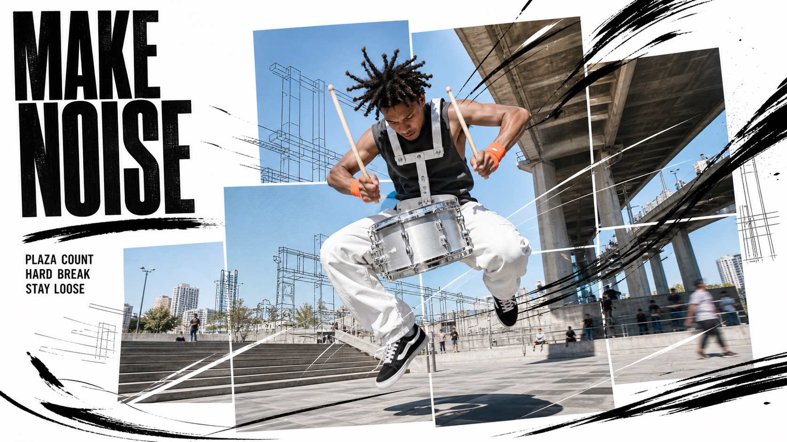</a>
<h3>Kinetic Editorial Photo Collage</h3>
<p>A high-energy action-poster system built from staggered photographic tiles on white space, a cutout motion subject, bold black condensed type, loose ink speed marks, and sparse line-art urban scaffolding.</p>
<p><a href="styles/kinetic-editorial-photo-collage-style/style.json"><strong>打開 style.json</strong></a> · <a href="docs/copy-prompts/kinetic-editorial-photo-collage-style.md">複製提示詞</a> · <a href="styles/kinetic-editorial-photo-collage-style">目錄</a></p>
</td>
<td width="33%" valign="top">
<a href="styles/sunlit-coastal-product-blitz">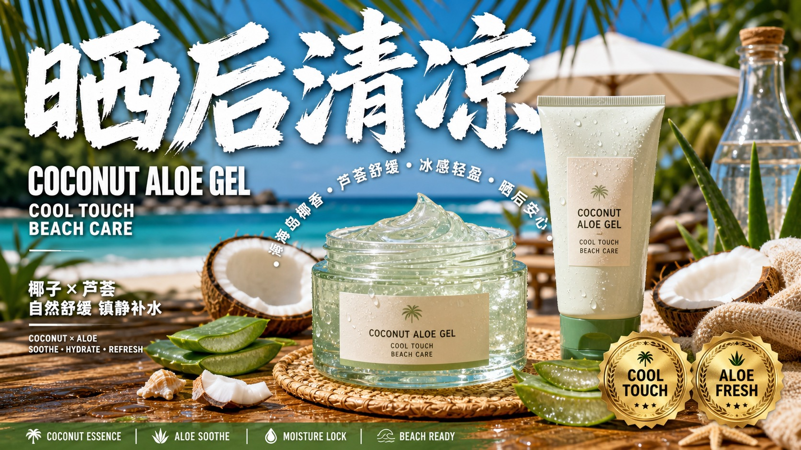</a>
<h3>Sunlit Coastal Product Blitz</h3>
<p>A high-density photoreal coastal product advertising style built from sunlit tabletop hero products, tropical foreground botanicals, blue ocean depth, oversized distressed white brush typography, compact bilingual-style label blocks, curved callouts, and shiny gold seal badges.</p>
<p><a href="styles/sunlit-coastal-product-blitz/style.json"><strong>打開 style.json</strong></a> · <a href="docs/copy-prompts/sunlit-coastal-product-blitz.md">複製提示詞</a> · <a href="styles/sunlit-coastal-product-blitz">目錄</a></p>
</td>
<td width="33%" valign="top">
<a href="styles/monochrome-grid-sneaker-tech-spec">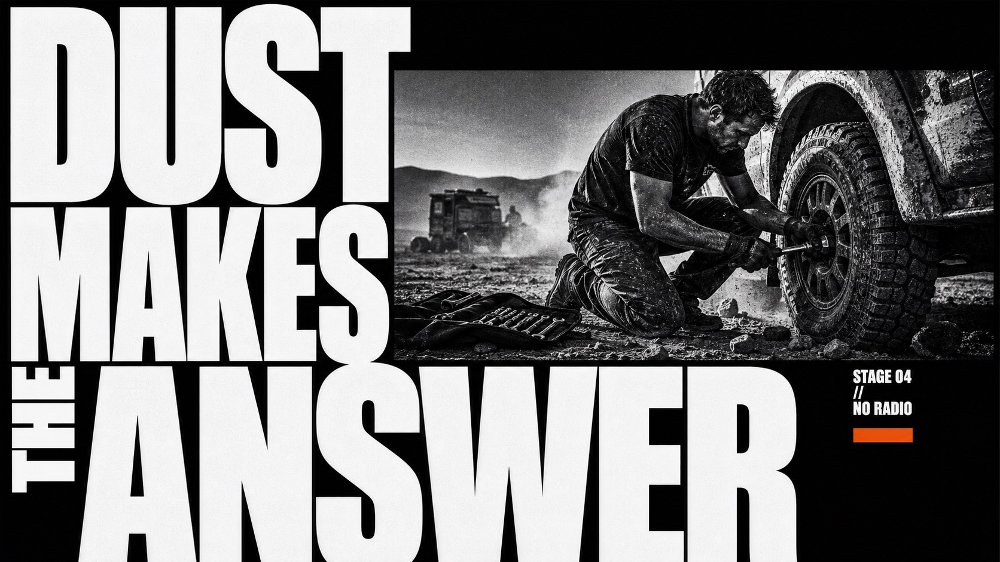</a>
<h3>Monochrome Grid Sneaker Tech Spec</h3>
<p>A black-and-white footwear product analysis poster system with an oversized sneaker hero, pale engineering grid, top-strip evidence panels, macro material callouts, thin technical connector lines, pixelated uppercase typography, and coarse halftone print texture.</p>
<p><a href="styles/monochrome-grid-sneaker-tech-spec/style.json"><strong>打開 style.json</strong></a> · <a href="docs/copy-prompts/monochrome-grid-sneaker-tech-spec.md">複製提示詞</a> · <a href="styles/monochrome-grid-sneaker-tech-spec">目錄</a></p>
</td>
</tr>
<tr>
<td width="33%" valign="top">
<a href="styles/sky-blue-lucky-tag-doodle-poster-style">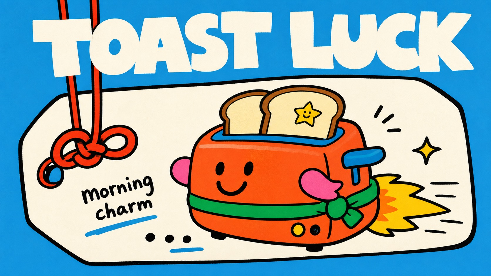</a>
<h3>Sky Blue Lucky Tag Doodle Poster Style</h3>
<p>A sparse flat doodle-poster system built around a saturated sky-blue field, chunky white headline type, an off-white hanging lucky-tag plaque, thick uneven black outlines, bright toy colors, and one large simplified mascot or prop crossing the tag like a playful charm illustration.</p>
<p><a href="styles/sky-blue-lucky-tag-doodle-poster-style/style.json"><strong>打開 style.json</strong></a> · <a href="docs/copy-prompts/sky-blue-lucky-tag-doodle-poster-style.md">複製提示詞</a> · <a href="styles/sky-blue-lucky-tag-doodle-poster-style">目錄</a></p>
</td>
<td width="33%" valign="top">
<a href="styles/neon-type-photo-scribble-poster">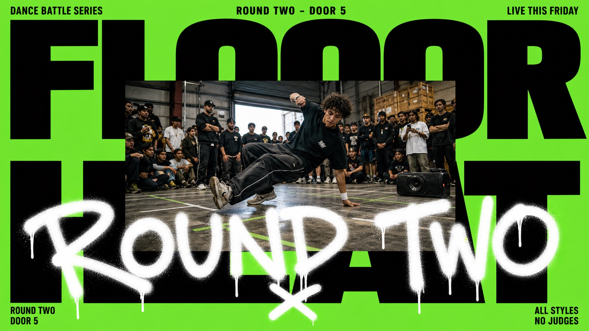</a>
<h3>Neon Type Photo Scribble Poster</h3>
<p>A high-impact event poster system built from a toxic neon color field, huge black condensed typography, a centered documentary photo crop, and a raw white spray-marker gesture that cuts across the middle of the composition.</p>
<p><a href="styles/neon-type-photo-scribble-poster/style.json"><strong>打開 style.json</strong></a> · <a href="docs/copy-prompts/neon-type-photo-scribble-poster.md">複製提示詞</a> · <a href="styles/neon-type-photo-scribble-poster">目錄</a></p>
</td>
<td width="33%" valign="top">
<a href="styles/loose-scribble-riso-print-style">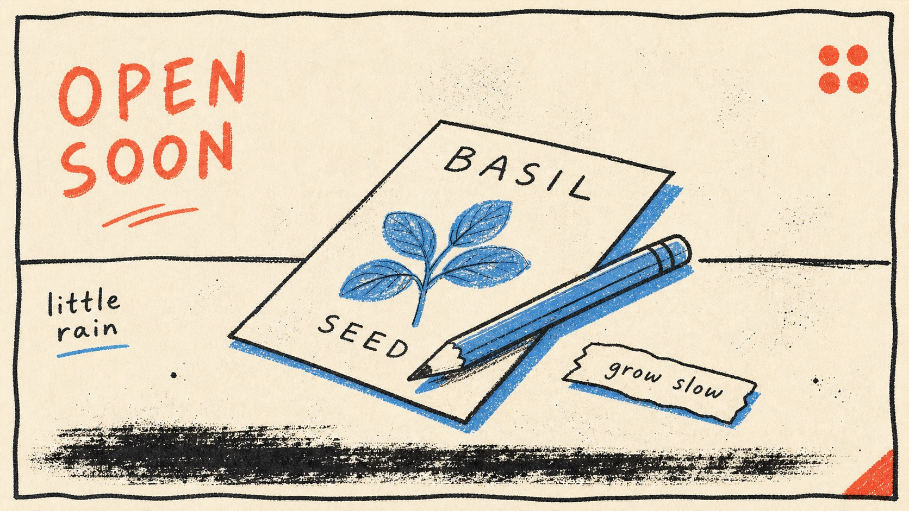</a>
<h3>Loose Scribble Riso Print Style</h3>
<p>A sparse handmade riso or screenprint poster style with one large simplified subject, wavering black contour drawing, rough off-white paper, flat blue and coral-red overprint accents, handwritten margin text, and visible print grain.</p>
<p><a href="styles/loose-scribble-riso-print-style/style.json"><strong>打開 style.json</strong></a> · <a href="docs/copy-prompts/loose-scribble-riso-print-style.md">複製提示詞</a> · <a href="styles/loose-scribble-riso-print-style">目錄</a></p>
</td>
</tr>
</table>

## 文件結構

```text
styles/<style-slug>/
  style.json          # 機器可讀的提示詞風格模板
  preview-16x9.jpg    # 橫向預覽圖
  preview-9x16.jpg    # 直向預覽圖
```

## style.json v2.1

每個 `style.json` 都是自包含的：把完整文件複製給 LLM，然後根據 `environment_variables` 的變數說明填寫新值，或直接改寫某個 `examples[*].values` 案例。

- `prompt_template` 是帶 `{VARIABLE}` 佔位符的可重用風格提示詞。
- `environment_variables` 聲明模板裡可使用的所有變數。
- `examples` 提供可直接改寫的案例；每個案例只包含 `case_name` 和 `values`。
- `style_fidelity_anchors` 和 `source_content_to_avoid` 分別說明要保留的風格錨點，以及不能複製的源內容。
- `negative_prompt` 用來排除水印、Logo、直接複刻源圖和偏離風格的輸出。

倉庫不會保存 `prompt_9x16`、`prompt_16x9` 或 `full_prompt` 這類渲染後的完整提示詞。它們可以在生成時由 `prompt_template` 和變數值臨時推導出來，讓 JSON 更輕，也不容易過期。

校驗命令：

```bash
python3 scripts/validate-style-json.py .
```

## All Styles

下面可以瀏覽全部 78 個風格。

完整庫包含上面的精選風格。每個風格的完整描述和全部文件連結見 [docs/CATALOG.md](docs/CATALOG.md)。

<!-- HTML table used for rich image+link cells -->

<table>
<tr>
<td width="33%" valign="top">
<a id="kinetic-editorial-photo-collage-style"></a>
<a href="styles/kinetic-editorial-photo-collage-style"></a>
<p><strong><a href="styles/kinetic-editorial-photo-collage-style">Kinetic Editorial Photo Collage</a></strong><br>
<em>High-energy action posters built from staggered photo tiles, a cutout motion subject, bold black condensed type, loose ink speed marks, and sparse line-art scaffolding.</em><br>
<a href="styles/kinetic-editorial-photo-collage-style/style.json">style.json</a> · <a href="docs/copy-prompts/kinetic-editorial-photo-collage-style.md">prompt</a> · <a href="styles/kinetic-editorial-photo-collage-style/preview-9x16.jpg">9:16</a></p>
</td>
<td width="33%" valign="top">
<a id="sunlit-coastal-product-blitz"></a>
<a href="styles/sunlit-coastal-product-blitz"></a>
<p><strong><a href="styles/sunlit-coastal-product-blitz">Sunlit Coastal Product Blitz</a></strong><br>
<em>Sunlit photoreal coastal product ads with tropical botanicals, ocean-blue depth, distressed white brush type, dense label blocks, curved callouts, and gold seal badges.</em><br>
<a href="styles/sunlit-coastal-product-blitz/style.json">style.json</a> · <a href="docs/copy-prompts/sunlit-coastal-product-blitz.md">prompt</a> · <a href="styles/sunlit-coastal-product-blitz/preview-9x16.jpg">9:16</a></p>
</td>
<td width="33%" valign="top">
<a id="monochrome-grid-sneaker-tech-spec"></a>
<a href="styles/monochrome-grid-sneaker-tech-spec"></a>
<p><strong><a href="styles/monochrome-grid-sneaker-tech-spec">Monochrome Grid Sneaker Tech Spec</a></strong><br>
<em>Black-and-white footwear tech-spec posters with an oversized sneaker hero, engineering grid, evidence panels, macro callouts, pixelated uppercase type, and coarse halftone print.</em><br>
<a href="styles/monochrome-grid-sneaker-tech-spec/style.json">style.json</a> · <a href="docs/copy-prompts/monochrome-grid-sneaker-tech-spec.md">prompt</a> · <a href="styles/monochrome-grid-sneaker-tech-spec/preview-9x16.jpg">9:16</a></p>
</td>
</tr>
<tr>
<td width="33%" valign="top">
<a id="sky-blue-lucky-tag-doodle-poster-style"></a>
<a href="styles/sky-blue-lucky-tag-doodle-poster-style"></a>
<p><strong><a href="styles/sky-blue-lucky-tag-doodle-poster-style">Sky Blue Lucky Tag Doodle Poster Style</a></strong><br>
<em>Sky-blue doodle posters with chunky white type, a hanging lucky-tag plaque, thick black outlines, and one big playful mascot.</em><br>
<a href="styles/sky-blue-lucky-tag-doodle-poster-style/style.json">style.json</a> · <a href="docs/copy-prompts/sky-blue-lucky-tag-doodle-poster-style.md">prompt</a> · <a href="styles/sky-blue-lucky-tag-doodle-poster-style/preview-9x16.jpg">9:16</a></p>
</td>
<td width="33%" valign="top">
<a id="neon-type-photo-scribble-poster"></a>
<a href="styles/neon-type-photo-scribble-poster"></a>
<p><strong><a href="styles/neon-type-photo-scribble-poster">Neon Type Photo Scribble Poster</a></strong><br>
<em>Neon event posters with huge condensed type, documentary photo crops, and raw white scribble gestures.</em><br>
<a href="styles/neon-type-photo-scribble-poster/style.json">style.json</a> · <a href="docs/copy-prompts/neon-type-photo-scribble-poster.md">prompt</a> · <a href="styles/neon-type-photo-scribble-poster/preview-9x16.jpg">9:16</a></p>
</td>
<td width="33%" valign="top">
<a id="loose-scribble-riso-print-style"></a>
<a href="styles/loose-scribble-riso-print-style"></a>
<p><strong><a href="styles/loose-scribble-riso-print-style">Loose Scribble Riso Print Style</a></strong><br>
<em>Sparse riso posters with wavering contours, overprint accents, handwritten margins, and visible paper grain.</em><br>
<a href="styles/loose-scribble-riso-print-style/style.json">style.json</a> · <a href="docs/copy-prompts/loose-scribble-riso-print-style.md">prompt</a> · <a href="styles/loose-scribble-riso-print-style/preview-9x16.jpg">9:16</a></p>
</td>
</tr>
<tr>
<td width="33%" valign="top">
<a id="jade-glyph-grocer-collage-poster-style"></a>
<a href="styles/jade-glyph-grocer-collage-poster-style">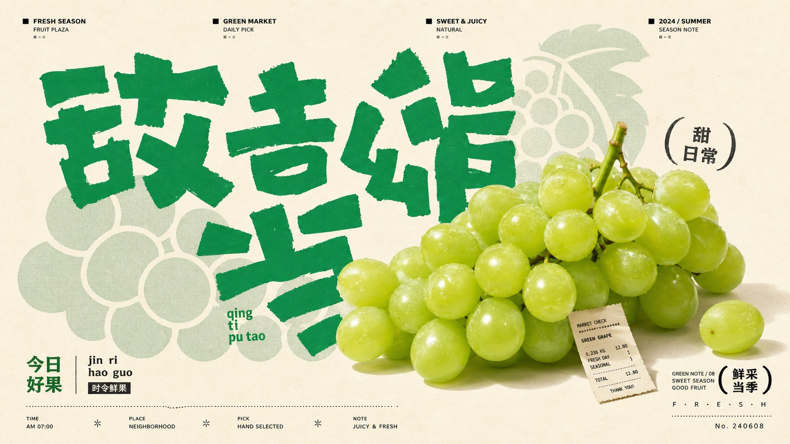</a>
<p><strong><a href="styles/jade-glyph-grocer-collage-poster-style">Jade Glyph Grocer Collage Poster Style</a></strong><br>
<em>Cream grocer posters with jade glyphs, vegetable silhouettes, and glossy produce-photo centerpieces.</em><br>
<a href="styles/jade-glyph-grocer-collage-poster-style/style.json">style.json</a> · <a href="docs/copy-prompts/jade-glyph-grocer-collage-poster-style.md">prompt</a> · <a href="styles/jade-glyph-grocer-collage-poster-style/preview-9x16.jpg">9:16</a></p>
</td>
<td width="33%" valign="top">
<a id="scarlet-court-photo-type-poster-style"></a>
<a href="styles/scarlet-court-photo-type-poster-style">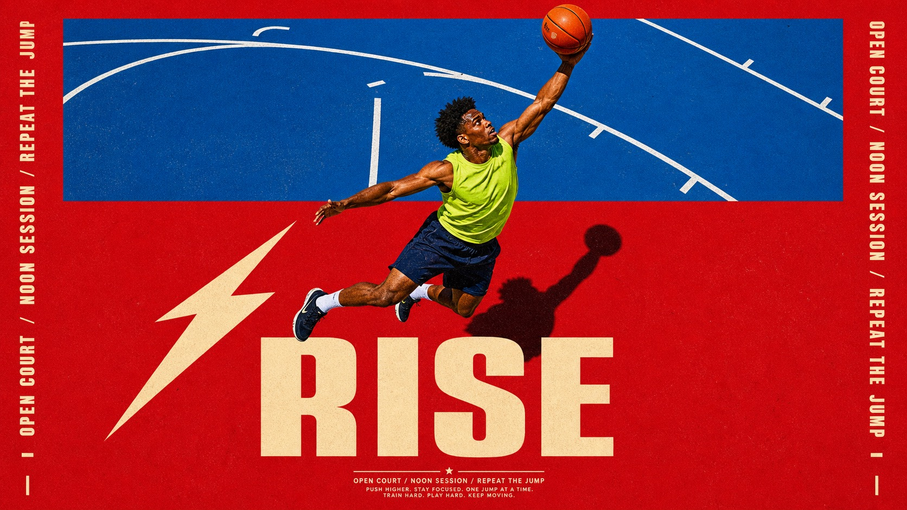</a>
<p><strong><a href="styles/scarlet-court-photo-type-poster-style">Scarlet Court Photo Type Poster</a></strong><br>
<em>Scarlet action posters with blue sports panels, cutout athletes, cream typography, and gritty print texture.</em><br>
<a href="styles/scarlet-court-photo-type-poster-style/style.json">style.json</a> · <a href="docs/copy-prompts/scarlet-court-photo-type-poster-style.md">prompt</a> · <a href="styles/scarlet-court-photo-type-poster-style/preview-9x16.jpg">9:16</a></p>
</td>
<td width="33%" valign="top">
<a id="sunlit-kinetic-block-type-photo-poster-style"></a>
<a href="styles/sunlit-kinetic-block-type-photo-poster-style">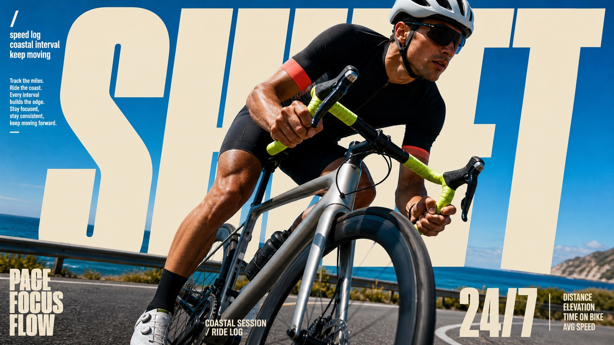</a>
<p><strong><a href="styles/sunlit-kinetic-block-type-photo-poster-style">Sunlit Kinetic Block Type Photo Poster</a></strong><br>
<em>Sunlit sports editorials with oversized cream block type, diagonal photo crops, and bright sky fields.</em><br>
<a href="styles/sunlit-kinetic-block-type-photo-poster-style/style.json">style.json</a> · <a href="docs/copy-prompts/sunlit-kinetic-block-type-photo-poster-style.md">prompt</a> · <a href="styles/sunlit-kinetic-block-type-photo-poster-style/preview-9x16.jpg">9:16</a></p>
</td>
</tr>
<tr>
<td width="33%" valign="top">
<a id="scarlet-block-cutout-doodle-book-cover-style"></a>
<a href="styles/scarlet-block-cutout-doodle-book-cover-style">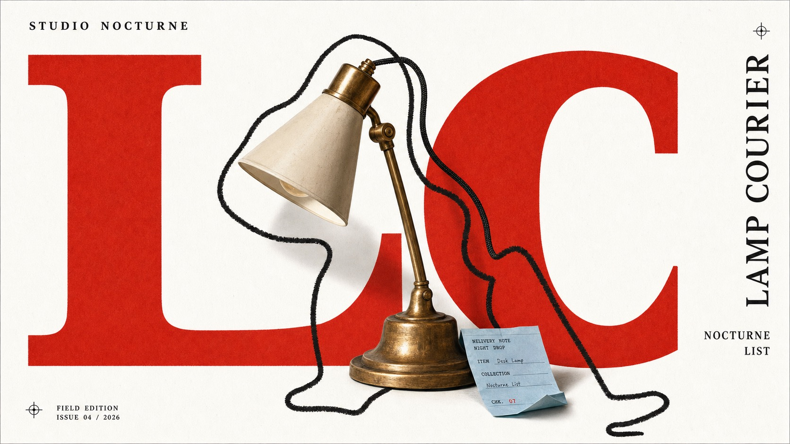</a>
<p><strong><a href="styles/scarlet-block-cutout-doodle-book-cover-style">Scarlet Block Cutout Doodle Book Cover Style</a></strong><br>
<em>Literary white-paper covers with scarlet letterforms, central cutout objects, marker contours, and asymmetrical space.</em><br>
<a href="styles/scarlet-block-cutout-doodle-book-cover-style/style.json">style.json</a> · <a href="docs/copy-prompts/scarlet-block-cutout-doodle-book-cover-style.md">prompt</a> · <a href="styles/scarlet-block-cutout-doodle-book-cover-style/preview-9x16.jpg">9:16</a></p>
</td>
<td width="33%" valign="top">
<a id="halftone-assemblage-metaphor-psa-poster-style"></a>
<a href="styles/halftone-assemblage-metaphor-psa-poster-style">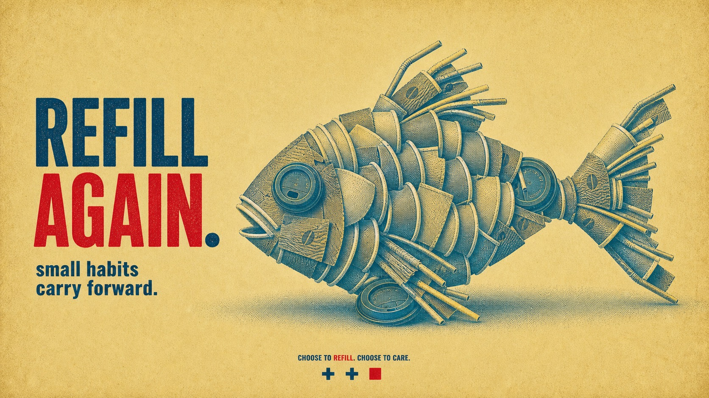</a>
<p><strong><a href="styles/halftone-assemblage-metaphor-psa-poster-style">Halftone Assemblage Metaphor PSA Poster Style</a></strong><br>
<em>復古公益海報，用日常材料拼出象徵性網點剪影，鋪在老紙張上。</em><br>
<a href="styles/halftone-assemblage-metaphor-psa-poster-style/style.json">style.json</a> · <a href="docs/copy-prompts/halftone-assemblage-metaphor-psa-poster-style.md">prompt</a> · <a href="styles/halftone-assemblage-metaphor-psa-poster-style/preview-9x16.jpg">9:16</a></p>
</td>
<td width="33%" valign="top">
<a id="school-grid-paper-cutout-poster"></a>
<a href="styles/school-grid-paper-cutout-poster">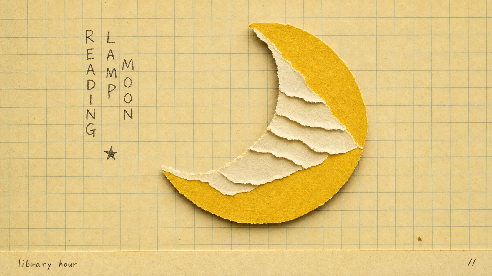</a>
<p><strong><a href="styles/school-grid-paper-cutout-poster">School Grid Paper Cutout Poster</a></strong><br>
<em>懷舊方格紙海報，撕紙剪貼物件、手寫筆記和柔和紙影。</em><br>
<a href="styles/school-grid-paper-cutout-poster/style.json">style.json</a> · <a href="docs/copy-prompts/school-grid-paper-cutout-poster.md">prompt</a> · <a href="styles/school-grid-paper-cutout-poster/preview-9x16.jpg">9:16</a></p>
</td>
</tr>
<tr>
<td width="33%" valign="top">
<a id="naive-marker-quote-card-style"></a>
<a href="styles/naive-marker-quote-card-style">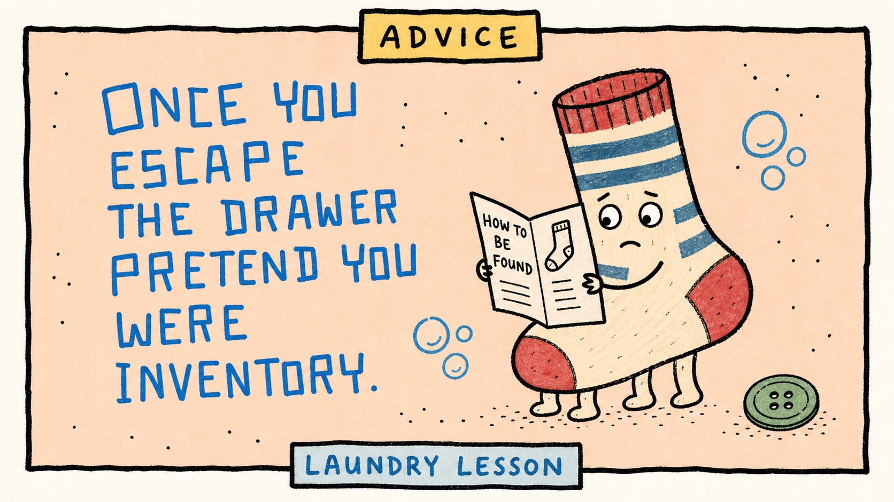</a>
<p><strong><a href="styles/naive-marker-quote-card-style">Naive Marker Quote Card Style</a></strong><br>
<em>荒誕語錄卡海報，粗麥克筆輪廓、粉彩面板、藍色塊字和物件笑點。</em><br>
<a href="styles/naive-marker-quote-card-style/style.json">style.json</a> · <a href="docs/copy-prompts/naive-marker-quote-card-style.md">prompt</a> · <a href="styles/naive-marker-quote-card-style/preview-9x16.jpg">9:16</a></p>
</td>
<td width="33%" valign="top">
<a id="sky-blue-home-life-doodle-poster-style"></a>
<a href="styles/sky-blue-home-life-doodle-poster-style">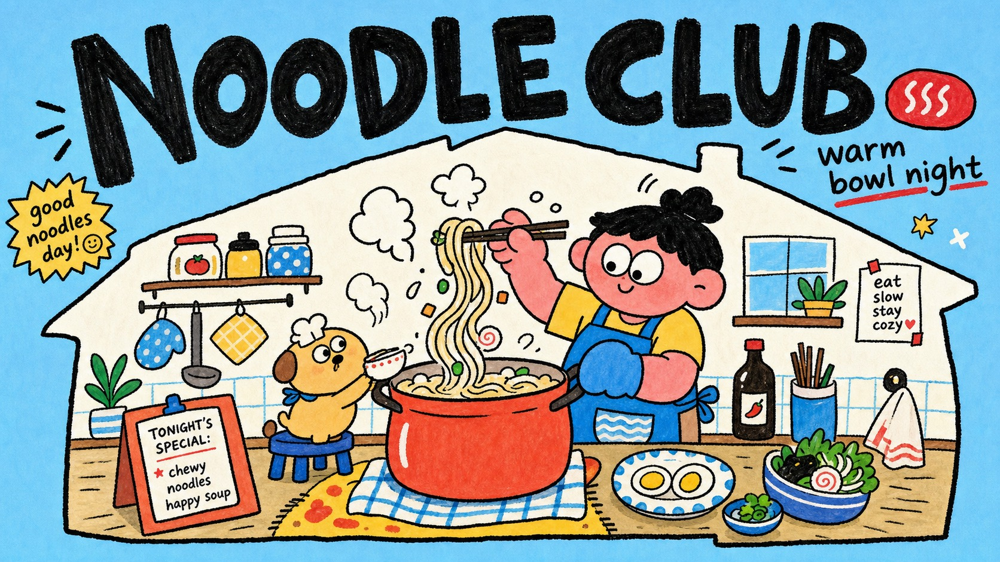</a>
<p><strong><a href="styles/sky-blue-home-life-doodle-poster-style">Sky Blue Home Life Doodle Poster Style</a></strong><br>
<em>天藍居家生活海報，房屋白框、巨大黑色手寫字、徽章和麥克筆場景。</em><br>
<a href="styles/sky-blue-home-life-doodle-poster-style/style.json">style.json</a> · <a href="docs/copy-prompts/sky-blue-home-life-doodle-poster-style.md">prompt</a> · <a href="styles/sky-blue-home-life-doodle-poster-style/preview-9x16.jpg">9:16</a></p>
</td>
<td width="33%" valign="top">
<a id="playful-marker-grounding-poster-style"></a>
<a href="styles/playful-marker-grounding-poster-style">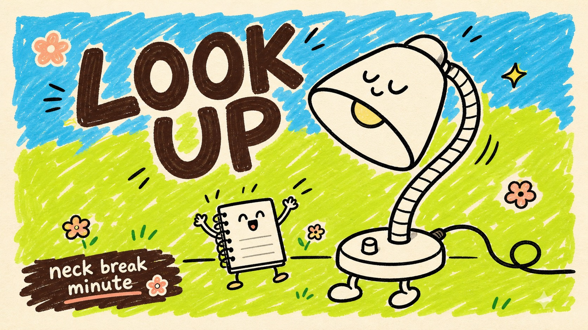</a>
<p><strong><a href="styles/playful-marker-grounding-poster-style">Playful Marker Grounding Poster Style</a></strong><br>
<em>輕快 grounding 海報，米色邊距、麥克筆色塊、粗描邊、大字和吉祥物人物。</em><br>
<a href="styles/playful-marker-grounding-poster-style/style.json">style.json</a> · <a href="docs/copy-prompts/playful-marker-grounding-poster-style.md">prompt</a> · <a href="styles/playful-marker-grounding-poster-style/preview-9x16.jpg">9:16</a></p>
</td>
</tr>
<tr>
<td width="33%" valign="top">
<a id="rough-marker-monster-poster-style"></a>
<a href="styles/rough-marker-monster-poster-style"></a>
<p><strong><a href="styles/rough-marker-monster-poster-style">Rough Marker Monster Poster Style</a></strong><br>
<em>童趣怪物海報，粗麥克筆輪廓、蠟筆色塊、米色紙紋和手寫粗字。</em><br>
<a href="styles/rough-marker-monster-poster-style/style.json">style.json</a> · <a href="docs/copy-prompts/rough-marker-monster-poster-style.md">prompt</a> · <a href="styles/rough-marker-monster-poster-style/preview-9x16.jpg">9:16</a></p>
</td>
<td width="33%" valign="top">
<a id="cyan-red-shockwave-type-poster-style"></a>
<a href="styles/cyan-red-shockwave-type-poster-style">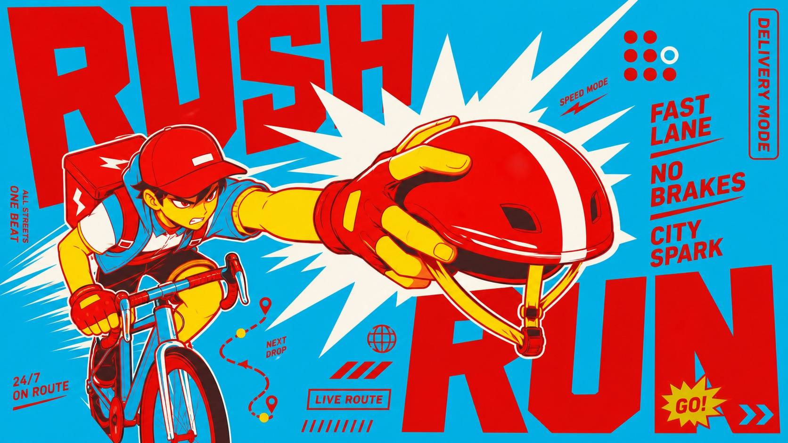</a>
<p><strong><a href="styles/cyan-red-shockwave-type-poster-style">Cyan Red Shockwave Type Poster Style</a></strong><br>
<em>青紅衝擊海報，巨大塊狀字、鋸齒衝擊波、檸檬黃人物點綴和旋轉微文案。</em><br>
<a href="styles/cyan-red-shockwave-type-poster-style/style.json">style.json</a> · <a href="docs/copy-prompts/cyan-red-shockwave-type-poster-style.md">prompt</a> · <a href="styles/cyan-red-shockwave-type-poster-style/preview-9x16.jpg">9:16</a></p>
</td>
<td width="33%" valign="top">
<a id="fantasy-scribble-mascot-poster-style"></a>
<a href="styles/fantasy-scribble-mascot-poster-style"></a>
<p><strong><a href="styles/fantasy-scribble-mascot-poster-style">Fantasy Scribble Mascot Poster Style</a></strong><br>
<em>幻想吉祥物手繪海報，螢光麥克筆色塊、搖晃大字和密集塗鴉。</em><br>
<a href="styles/fantasy-scribble-mascot-poster-style/style.json">style.json</a> · <a href="docs/copy-prompts/fantasy-scribble-mascot-poster-style.md">prompt</a> · <a href="styles/fantasy-scribble-mascot-poster-style/preview-9x16.jpg">9:16</a></p>
</td>
</tr>
<tr>
<td width="33%" valign="top">
<a id="crayon-catalog-doodle-poster-style"></a>
<a href="styles/crayon-catalog-doodle-poster-style">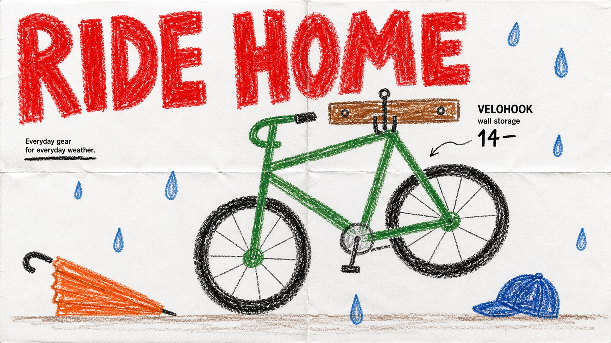</a>
<p><strong><a href="styles/crayon-catalog-doodle-poster-style">Crayon Catalog Doodle Poster Style</a></strong><br>
<em>蠟筆目錄海報，紅色手寫標題、簡單產品塗鴉和摺紙質感。</em><br>
<a href="styles/crayon-catalog-doodle-poster-style/style.json">style.json</a> · <a href="docs/copy-prompts/crayon-catalog-doodle-poster-style.md">prompt</a> · <a href="styles/crayon-catalog-doodle-poster-style/preview-9x16.jpg">9:16</a></p>
</td>
<td width="33%" valign="top">
<a id="blue-halftone-ransom-zine-poster-style"></a>
<a href="styles/blue-halftone-ransom-zine-poster-style">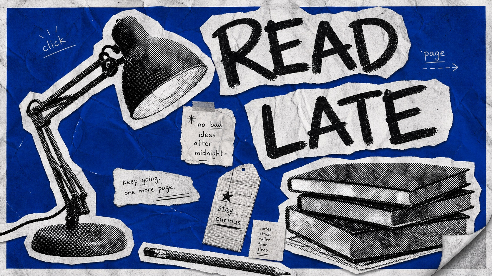</a>
<p><strong><a href="styles/blue-halftone-ransom-zine-poster-style">Blue Halftone Ransom Zine Poster Style</a></strong><br>
<em>鈷藍 ransom zine 海報，撕紙塊、半調切圖和麥克筆字。</em><br>
<a href="styles/blue-halftone-ransom-zine-poster-style/style.json">style.json</a> · <a href="docs/copy-prompts/blue-halftone-ransom-zine-poster-style.md">prompt</a> · <a href="styles/blue-halftone-ransom-zine-poster-style/preview-9x16.jpg">9:16</a></p>
</td>
<td width="33%" valign="top">
<a id="market-brush-produce-poster-style"></a>
<a href="styles/market-brush-produce-poster-style">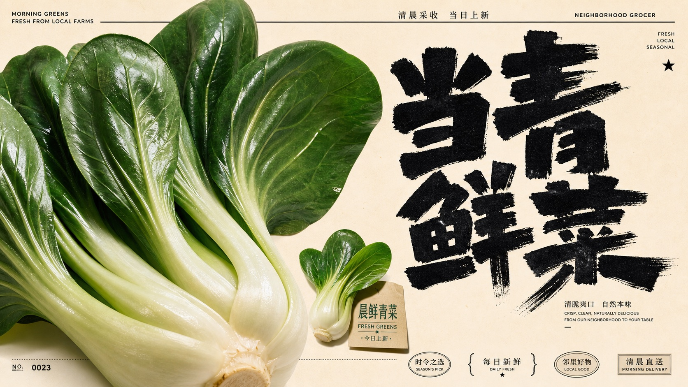</a>
<p><strong><a href="styles/market-brush-produce-poster-style">Market Brush Produce Poster Style</a></strong><br>
<em>菜市場蔬果海報，超大光澤作物、粗刷字體和象牙色紙面留白。</em><br>
<a href="styles/market-brush-produce-poster-style/style.json">style.json</a> · <a href="docs/copy-prompts/market-brush-produce-poster-style.md">prompt</a> · <a href="styles/market-brush-produce-poster-style/preview-9x16.jpg">9:16</a></p>
</td>
</tr>
<tr>
<td width="33%" valign="top">
<a id="folded-newspaper-product-ad-style"></a>
<a href="styles/folded-newspaper-product-ad-style">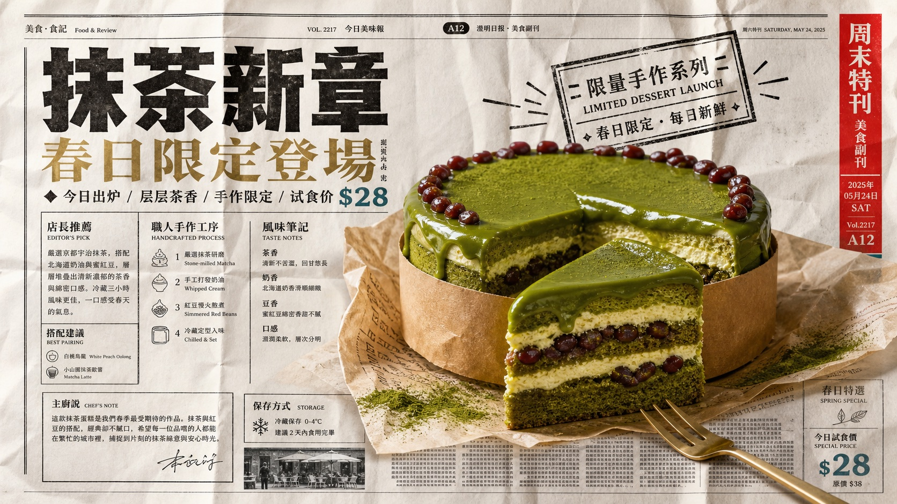</a>
<p><strong><a href="styles/folded-newspaper-product-ad-style">Folded Newspaper Product Ad Style</a></strong><br>
<em>折疊報紙廣告視覺，超大產品切圖、密集分欄、印章和古金色標題。</em><br>
<a href="styles/folded-newspaper-product-ad-style/style.json">style.json</a> · <a href="docs/copy-prompts/folded-newspaper-product-ad-style.md">prompt</a> · <a href="styles/folded-newspaper-product-ad-style/preview-9x16.jpg">9:16</a></p>
</td>
<td width="33%" valign="top">
<a id="sunlit-supermodel-nameplate-editorial"></a>
<a href="styles/sunlit-supermodel-nameplate-editorial">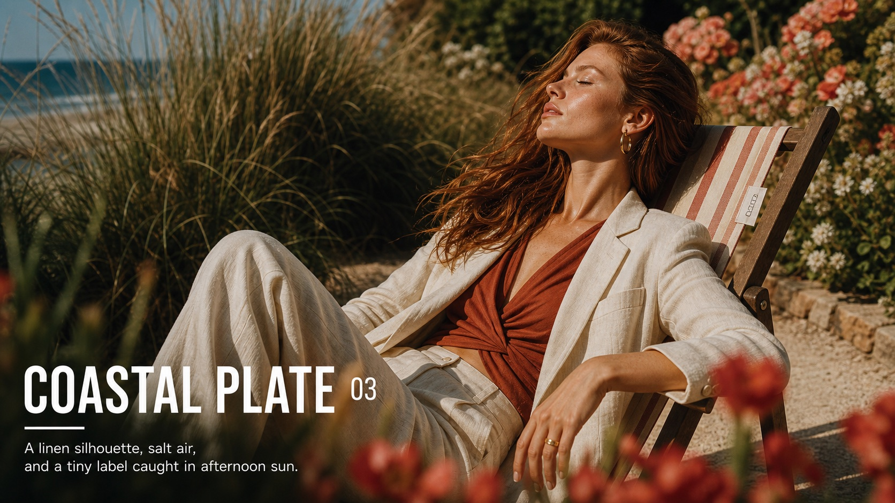</a>
<p><strong><a href="styles/sunlit-supermodel-nameplate-editorial">Sunlit Supermodel Nameplate Editorial</a></strong><br>
<em>日光超模編輯視覺，戶外質感、名牌細節和乾淨下三分之一排版。</em><br>
<a href="styles/sunlit-supermodel-nameplate-editorial/style.json">style.json</a> · <a href="docs/copy-prompts/sunlit-supermodel-nameplate-editorial.md">prompt</a> · <a href="styles/sunlit-supermodel-nameplate-editorial/preview-9x16.jpg">9:16</a></p>
</td>
<td width="33%" valign="top">
<a id="black-cutout-food-card-ad-style"></a>
<a href="styles/black-cutout-food-card-ad-style">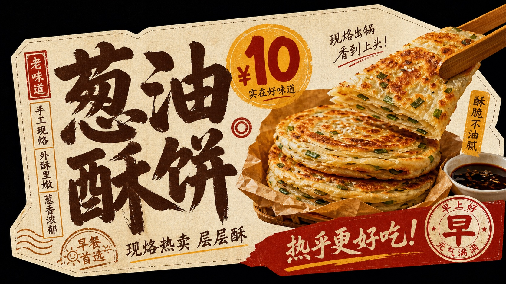</a>
<p><strong><a href="styles/black-cutout-food-card-ad-style">Black Cutout Food Card Ad</a></strong><br>
<em>黑底食物卡片廣告，手刷中文、裁切攝影和街頭小吃印刷質感。</em><br>
<a href="styles/black-cutout-food-card-ad-style/style.json">style.json</a> · <a href="docs/copy-prompts/black-cutout-food-card-ad-style.md">prompt</a> · <a href="styles/black-cutout-food-card-ad-style/preview-9x16.jpg">9:16</a></p>
</td>
</tr>
<tr>
<td width="33%" valign="top">
<a id="kinetic-geometric-doodle-cutouts"></a>
<a href="styles/kinetic-geometric-doodle-cutouts">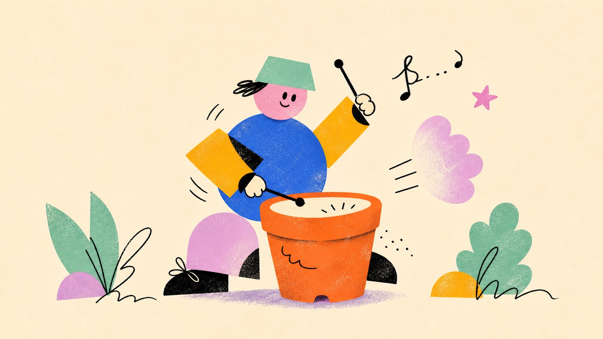</a>
<p><strong><a href="styles/kinetic-geometric-doodle-cutouts">Kinetic Geometric Doodle Cutouts</a></strong><br>
<em>幾何塗鴉切圖插畫，扁平色塊、鬆散線條和紙張顆粒。</em><br>
<a href="styles/kinetic-geometric-doodle-cutouts/style.json">style.json</a> · <a href="docs/copy-prompts/kinetic-geometric-doodle-cutouts.md">prompt</a> · <a href="styles/kinetic-geometric-doodle-cutouts/preview-9x16.jpg">9:16</a></p>
</td>
<td width="33%" valign="top">
<a id="quiet-luxury-furniture-nameplate-poster-style"></a>
<a href="styles/quiet-luxury-furniture-nameplate-poster-style">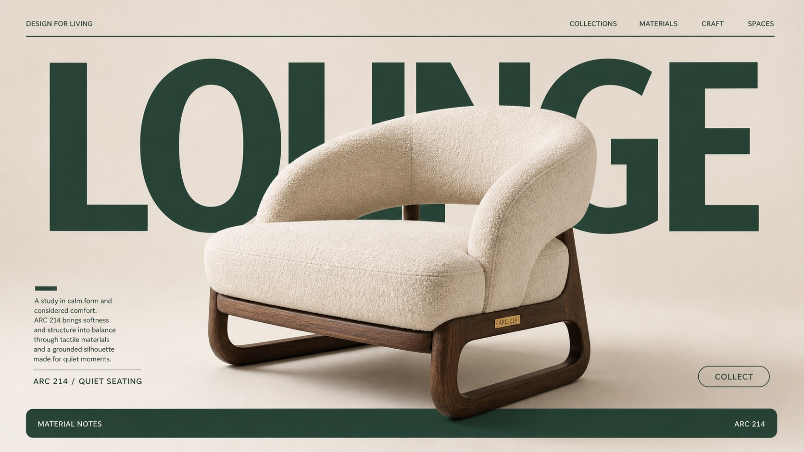</a>
<p><strong><a href="styles/quiet-luxury-furniture-nameplate-poster-style">Quiet Luxury Furniture Nameplate Poster Style</a></strong><br>
<em>靜奢家具名牌海報，森林綠大字、目錄標籤和溫暖棚拍克制感。</em><br>
<a href="styles/quiet-luxury-furniture-nameplate-poster-style/style.json">style.json</a> · <a href="docs/copy-prompts/quiet-luxury-furniture-nameplate-poster-style.md">prompt</a> · <a href="styles/quiet-luxury-furniture-nameplate-poster-style/preview-9x16.jpg">9:16</a></p>
</td>
<td width="33%" valign="top">
<a id="kinetic-luxury-street-fashion-cover-style"></a>
<a href="styles/kinetic-luxury-street-fashion-cover-style"></a>
<p><strong><a href="styles/kinetic-luxury-street-fashion-cover-style">Kinetic Luxury Street Fashion Cover Style</a></strong><br>
<em>街頭時尚封面大片，運動模糊建築、奢華服裝和寬字距襯線標題。</em><br>
<a href="styles/kinetic-luxury-street-fashion-cover-style/style.json">style.json</a> · <a href="docs/copy-prompts/kinetic-luxury-street-fashion-cover-style.md">prompt</a> · <a href="styles/kinetic-luxury-street-fashion-cover-style/preview-9x16.jpg">9:16</a></p>
</td>
</tr>
<tr>
<td width="33%" valign="top">
<a id="sunlit-architectural-fashion-editorial"></a>
<a href="styles/sunlit-architectural-fashion-editorial">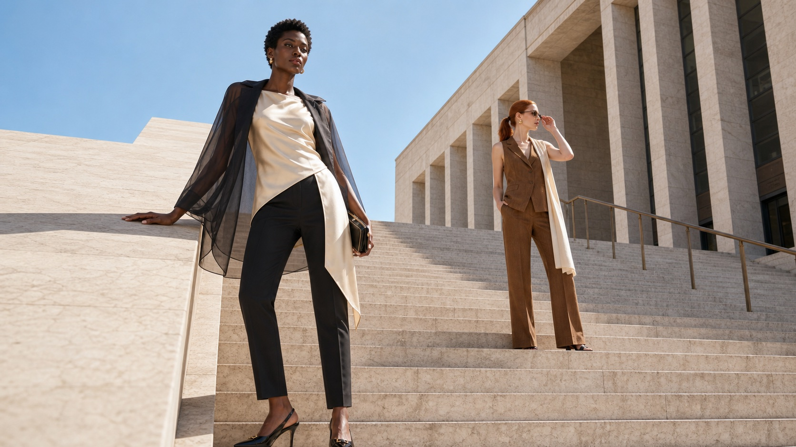</a>
<p><strong><a href="styles/sunlit-architectural-fashion-editorial">Sunlit Architectural Fashion Editorial</a></strong><br>
<em>日光建築時裝大片，低機位、溫暖石材和拉長模特輪廓。</em><br>
<a href="styles/sunlit-architectural-fashion-editorial/style.json">style.json</a> · <a href="docs/copy-prompts/sunlit-architectural-fashion-editorial.md">prompt</a> · <a href="styles/sunlit-architectural-fashion-editorial/preview-9x16.jpg">9:16</a></p>
</td>
<td width="33%" valign="top">
<a id="multi-color-beverage-splash-ad-system-style"></a>
<a href="styles/multi-color-beverage-splash-ad-system-style"></a>
<p><strong><a href="styles/multi-color-beverage-splash-ad-system-style">Multi-Color Beverage Splash Ad System Style</a></strong><br>
<em>多配色飲料發布廣告，白色 3D 大字、斜向包裝和凍結液體動勢。</em><br>
<a href="styles/multi-color-beverage-splash-ad-system-style/style.json">style.json</a> · <a href="docs/copy-prompts/multi-color-beverage-splash-ad-system-style.md">prompt</a> · <a href="styles/multi-color-beverage-splash-ad-system-style/preview-9x16.jpg">9:16</a></p>
</td>
<td width="33%" valign="top">
<a id="yellow-black-manga-food-zine-ad-style"></a>
<a href="styles/yellow-black-manga-food-zine-ad-style">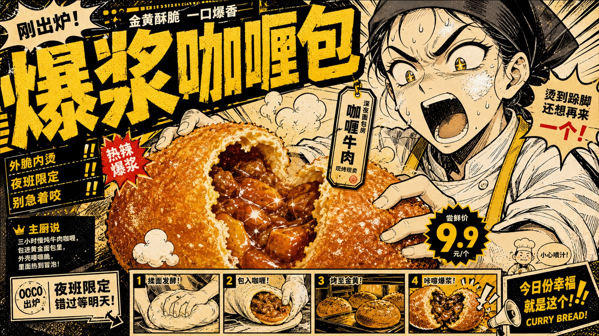</a>
<p><strong><a href="styles/yellow-black-manga-food-zine-ad-style">Yellow Black Manga Food Zine Ad Style</a></strong><br>
<em>黑黃漫畫食物 zine 廣告，變形大字、中文小字和發亮主體物。</em><br>
<a href="styles/yellow-black-manga-food-zine-ad-style/style.json">style.json</a> · <a href="docs/copy-prompts/yellow-black-manga-food-zine-ad-style.md">prompt</a> · <a href="styles/yellow-black-manga-food-zine-ad-style/preview-9x16.jpg">9:16</a></p>
</td>
</tr>
<tr>
<td width="33%" valign="top">
<a id="neon-outdoor-diary-longform-collage-style"></a>
<a href="styles/neon-outdoor-diary-longform-collage-style">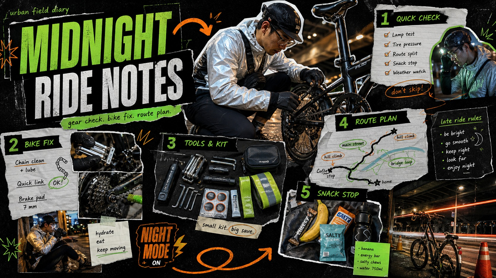</a>
<p><strong><a href="styles/neon-outdoor-diary-longform-collage-style">Neon Outdoor Diary Longform Collage Style</a></strong><br>
<em>戶外日記長圖拼貼，酸性綠標題、撕紙資訊板和紀實切圖。</em><br>
<a href="styles/neon-outdoor-diary-longform-collage-style/style.json">style.json</a> · <a href="docs/copy-prompts/neon-outdoor-diary-longform-collage-style.md">prompt</a> · <a href="styles/neon-outdoor-diary-longform-collage-style/preview-9x16.jpg">9:16</a></p>
</td>
<td width="33%" valign="top">
<a id="acid-lime-3d-streetwear-type-poster-style"></a>
<a href="styles/acid-lime-3d-streetwear-type-poster-style">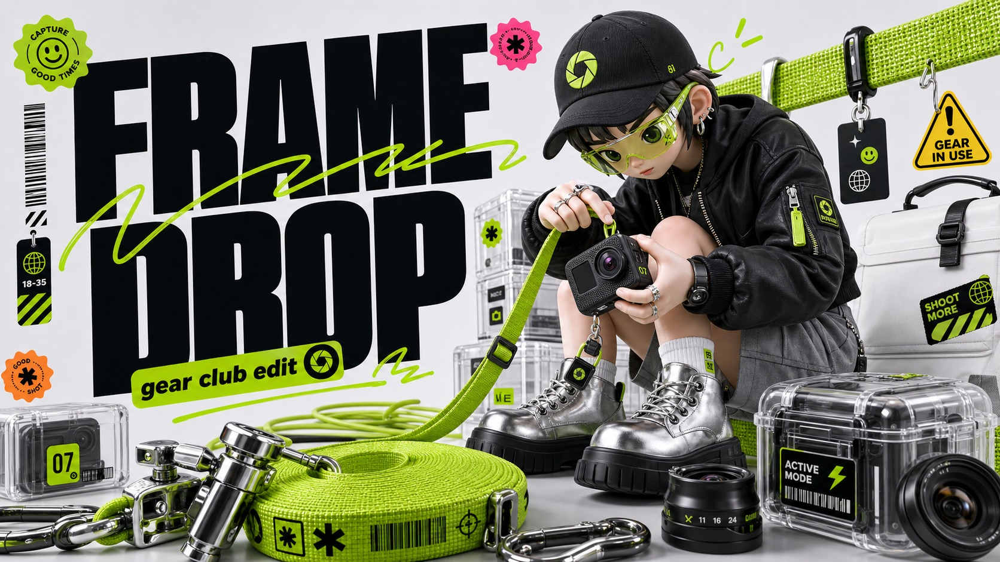</a>
<p><strong><a href="styles/acid-lime-3d-streetwear-type-poster-style">Acid Lime 3D Streetwear Type Poster Style</a></strong><br>
<em>光滑 C4D 街頭服飾活動海報，黑色塊字和酸性萊姆點綴。</em><br>
<a href="styles/acid-lime-3d-streetwear-type-poster-style/style.json">style.json</a> · <a href="docs/copy-prompts/acid-lime-3d-streetwear-type-poster-style.md">prompt</a> · <a href="styles/acid-lime-3d-streetwear-type-poster-style/preview-9x16.jpg">9:16</a></p>
</td>
<td width="33%" valign="top">
<a id="electric-blue-silhouette-product-launch-style"></a>
<a href="styles/electric-blue-silhouette-product-launch-style"></a>
<p><strong><a href="styles/electric-blue-silhouette-product-launch-style">Electric Blue Silhouette Product Launch Style</a></strong><br>
<em>黑藍高端產品發布海報，發光剪影、裁切大字和極簡發布文案。</em><br>
<a href="styles/electric-blue-silhouette-product-launch-style/style.json">style.json</a> · <a href="docs/copy-prompts/electric-blue-silhouette-product-launch-style.md">prompt</a> · <a href="styles/electric-blue-silhouette-product-launch-style/preview-9x16.jpg">9:16</a></p>
</td>
</tr>
<tr>
<td width="33%" valign="top">
<a id="luxury-perspective-checkerboard-editorial"></a>
<a href="styles/luxury-perspective-checkerboard-editorial"></a>
<p><strong><a href="styles/luxury-perspective-checkerboard-editorial">Luxury Perspective Checkerboard Editorial</a></strong><br>
<em>奢侈品編輯海報，棋盤格透視、手寫體大字和精緻留白。</em><br>
<a href="styles/luxury-perspective-checkerboard-editorial/style.json">style.json</a> · <a href="docs/copy-prompts/luxury-perspective-checkerboard-editorial.md">prompt</a> · <a href="styles/luxury-perspective-checkerboard-editorial/preview-9x16.jpg">9:16</a></p>
</td>
<td width="33%" valign="top">
<a id="sunny-3d-avatar-campaign-style"></a>
<a href="styles/sunny-3d-avatar-campaign-style"></a>
<p><strong><a href="styles/sunny-3d-avatar-campaign-style">Sunny 3D Avatar Campaign Style</a></strong><br>
<em>陽光 3D 活動海報，玩具感頭像、藍天、斜體大標題和螢光塗鴉動線。</em><br>
<a href="styles/sunny-3d-avatar-campaign-style/style.json">style.json</a> · <a href="docs/copy-prompts/sunny-3d-avatar-campaign-style.md">prompt</a> · <a href="styles/sunny-3d-avatar-campaign-style/preview-9x16.jpg">9:16</a></p>
</td>
<td width="33%" valign="top">
<a id="y2k-mirror-ui-scribble-collage-style"></a>
<a href="styles/y2k-mirror-ui-scribble-collage-style"></a>
<p><strong><a href="styles/y2k-mirror-ui-scribble-collage-style">Y2K Mirror UI Scribble Collage Style</a></strong><br>
<em>閃光燈 Y2K 拼貼，鏡面 UI 面板、電藍塗鴉線和粗糙螢幕噪點。</em><br>
<a href="styles/y2k-mirror-ui-scribble-collage-style/style.json">style.json</a> · <a href="docs/copy-prompts/y2k-mirror-ui-scribble-collage-style.md">prompt</a> · <a href="styles/y2k-mirror-ui-scribble-collage-style/preview-9x16.jpg">9:16</a></p>
</td>
</tr>
<tr>
<td width="33%" valign="top">
<a id="neon-plush-gadget-pop-3d-style"></a>
<a href="styles/neon-plush-gadget-pop-3d-style"></a>
<p><strong><a href="styles/neon-plush-gadget-pop-3d-style">Neon Plush Gadget Pop 3D Style</a></strong><br>
<em>螢光玩具產品 3D 渲染，毛絨吉祥物搭配厚重小工具道具。</em><br>
<a href="styles/neon-plush-gadget-pop-3d-style/style.json">style.json</a> · <a href="docs/copy-prompts/neon-plush-gadget-pop-3d-style.md">prompt</a> · <a href="styles/neon-plush-gadget-pop-3d-style/preview-9x16.jpg">9:16</a></p>
</td>
<td width="33%" valign="top">
<a id="blue-lime-kinetic-comic-type-poster-style"></a>
<a href="styles/blue-lime-kinetic-comic-type-poster-style">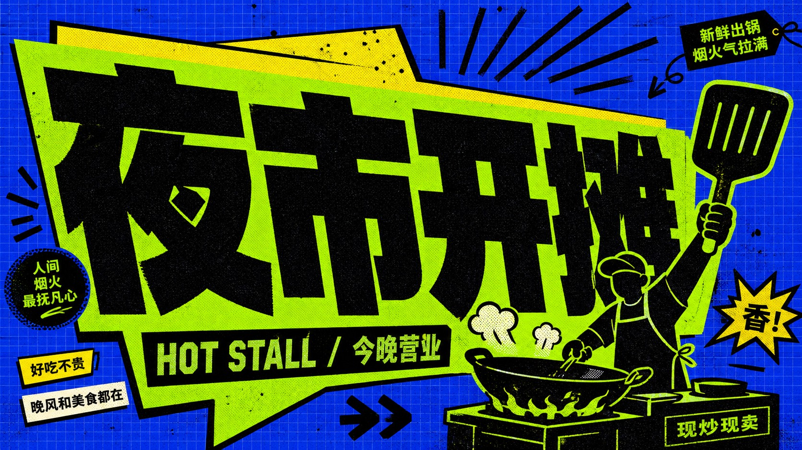</a>
<p><strong><a href="styles/blue-lime-kinetic-comic-type-poster-style">Blue Lime Kinetic Comic Type Poster Style</a></strong><br>
<em>Electric-blue comic posters with lime speech panels and massive black type.</em><br>
<a href="styles/blue-lime-kinetic-comic-type-poster-style/style.json">style.json</a> · <a href="docs/copy-prompts/blue-lime-kinetic-comic-type-poster-style.md">prompt</a> · <a href="styles/blue-lime-kinetic-comic-type-poster-style/preview-9x16.jpg">9:16</a></p>
</td>
<td width="33%" valign="top">
<a id="blue-chinese-perspective-type-canyon-style"></a>
<a href="styles/blue-chinese-perspective-type-canyon-style"></a>
<p><strong><a href="styles/blue-chinese-perspective-type-canyon-style">Blue Chinese Perspective Type Canyon Style</a></strong><br>
<em>Blue perspective corridors with stacked Chinese display type.</em><br>
<a href="styles/blue-chinese-perspective-type-canyon-style/style.json">style.json</a> · <a href="docs/copy-prompts/blue-chinese-perspective-type-canyon-style.md">prompt</a> · <a href="styles/blue-chinese-perspective-type-canyon-style/preview-9x16.jpg">9:16</a></p>
</td>
</tr>
<tr>
<td width="33%" valign="top">
<a id="rough-ink-music-doodle-poster-style"></a>
<a href="styles/rough-ink-music-doodle-poster-style"></a>
<p><strong><a href="styles/rough-ink-music-doodle-poster-style">Rough Ink Music Doodle Poster Style</a></strong><br>
<em>Hand-inked music posters with brush lettering and playful doodles.</em><br>
<a href="styles/rough-ink-music-doodle-poster-style/style.json">style.json</a> · <a href="docs/copy-prompts/rough-ink-music-doodle-poster-style.md">prompt</a> · <a href="styles/rough-ink-music-doodle-poster-style/preview-9x16.jpg">9:16</a></p>
</td>
<td width="33%" valign="top">
<a id="mono-noir-type-portrait-poster-style"></a>
<a href="styles/mono-noir-type-portrait-poster-style"></a>
<p><strong><a href="styles/mono-noir-type-portrait-poster-style">Mono Noir Type Portrait Poster Style</a></strong><br>
<em>Black-and-white editorial portraits with massive lowercase type.</em><br>
<a href="styles/mono-noir-type-portrait-poster-style/style.json">style.json</a> · <a href="docs/copy-prompts/mono-noir-type-portrait-poster-style.md">prompt</a> · <a href="styles/mono-noir-type-portrait-poster-style/preview-9x16.jpg">9:16</a></p>
</td>
<td width="33%" valign="top">
<a id="bold-block-mascot-poster-style"></a>
<a href="styles/bold-block-mascot-poster-style"></a>
<p><strong><a href="styles/bold-block-mascot-poster-style">Bold Block Mascot Poster Style</a></strong><br>
<em>Flat mascot posters with chunky block type and sticker figures.</em><br>
<a href="styles/bold-block-mascot-poster-style/style.json">style.json</a> · <a href="docs/copy-prompts/bold-block-mascot-poster-style.md">prompt</a> · <a href="styles/bold-block-mascot-poster-style/preview-9x16.jpg">9:16</a></p>
</td>
</tr>
<tr>
<td width="33%" valign="top">
<a id="blue-hud-macro-product-poster"></a>
<a href="styles/blue-hud-macro-product-poster">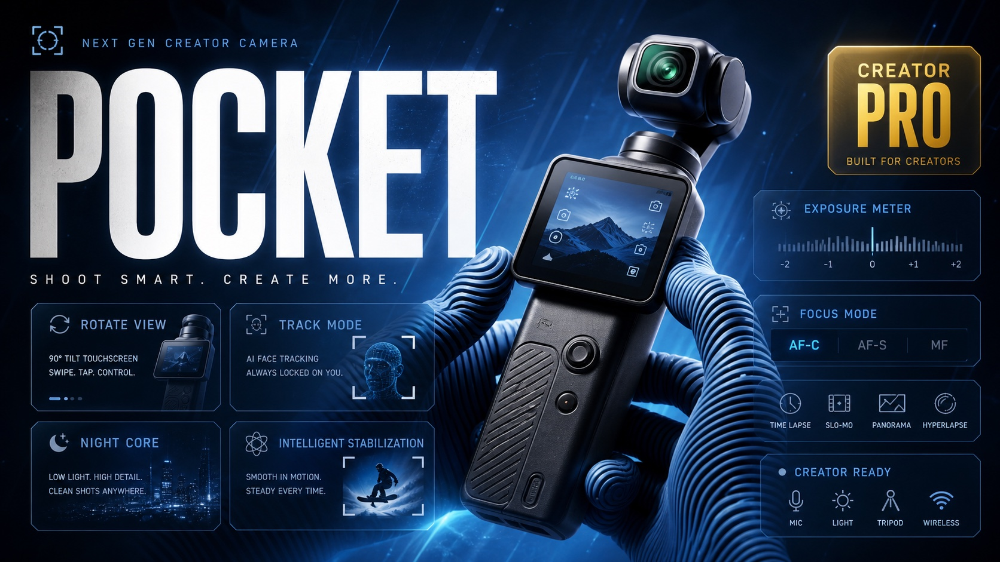</a>
<p><strong><a href="styles/blue-hud-macro-product-poster">Blue HUD Macro Creator Tech Poster</a></strong><br>
<em>Glossy macro product posters with blue HUD launch graphics.</em><br>
<a href="styles/blue-hud-macro-product-poster/style.json">style.json</a> · <a href="docs/copy-prompts/blue-hud-macro-product-poster.md">prompt</a> · <a href="styles/blue-hud-macro-product-poster/preview-9x16.jpg">9:16</a></p>
</td>
<td width="33%" valign="top">
<a id="warm-fisheye-product-impact-ad-style"></a>
<a href="styles/warm-fisheye-product-impact-ad-style">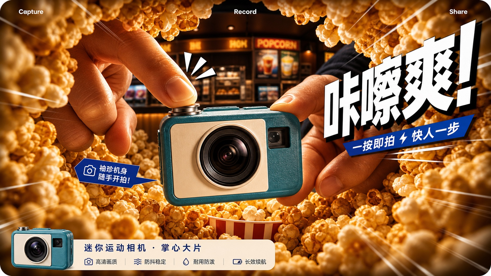</a>
<p><strong><a href="styles/warm-fisheye-product-impact-ad-style">Warm Fisheye Product Impact Ad Style</a></strong><br>
<em>Warm fisheye product ads with bold Chinese social-commerce type.</em><br>
<a href="styles/warm-fisheye-product-impact-ad-style/style.json">style.json</a> · <a href="docs/copy-prompts/warm-fisheye-product-impact-ad-style.md">prompt</a> · <a href="styles/warm-fisheye-product-impact-ad-style/preview-9x16.jpg">9:16</a></p>
</td>
<td width="33%" valign="top">
<a id="olive-scribble-sports-poster-style"></a>
<a href="styles/olive-scribble-sports-poster-style"></a>
<p><strong><a href="styles/olive-scribble-sports-poster-style">Olive Scribble Sports Poster Style</a></strong><br>
<em>Handmade sports posters with olive blocks and kinetic scribbles.</em><br>
<a href="styles/olive-scribble-sports-poster-style/style.json">style.json</a> · <a href="docs/copy-prompts/olive-scribble-sports-poster-style.md">prompt</a> · <a href="styles/olive-scribble-sports-poster-style/preview-9x16.jpg">9:16</a></p>
</td>
</tr>
<tr>
<td width="33%" valign="top">
<a id="bold-anime-reaction-thumbnail-style"></a>
<a href="styles/bold-anime-reaction-thumbnail-style">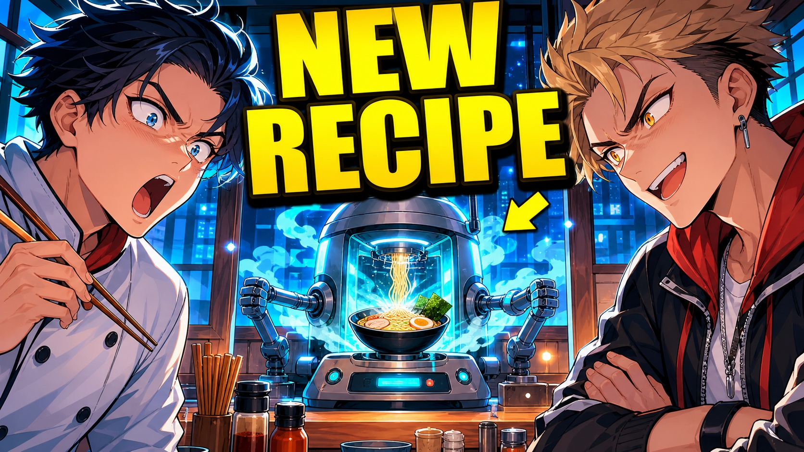</a>
<p><strong><a href="styles/bold-anime-reaction-thumbnail-style">Bold Anime Reaction Thumbnail Style</a></strong><br>
<em>High-impact anime thumbnails with bold yellow reaction typography.</em><br>
<a href="styles/bold-anime-reaction-thumbnail-style/style.json">style.json</a> · <a href="docs/copy-prompts/bold-anime-reaction-thumbnail-style.md">prompt</a> · <a href="styles/bold-anime-reaction-thumbnail-style/preview-9x16.jpg">9:16</a></p>
</td>
<td width="33%" valign="top">
<a id="turquoise-red-techno-manga-poster-style"></a>
<a href="styles/turquoise-red-techno-manga-poster-style">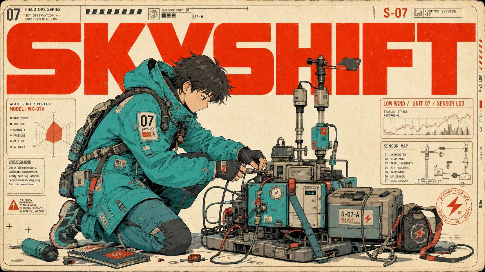</a>
<p><strong><a href="styles/turquoise-red-techno-manga-poster-style">Turquoise Red Techno Manga Poster Style</a></strong><br>
<em>Retro techno-manga posters with turquoise hardware and red lettering.</em><br>
<a href="styles/turquoise-red-techno-manga-poster-style/style.json">style.json</a> · <a href="docs/copy-prompts/turquoise-red-techno-manga-poster-style.md">prompt</a> · <a href="styles/turquoise-red-techno-manga-poster-style/preview-9x16.jpg">9:16</a></p>
</td>
<td width="33%" valign="top">
<a id="chromatic-fisheye-orbit-pop-poster-style"></a>
<a href="styles/chromatic-fisheye-orbit-pop-poster-style">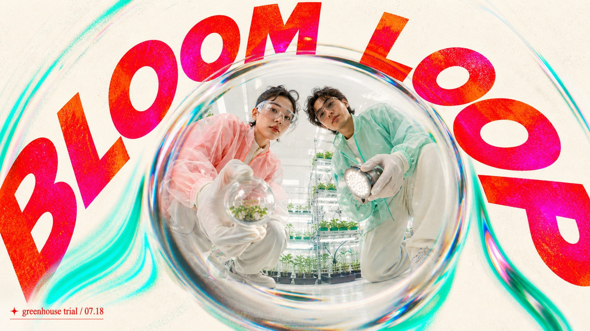</a>
<p><strong><a href="styles/chromatic-fisheye-orbit-pop-poster-style">Chromatic Fisheye Orbit Pop Poster Style</a></strong><br>
<em>Pop fisheye posters with orbiting type and chromatic arcs.</em><br>
<a href="styles/chromatic-fisheye-orbit-pop-poster-style/style.json">style.json</a> · <a href="docs/copy-prompts/chromatic-fisheye-orbit-pop-poster-style.md">prompt</a> · <a href="styles/chromatic-fisheye-orbit-pop-poster-style/preview-9x16.jpg">9:16</a></p>
</td>
</tr>
<tr>
<td width="33%" valign="top">
<a id="naive-marker-psa-poster-style"></a>
<a href="styles/naive-marker-psa-poster-style">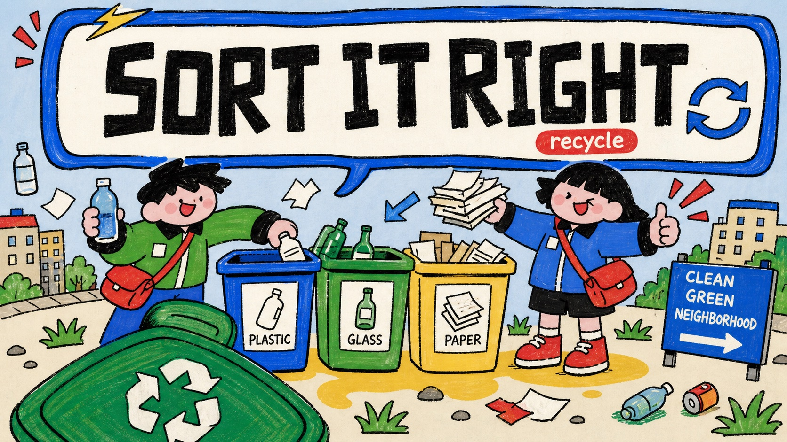</a>
<p><strong><a href="styles/naive-marker-psa-poster-style">Naive Marker PSA Poster Style</a></strong><br>
<em>Friendly civic PSA posters with naive marker drawings.</em><br>
<a href="styles/naive-marker-psa-poster-style/style.json">style.json</a> · <a href="docs/copy-prompts/naive-marker-psa-poster-style.md">prompt</a> · <a href="styles/naive-marker-psa-poster-style/preview-9x16.jpg">9:16</a></p>
</td>
<td width="33%" valign="top">
<a id="blue-bubble-fisheye-action-poster-style"></a>
<a href="styles/blue-bubble-fisheye-action-poster-style">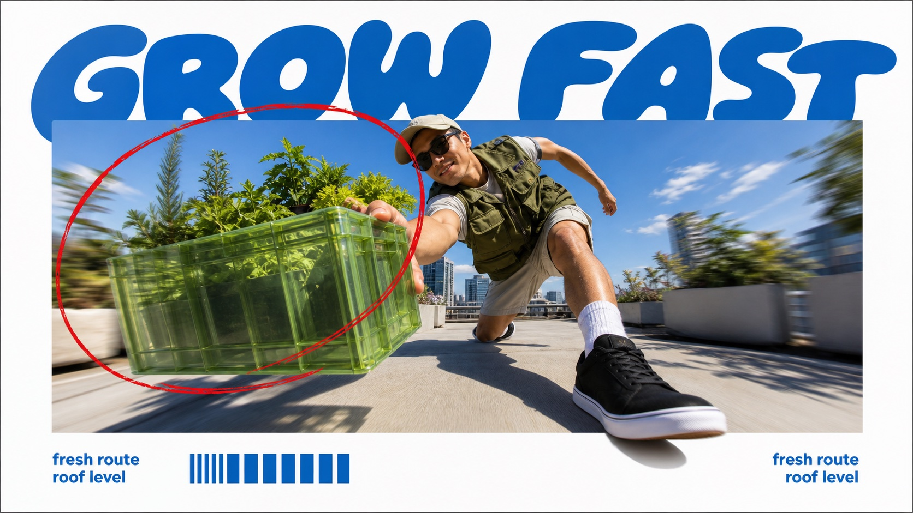</a>
<p><strong><a href="styles/blue-bubble-fisheye-action-poster-style">Blue Bubble Fisheye Action Poster Style</a></strong><br>
<em>Youth action posters with blue bubble type and fisheye photos.</em><br>
<a href="styles/blue-bubble-fisheye-action-poster-style/style.json">style.json</a> · <a href="docs/copy-prompts/blue-bubble-fisheye-action-poster-style.md">prompt</a> · <a href="styles/blue-bubble-fisheye-action-poster-style/preview-9x16.jpg">9:16</a></p>
</td>
<td width="33%" valign="top">
<a id="cozy-bedroom-doodle-companion-snapshot-style"></a>
<a href="styles/cozy-bedroom-doodle-companion-snapshot-style">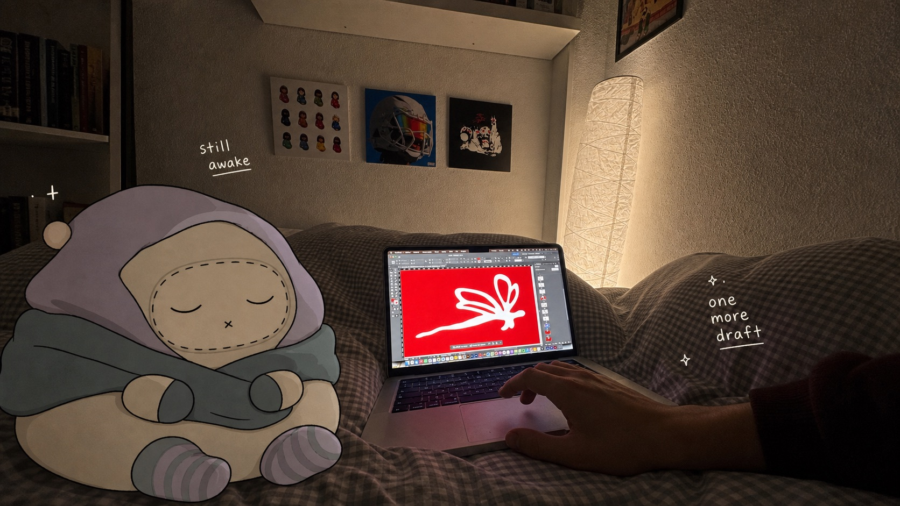</a>
<p><strong><a href="styles/cozy-bedroom-doodle-companion-snapshot-style">Cozy Bedroom Doodle Companion Snapshot Style</a></strong><br>
<em>Low-light bedroom snapshots with quiet doodle companion energy.</em><br>
<a href="styles/cozy-bedroom-doodle-companion-snapshot-style/style.json">style.json</a> · <a href="docs/copy-prompts/cozy-bedroom-doodle-companion-snapshot-style.md">prompt</a> · <a href="styles/cozy-bedroom-doodle-companion-snapshot-style/preview-9x16.jpg">9:16</a></p>
</td>
</tr>
<tr>
<td width="33%" valign="top">
<a id="surreal-fish-doodle-landmark-photo-collage-style"></a>
<a href="styles/surreal-fish-doodle-landmark-photo-collage-style">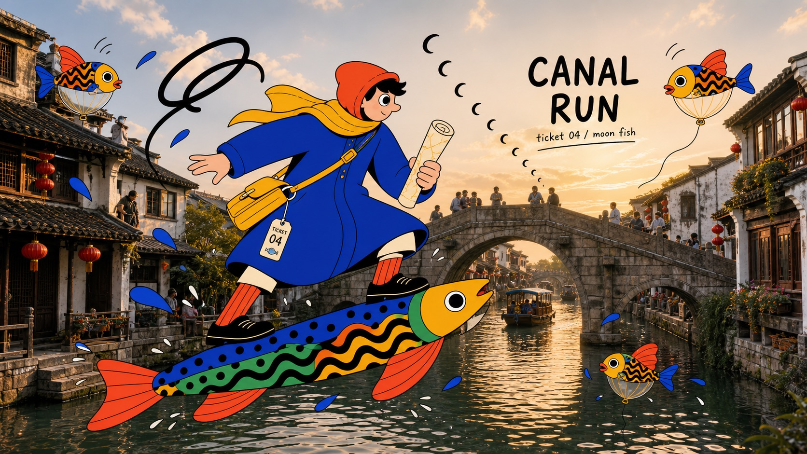</a>
<p><strong><a href="styles/surreal-fish-doodle-landmark-photo-collage-style">Surreal Fish Doodle Landmark Photo Collage Style</a></strong><br>
<em>Landmark travel photos remixed with folk-art fish doodles.</em><br>
<a href="styles/surreal-fish-doodle-landmark-photo-collage-style/style.json">style.json</a> · <a href="docs/copy-prompts/surreal-fish-doodle-landmark-photo-collage-style.md">prompt</a> · <a href="styles/surreal-fish-doodle-landmark-photo-collage-style/preview-9x16.jpg">9:16</a></p>
</td>
<td width="33%" valign="top">
<a id="plush-comic-toy-product-poster-style"></a>
<a href="styles/plush-comic-toy-product-poster-style">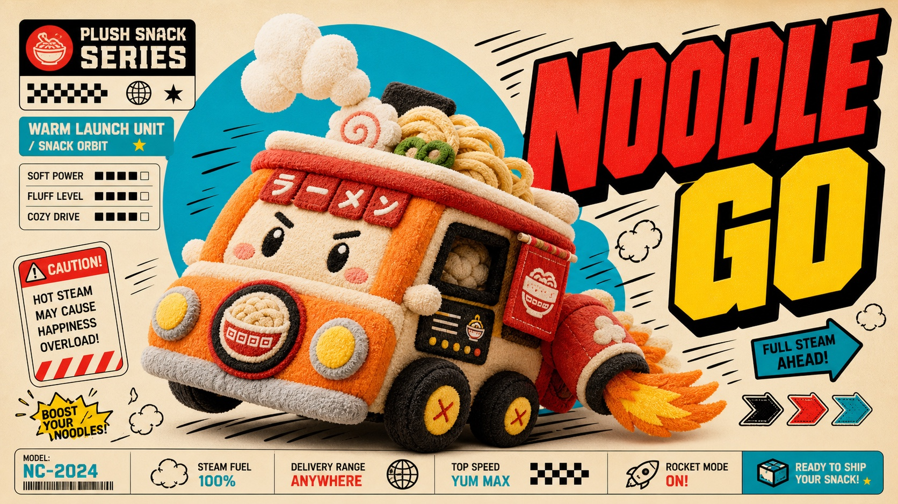</a>
<p><strong><a href="styles/plush-comic-toy-product-poster-style">Plush Comic Toy Product Poster Style</a></strong><br>
<em>Toy-product posters with fuzzy plush heroes and comic typography.</em><br>
<a href="styles/plush-comic-toy-product-poster-style/style.json">style.json</a> · <a href="docs/copy-prompts/plush-comic-toy-product-poster-style.md">prompt</a> · <a href="styles/plush-comic-toy-product-poster-style/preview-9x16.jpg">9:16</a></p>
</td>
<td width="33%" valign="top">
<a id="rough-animation-pet-sketch-storyboard-style"></a>
<a href="styles/rough-animation-pet-sketch-storyboard-style">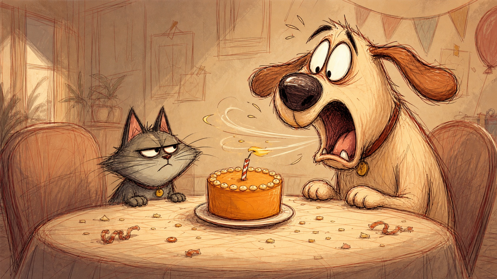</a>
<p><strong><a href="styles/rough-animation-pet-sketch-storyboard-style">Rough Animation Pet Sketch Storyboard Style</a></strong><br>
<em>Loose pet-comedy storyboard frames with warm sketch texture.</em><br>
<a href="styles/rough-animation-pet-sketch-storyboard-style/style.json">style.json</a> · <a href="docs/copy-prompts/rough-animation-pet-sketch-storyboard-style.md">prompt</a> · <a href="styles/rough-animation-pet-sketch-storyboard-style/preview-9x16.jpg">9:16</a></p>
</td>
</tr>
<tr>
<td width="33%" valign="top">
<a id="tri-color-hardcut-portrait-poster-style"></a>
<a href="styles/tri-color-hardcut-portrait-poster-style">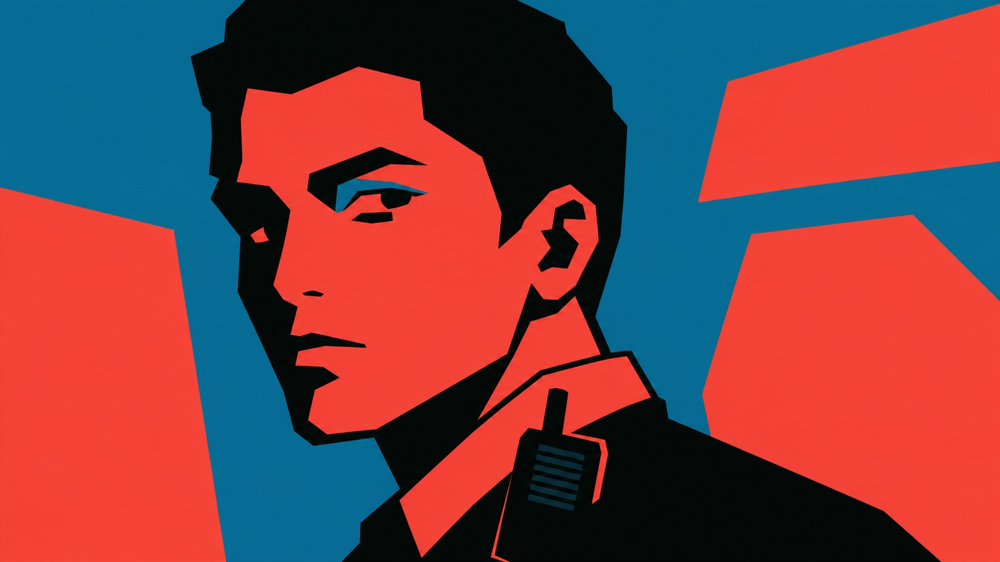</a>
<p><strong><a href="styles/tri-color-hardcut-portrait-poster-style">Tri Color Hardcut Portrait Poster Style</a></strong><br>
<em>Three-color portrait posters built from hard-edged cutout planes.</em><br>
<a href="styles/tri-color-hardcut-portrait-poster-style/style.json">style.json</a> · <a href="docs/copy-prompts/tri-color-hardcut-portrait-poster-style.md">prompt</a> · <a href="styles/tri-color-hardcut-portrait-poster-style/preview-9x16.jpg">9:16</a></p>
</td>
<td width="33%" valign="top">
<a id="clean-triptych-travel-vlog-thumbnail-style"></a>
<a href="styles/clean-triptych-travel-vlog-thumbnail-style">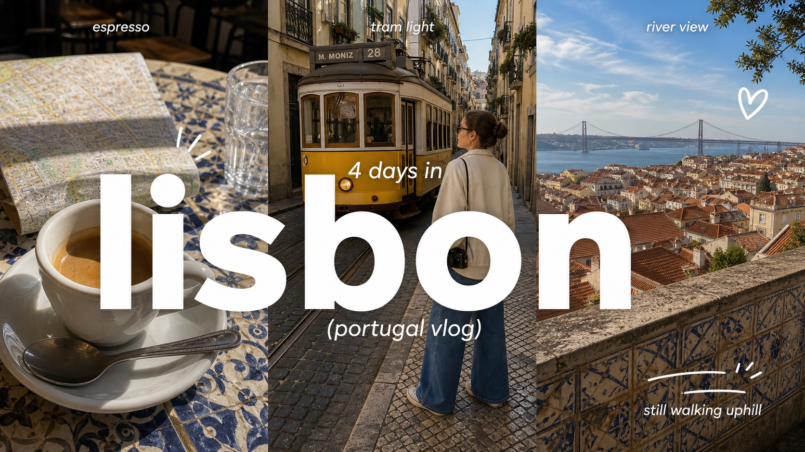</a>
<p><strong><a href="styles/clean-triptych-travel-vlog-thumbnail-style">Clean Triptych Travel Vlog Thumbnail Style</a></strong><br>
<em>Clean travel thumbnails with three photo panels and soft notes.</em><br>
<a href="styles/clean-triptych-travel-vlog-thumbnail-style/style.json">style.json</a> · <a href="docs/copy-prompts/clean-triptych-travel-vlog-thumbnail-style.md">prompt</a> · <a href="styles/clean-triptych-travel-vlog-thumbnail-style/preview-9x16.jpg">9:16</a></p>
</td>
<td width="33%" valign="top">
<a id="playful-mascot-doodle-snapshot-style"></a>
<a href="styles/playful-mascot-doodle-snapshot-style"></a>
<p><strong><a href="styles/playful-mascot-doodle-snapshot-style">Playful Mascot Doodle Snapshot Style</a></strong><br>
<em>Real-life snapshots layered with mascot stickers and doodles.</em><br>
<a href="styles/playful-mascot-doodle-snapshot-style/style.json">style.json</a> · <a href="docs/copy-prompts/playful-mascot-doodle-snapshot-style.md">prompt</a> · <a href="styles/playful-mascot-doodle-snapshot-style/preview-9x16.jpg">9:16</a></p>
</td>
</tr>
<tr>
<td width="33%" valign="top">
<a id="teenage-skate-scribble-screenprint-poster-style"></a>
<a href="styles/teenage-skate-scribble-screenprint-poster-style"></a>
<p><strong><a href="styles/teenage-skate-scribble-screenprint-poster-style">Teenage Skate Scribble Screenprint Poster Style</a></strong><br>
<em>Retro skate posters with scribbled borders and screenprint grit.</em><br>
<a href="styles/teenage-skate-scribble-screenprint-poster-style/style.json">style.json</a> · <a href="docs/copy-prompts/teenage-skate-scribble-screenprint-poster-style.md">prompt</a> · <a href="styles/teenage-skate-scribble-screenprint-poster-style/preview-9x16.jpg">9:16</a></p>
</td>
<td width="33%" valign="top">
<a id="impact-burst-halftone-comic-poster-style"></a>
<a href="styles/impact-burst-halftone-comic-poster-style"></a>
<p><strong><a href="styles/impact-burst-halftone-comic-poster-style">Impact Burst Halftone Comic Poster Style</a></strong><br>
<em>Loud comic posters with impact type and halftone bursts.</em><br>
<a href="styles/impact-burst-halftone-comic-poster-style/style.json">style.json</a> · <a href="docs/copy-prompts/impact-burst-halftone-comic-poster-style.md">prompt</a> · <a href="styles/impact-burst-halftone-comic-poster-style/preview-9x16.jpg">9:16</a></p>
</td>
<td width="33%" valign="top">
<a id="sunburst-fisheye-bubble-type-poster-style"></a>
<a href="styles/sunburst-fisheye-bubble-type-poster-style"></a>
<p><strong><a href="styles/sunburst-fisheye-bubble-type-poster-style">Sunburst Fisheye Bubble Type Poster Style</a></strong><br>
<em>Summer fisheye posters with sunny bubble typography.</em><br>
<a href="styles/sunburst-fisheye-bubble-type-poster-style/style.json">style.json</a> · <a href="docs/copy-prompts/sunburst-fisheye-bubble-type-poster-style.md">prompt</a> · <a href="styles/sunburst-fisheye-bubble-type-poster-style/preview-9x16.jpg">9:16</a></p>
</td>
</tr>
<tr>
<td width="33%" valign="top">
<a id="backseat-transit-doodle-letter-poster-style"></a>
<a href="styles/backseat-transit-doodle-letter-poster-style"></a>
<p><strong><a href="styles/backseat-transit-doodle-letter-poster-style">Backseat Transit Doodle Letter Poster Style</a></strong><br>
<em>Transit photos turned into energetic hand-lettered travel posters.</em><br>
<a href="styles/backseat-transit-doodle-letter-poster-style/style.json">style.json</a> · <a href="docs/copy-prompts/backseat-transit-doodle-letter-poster-style.md">prompt</a> · <a href="styles/backseat-transit-doodle-letter-poster-style/preview-9x16.jpg">9:16</a></p>
</td>
<td width="33%" valign="top">
<a id="analog-sticker-diary-portrait-poster-style"></a>
<a href="styles/analog-sticker-diary-portrait-poster-style"></a>
<p><strong><a href="styles/analog-sticker-diary-portrait-poster-style">Analog Sticker Diary Portrait Poster Style</a></strong><br>
<em>Nostalgic diary portraits with stickers and distressed lettering.</em><br>
<a href="styles/analog-sticker-diary-portrait-poster-style/style.json">style.json</a> · <a href="docs/copy-prompts/analog-sticker-diary-portrait-poster-style.md">prompt</a> · <a href="styles/analog-sticker-diary-portrait-poster-style/preview-9x16.jpg">9:16</a></p>
</td>
<td width="33%" valign="top">
<a id="folded-diamond-perspective-type-poster-style"></a>
<a href="styles/folded-diamond-perspective-type-poster-style"></a>
<p><strong><a href="styles/folded-diamond-perspective-type-poster-style">Folded Diamond Perspective Type Poster Style</a></strong><br>
<em>Minimal diamond-aperture posters with folded perspective typography.</em><br>
<a href="styles/folded-diamond-perspective-type-poster-style/style.json">style.json</a> · <a href="docs/copy-prompts/folded-diamond-perspective-type-poster-style.md">prompt</a> · <a href="styles/folded-diamond-perspective-type-poster-style/preview-9x16.jpg">9:16</a></p>
</td>
</tr>
<tr>
<td width="33%" valign="top">
<a id="gothic-cat-doodle-photo-collage-style"></a>
<a href="styles/gothic-cat-doodle-photo-collage-style"></a>
<p><strong><a href="styles/gothic-cat-doodle-photo-collage-style">Gothic Cat Doodle Photo Collage Style</a></strong><br>
<em>Dramatic architecture photos with playful cartoon creature overlays.</em><br>
<a href="styles/gothic-cat-doodle-photo-collage-style/style.json">style.json</a> · <a href="docs/copy-prompts/gothic-cat-doodle-photo-collage-style.md">prompt</a> · <a href="styles/gothic-cat-doodle-photo-collage-style/preview-9x16.jpg">9:16</a></p>
</td>
<td width="33%" valign="top">
<a id="k-pop-apocalypse-ransom-zine-style"></a>
<a href="styles/k-pop-apocalypse-ransom-zine-style"></a>
<p><strong><a href="styles/k-pop-apocalypse-ransom-zine-style">K-Pop Apocalypse Ransom Zine Style</a></strong><br>
<em>Maximal K-pop zines with ransom type and sticker blocks.</em><br>
<a href="styles/k-pop-apocalypse-ransom-zine-style/style.json">style.json</a> · <a href="docs/copy-prompts/k-pop-apocalypse-ransom-zine-style.md">prompt</a> · <a href="styles/k-pop-apocalypse-ransom-zine-style/preview-9x16.jpg">9:16</a></p>
</td>
<td width="33%" valign="top">
<a id="metro-doodle-snapshot-diary-style"></a>
<a href="styles/metro-doodle-snapshot-diary-style"></a>
<p><strong><a href="styles/metro-doodle-snapshot-diary-style">Metro Doodle Snapshot Diary</a></strong><br>
<em>Crowded transit snapshots layered with marker doodles and oversized comic faces.</em><br>
<a href="styles/metro-doodle-snapshot-diary-style/style.json">style.json</a> · <a href="docs/copy-prompts/metro-doodle-snapshot-diary-style.md">prompt</a> · <a href="styles/metro-doodle-snapshot-diary-style/preview-9x16.jpg">9:16</a></p>
</td>
</tr>
<tr>
<td width="33%" valign="top">
<a id="mountain-trail-monster-doodle-poster-style"></a>
<a href="styles/mountain-trail-monster-doodle-poster-style"></a>
<p><strong><a href="styles/mountain-trail-monster-doodle-poster-style">Mountain Trail Monster Doodle Poster Style</a></strong><br>
<em>Outdoor hiking photos remixed with monster companions and annotations.</em><br>
<a href="styles/mountain-trail-monster-doodle-poster-style/style.json">style.json</a> · <a href="docs/copy-prompts/mountain-trail-monster-doodle-poster-style.md">prompt</a> · <a href="styles/mountain-trail-monster-doodle-poster-style/preview-9x16.jpg">9:16</a></p>
</td>
<td width="33%" valign="top">
<a id="neon-doodle-gallery-snapshot-style"></a>
<a href="styles/neon-doodle-gallery-snapshot-style"></a>
<p><strong><a href="styles/neon-doodle-gallery-snapshot-style">Neon Doodle Gallery Snapshot</a></strong><br>
<em>Phone photos covered in hot neon diary doodles.</em><br>
<a href="styles/neon-doodle-gallery-snapshot-style/style.json">style.json</a> · <a href="docs/copy-prompts/neon-doodle-gallery-snapshot-style.md">prompt</a> · <a href="styles/neon-doodle-gallery-snapshot-style/preview-9x16.jpg">9:16</a></p>
</td>
<td width="33%" valign="top">
<a id="neon-kinetic-typographic-poster-style"></a>
<a href="styles/neon-kinetic-typographic-poster-style"></a>
<p><strong><a href="styles/neon-kinetic-typographic-poster-style">Neon Kinetic Typographic Poster</a></strong><br>
<em>Outdoor editorial posters with warped neon kinetic typography.</em><br>
<a href="styles/neon-kinetic-typographic-poster-style/style.json">style.json</a> · <a href="docs/copy-prompts/neon-kinetic-typographic-poster-style.md">prompt</a> · <a href="styles/neon-kinetic-typographic-poster-style/preview-9x16.jpg">9:16</a></p>
</td>
</tr>
<tr>
<td width="33%" valign="top">
<a id="orange-brush-mascot-action-poster-style"></a>
<a href="styles/orange-brush-mascot-action-poster-style"></a>
<p><strong><a href="styles/orange-brush-mascot-action-poster-style">Orange Brush Mascot Action Poster Style</a></strong><br>
<em>Sparse mascot illustrations with orange brush texture and print grain.</em><br>
<a href="styles/orange-brush-mascot-action-poster-style/style.json">style.json</a> · <a href="docs/copy-prompts/orange-brush-mascot-action-poster-style.md">prompt</a> · <a href="styles/orange-brush-mascot-action-poster-style/preview-9x16.jpg">9:16</a></p>
</td>
<td width="33%" valign="top">
<a id="photo-illustration-overlay-poster-style"></a>
<a href="styles/photo-illustration-overlay-poster-style"></a>
<p><strong><a href="styles/photo-illustration-overlay-poster-style">Photo Illustration Overlay Poster</a></strong><br>
<em>City photos composited with saturated 2D character overlays.</em><br>
<a href="styles/photo-illustration-overlay-poster-style/style.json">style.json</a> · <a href="docs/copy-prompts/photo-illustration-overlay-poster-style.md">prompt</a> · <a href="styles/photo-illustration-overlay-poster-style/preview-9x16.jpg">9:16</a></p>
</td>
<td width="33%" valign="top">
<a id="plush-city-festival-mobile-poster-style"></a>
<a href="styles/plush-city-festival-mobile-poster-style"></a>
<p><strong><a href="styles/plush-city-festival-mobile-poster-style">Plush City Festival Mobile Poster</a></strong><br>
<em>Mobile city-event posters with fuzzy mascots and app-card framing.</em><br>
<a href="styles/plush-city-festival-mobile-poster-style/style.json">style.json</a> · <a href="docs/copy-prompts/plush-city-festival-mobile-poster-style.md">prompt</a> · <a href="styles/plush-city-festival-mobile-poster-style/preview-9x16.jpg">9:16</a></p>
</td>
</tr>
<tr>
<td width="33%" valign="top">
<a id="pop-bubble-letter-photo-poster-style"></a>
<a href="styles/pop-bubble-letter-photo-poster-style"></a>
<p><strong><a href="styles/pop-bubble-letter-photo-poster-style">Pop Bubble Letter Photo Poster Style</a></strong><br>
<em>Fashion photo posters framed by candy-colored bubble letters.</em><br>
<a href="styles/pop-bubble-letter-photo-poster-style/style.json">style.json</a> · <a href="docs/copy-prompts/pop-bubble-letter-photo-poster-style.md">prompt</a> · <a href="styles/pop-bubble-letter-photo-poster-style/preview-9x16.jpg">9:16</a></p>
</td>
<td width="33%" valign="top">
<a id="soft-analog-future-editorial-poster-style"></a>
<a href="styles/soft-analog-future-editorial-poster-style"></a>
<p><strong><a href="styles/soft-analog-future-editorial-poster-style">Soft Analog Future Editorial Poster</a></strong><br>
<em>Quiet analog-future editorials with grids and retro technology.</em><br>
<a href="styles/soft-analog-future-editorial-poster-style/style.json">style.json</a> · <a href="docs/copy-prompts/soft-analog-future-editorial-poster-style.md">prompt</a> · <a href="styles/soft-analog-future-editorial-poster-style/preview-9x16.jpg">9:16</a></p>
</td>
<td width="33%" valign="top">
<a id="subway-doodle-photo-hybrid-style"></a>
<a href="styles/subway-doodle-photo-hybrid-style"></a>
<p><strong><a href="styles/subway-doodle-photo-hybrid-style">Subway Doodle Photo Hybrid</a></strong><br>
<em>Subway photos overlaid with social-media-style cartoon doodles and handwritten notes.</em><br>
<a href="styles/subway-doodle-photo-hybrid-style/style.json">style.json</a> · <a href="docs/copy-prompts/subway-doodle-photo-hybrid-style.md">prompt</a> · <a href="styles/subway-doodle-photo-hybrid-style/preview-9x16.jpg">9:16</a></p>
</td>
</tr>
<tr>
<td width="33%" valign="top">
<a id="tokyo-kawaii-travel-collage-poster-style"></a>
<a href="styles/tokyo-kawaii-travel-collage-poster-style"></a>
<p><strong><a href="styles/tokyo-kawaii-travel-collage-poster-style">Tokyo Kawaii Travel Collage Poster</a></strong><br>
<em>Maximal Tokyo travel collages with manga bubbles and stickers.</em><br>
<a href="styles/tokyo-kawaii-travel-collage-poster-style/style.json">style.json</a> · <a href="docs/copy-prompts/tokyo-kawaii-travel-collage-poster-style.md">prompt</a> · <a href="styles/tokyo-kawaii-travel-collage-poster-style/preview-9x16.jpg">9:16</a></p>
</td>
<td width="33%" valign="top">
<a id="urban-transit-doodle-diary-style"></a>
<a href="styles/urban-transit-doodle-diary-style"></a>
<p><strong><a href="styles/urban-transit-doodle-diary-style">Urban Transit Doodle Diary Style</a></strong><br>
<em>Public-space photos remixed with bold foreground gestures and travel diary notes.</em><br>
<a href="styles/urban-transit-doodle-diary-style/style.json">style.json</a> · <a href="docs/copy-prompts/urban-transit-doodle-diary-style.md">prompt</a> · <a href="styles/urban-transit-doodle-diary-style/preview-9x16.jpg">9:16</a></p>
</td>
<td width="33%" valign="top">
<a id="y2k-grunge-hiphop-cutout-poster-style"></a>
<a href="styles/y2k-grunge-hiphop-cutout-poster-style"></a>
<p><strong><a href="styles/y2k-grunge-hiphop-cutout-poster-style">Y2K Grunge Hip-Hop Cutout Poster Style</a></strong><br>
<em>Y2K hip-hop collage posters with acid type and photocopy grit.</em><br>
<a href="styles/y2k-grunge-hiphop-cutout-poster-style/style.json">style.json</a> · <a href="docs/copy-prompts/y2k-grunge-hiphop-cutout-poster-style.md">prompt</a> · <a href="styles/y2k-grunge-hiphop-cutout-poster-style/preview-9x16.jpg">9:16</a></p>
</td>
</tr>
</table>

## 發布規則

- 一個目錄 = 一種風格
- 新風格會優先出現在精選風格和 All Styles 畫廊中，完整描述同步添加到 [docs/CATALOG.md](docs/CATALOG.md)
- main 分支只放每個風格的 `style.json` 和兩張預覽 JPG
- 完整圖庫不放在這個倉庫中
- 不發布原始參考圖、水印圖、平台標識、QR code、帳號資訊、私有提示詞，或未經授權的品牌素材

## Contributing

提交新風格時，請遵循 [CONTRIBUTING.md](CONTRIBUTING.md) 中的公開包結構、校驗規則和 PR checklist。

## 授權

倉庫結構和文件採用 MIT。每個 `style.json` 會聲明自己的授權方式。預覽圖僅作為視覺參考隨倉庫展示。
