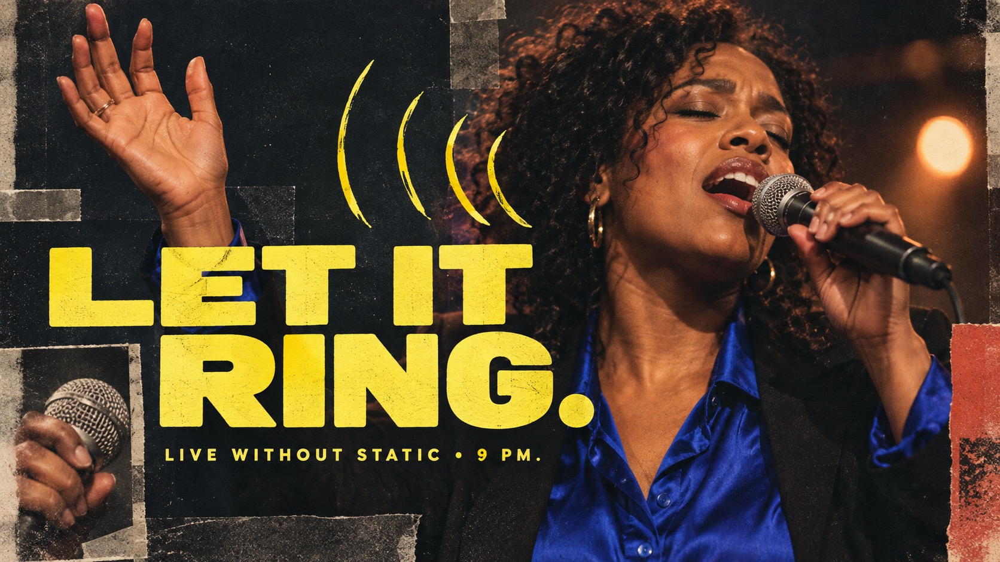

# Acid Jolt Portrait Collage



A punchy portrait-poster system mixing warm, low-fi close-up photography, blunt photo-fragment inserts, massive lemon-yellow rounded lettering, and loose marker signals against dark, quiet fields.

## Copy Prompt

Default case: `voice-carries`

```text
Use the "Acid Jolt Portrait Collage" visual style as the locked style.

Create a 16:9 image.

Subject: a charismatic Black woman vocalist in her early thirties
Action: singing with eyes closed, one hand lifted as if feeling the note leave her body
Prop / product: a plain handheld stage microphone with no logo
Location: [your Dark quiet field behind the portrait]
Background: [your Loose marker signals and blunt photo-fragment inserts]
Main text: LET IT RING
Secondary text: LIVE WITHOUT STATIC • 9 PM
Accent symbol: [your Massive lemon-yellow rounded lettering]
Styling: a vivid cobalt satin shirt under a simple dark jacket, no jewelry with visible branding

Style direction:
A punchy portrait-poster system mixing warm, low-fi close-up photography, blunt photo-fragment
inserts, massive lemon-yellow rounded lettering, and loose marker signals against dark, quiet
fields.

Keep visible:
- [CORE] Build the image around a large, close, warm-toned photographic portrait or human detail, with realistic peach, coral, and brown skin against a much darker, muted field.
- [CORE] Use a small number of deliberately blunt rectangular or trapezoid photo fragments, visibly layered across or beside the main photo; the inserts may isolate a face detail, hand, clothing, or case-relevant prop without repeating one fixed anatomy layout.
- [CORE] Make one short all-caps headline visually dominant in thick, rounded, tightly spaced sans-serif letters, usually lemon or acid yellow; let the type press into the photo layers while keeping the complete wording readable.
- [CORE] Hold a stark warm-light / dark-field / acid-yellow contrast, with yellow reserved for the headline and a few hand-drawn graphic accents.
- [CORE] Add one or two loose, hand-marked yellow strokes or simple signals that interact with the subject's gesture or theme; keep them irregular and editorial, not a dense technical interface.

Avoid:
the source person's identity, POP, original footer text, duplicated eye strips, polygon mouth
crop, exact source layout, exact upper-left zigzag, repeated face-centered template, unreadable
headline, misspelled required text, extra pseudo-copy, obscured action, obscured essential prop,
brand mark, watermark, QR code, app interface, dense technical rails, monochrome-only treatment,
clean vector-only poster, glossy 3D render, luxury beauty advertising, heavy grunge, random
glitch effects, rainbow palette, unrelated props

Do not copy source content, real logos, watermarks, platform UI, QR codes, or exact
reference layouts. Keep the visual system, but change the subject, text, and scene.
```

## Full Style

- [Open style.json](../../styles/acid-jolt-photo-collage/style.json)
- [Open style folder](../../styles/acid-jolt-photo-collage/)

<!-- Generated by scripts/generate-copy-prompts.py. Do not edit manually. -->
