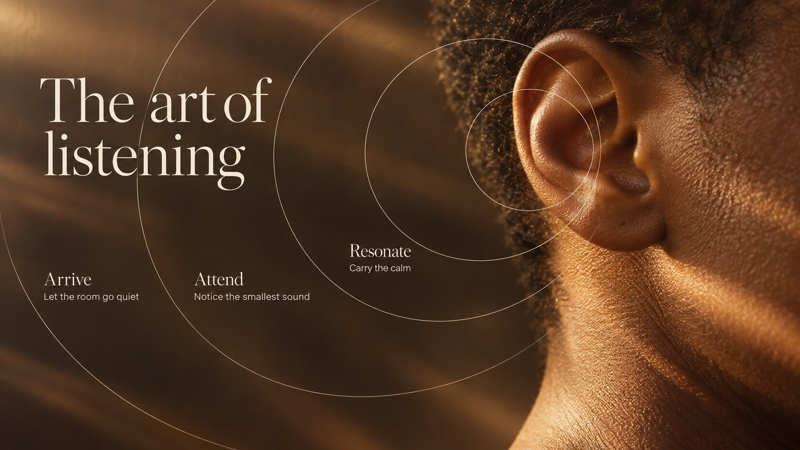

# Amber Orbit Editorial



Intimate warm macro photography, grazing amber light, ivory serif typography and fine overlapping orbital lines turn tactile details into quiet editorial stories about attention, making and time.

## Copy Prompt

Default case: `listening-field`

```text
Use the "Amber Orbit Editorial" visual style as the locked style.

Create a 16:9 image.

Subject: An extreme close photographic study of an anonymous adult's ear and adjoining neck, warm brown skin and short cropped hair, with no eye, nose or lips visible and no jewelry. The ear has natural, plausible anatomy, and warm grazing light reveals fine skin texture.
Action: [your How attention, making or time is shown through the tactile detail]
Prop / product: [your The intimate object under amber light]
Location: [your Warm close editorial field]
Background: [your Fine overlapping orbital lines]
Main text: The art of listening
Secondary text: [your Small ivory serif supporting lines]
Accent symbol: [your Grazing amber light and orbital line]
Styling: [your Hands, tools or surfaces that stay tactile and close]

Style direction:
Intimate warm macro photography, grazing amber light, ivory serif typography and fine
overlapping orbital lines turn tactile details into quiet editorial stories about attention,
making and time.

Keep visible:
- [CORE] Let one intimate, oversized photographic detail dominate the frame; render it as a tangible surface with real depth, an assertive crop and selective focal clarity.
- [CORE] Keep a continuous warm tonal family of ivory, sand, honey amber, tobacco and deep brown, with luminous grazing highlights against quiet, sufficiently dark regions for pale lettering.
- [CORE] Pair fine ivory high-contrast serif display lettering with small, restrained sans-serif supporting copy; preserve a quiet editorial hierarchy and ample breathing room.
- [CORE] Overlay a small family of hairline, translucent ivory circles or circular arcs, nested, offset or tangent, that visibly relate to a meaningful contour or action in the photograph.
- [CORE] Preserve tactile microtexture at the focal plane, gentle optical softness elsewhere and a few subtle horizontal light-drag veils across peripheral photo areas; keep the graphic lines and wording clear.

Avoid:
original woman's face or profile, Your longevity journey, Month One, Month Two, Month Three,
skincare benefit claims, copied centered month timeline, extra words, extra punctuation,
misspelling, duplicated text, tiny illegible copy, text on blown highlights, opaque text cards,
brand logo, watermark, QR code, UI, frame, ruler, grid, reticle, thick luminous circles, neon
rainbow palette, flat vector subject, plastic CGI texture, waxy skin, malformed hands, heavy
grunge, global blur, excessive sharpening

Do not copy source content, real logos, watermarks, platform UI, QR codes, or exact
reference layouts. Keep the visual system, but change the subject, text, and scene.
```

## Full Style

- [Open style.json](../../styles/amber-orbit-editorial/style.json)
- [Open style folder](../../styles/amber-orbit-editorial/)

<!-- Generated by scripts/generate-copy-prompts.py. Do not edit manually. -->
