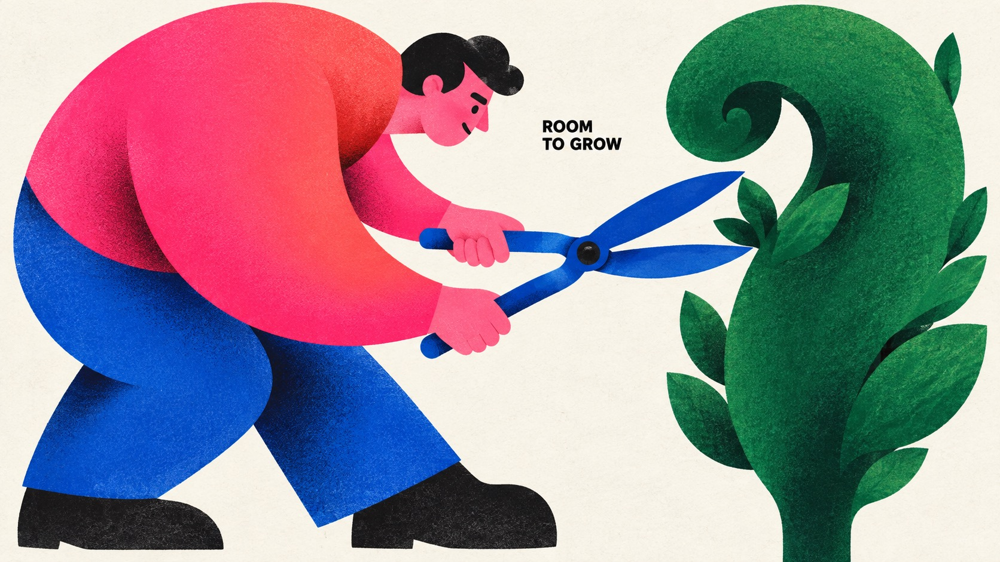

# Chromatic Gesture Characters — Part 3



Part 3 of Chromatic Gesture Characters: keeps the exaggerated geometric figures, hot-pink clashes, grainy airbrush and off-white paper while exploring topiary gardening, freediving, a chess move and carrying stacked boxes.

## Copy Prompt

Default case: `shape-the-green`

```text
Use the "Chromatic Gesture Characters — Part 3" visual style as the locked style.

Create a 16:9 image.

Subject: A focused adult topiary gardener with an oversized hot-pink curved torso fading to coral-red, cobalt trousers, small near-black hair and face marks, operating one pair of large simple cobalt pruning shears beside a tall emerald-green topiary with a broad curling crown.
Action: [your the readable physical interaction and emotional expression described in ACTION]
Prop / product: [your one or two oversized theme-bearing objects that join the character silhouette]
Location: [your edge-to-edge off-white paper with no scene; depth implied only by overlapping shapes]
Background: [your bare paper gaps, selective grainy airbrushed shadow and the small black caption]
Main text: ROOM TO GROW
Secondary text: [your none; MAIN_TEXT is the only visible wording]
Accent symbol: [your the minimal black cut-paper facial marks]
Styling: [your flat sculptural garment blocks in hot pink, coral red, cobalt and emerald]

Style direction:
Part 3 of Chromatic Gesture Characters: keeps the exaggerated geometric figures, hot-pink
clashes, grainy airbrush and off-white paper while exploring topiary gardening, freediving, a
chess move and carrying stacked boxes.

Keep visible:
- [CORE] Build a monumental, asymmetric character silhouette from few interlocking circles, flattened capsules, wedges, tapered limbs and large flowing contour cuts; enlarge anatomy according to the emotional gesture.
- [CORE] Use nearly black, radically reduced facial marks and weight-bearing accents; eyes, brows and mouth read as deliberately cut graphic shapes rather than detailed drawing.
- [CORE] Pair a dominant hot pink or magenta color field with one adjacent warm red or coral gradient and two saturated cool counterweights, on an open off-white paper ground.
- [CORE] Keep most shapes flat and crisply bounded, with localized dark-to-color airbrushed shading at overlaps or bends and the specified fine print texture; depth must remain graphic.
- [CORE] Let the character-object interaction carry the poster; sparse small bold black uppercase sans-serif copy occupies a useful pocket of negative space.

Avoid:
Source angry man, steam puffs, original caption, creator oval stamp, copied identity, watermark,
logo, extra text, added punctuation, extra limbs, disconnected grips, glossy 3D toy,
photorealism, outlined cartoon, coarse weave, scratch distress, huge headline, clutter, frames,
poster mockup, previous saxophone, pear, umbrella, reading, dough, bicycle, dog-walker and
camera concepts.

Do not copy source content, real logos, watermarks, platform UI, QR codes, or exact
reference layouts. Keep the visual system, but change the subject, text, and scene.
```

## Full Style

- [Open style.json](../../styles/chromatic-gesture-characters-part-03/style.json)
- [Open style folder](../../styles/chromatic-gesture-characters-part-03/)

<!-- Generated by scripts/generate-copy-prompts.py. Do not edit manually. -->
