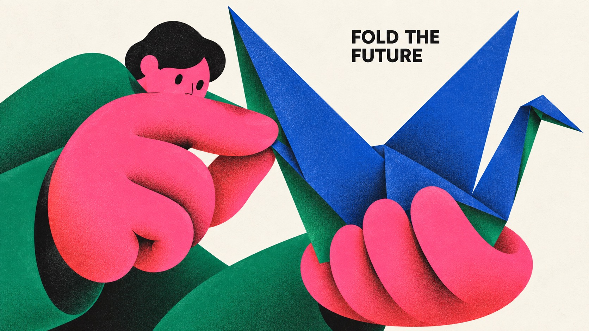

# Chromatic Gesture Characters — Part 7



Part 7 of Chromatic Gesture Characters: carries the geometric exaggeration, hot-pink clashes and grainy print feel into paper folding, headphone listening, canoe paddling and a sideways crab.

## Copy Prompt

Default case: `fold-the-future`

```text
Use the "Chromatic Gesture Characters — Part 7" visual style as the locked style.

Create a 16:9 image.

Subject: An absorbed adult paper folder with tiny pink face, black compact hair, emerald sleeves and enormous hot-pink hands holding one large cobalt origami crane with emerald underside planes.
Action: [your the readable physical interaction and emotional expression described in ACTION]
Prop / product: [your one or two oversized theme-bearing objects that join the character silhouette]
Location: [your edge-to-edge off-white paper with no scene; depth implied only by overlapping shapes]
Background: [your bare paper gaps, selective grainy airbrushed shadow and the small black caption]
Main text: FOLD THE FUTURE
Secondary text: [your none; MAIN_TEXT is the only visible wording]
Accent symbol: [your the minimal black cut-paper facial marks]
Styling: [your flat sculptural garment blocks in hot pink, coral red, cobalt and emerald]

Style direction:
Part 7 of Chromatic Gesture Characters: carries the geometric exaggeration, hot-pink clashes and
grainy print feel into paper folding, headphone listening, canoe paddling and a sideways crab.

Keep visible:
- [CORE] Build a monumental, asymmetric character silhouette from few interlocking circles, flattened capsules, wedges, tapered limbs and large flowing contour cuts; enlarge anatomy according to the emotional gesture.
- [CORE] Use nearly black, radically reduced facial marks and weight-bearing accents; eyes, brows and mouth read as deliberately cut graphic shapes rather than detailed drawing.
- [CORE] Pair a dominant hot pink or magenta color field with one adjacent warm red or coral gradient and two saturated cool counterweights, on an open off-white paper ground.
- [CORE] Keep most shapes flat and crisply bounded, with localized dark-to-color airbrushed shading at overlaps or bends and the specified fine print texture; depth must remain graphic.
- [CORE] Let the character-object interaction carry the poster; sparse small bold black uppercase sans-serif copy occupies a useful pocket of negative space.

Avoid:
Source angry man, steam puffs, original caption, creator oval stamp, copied identity, watermark,
logo, extra text, punctuation, extra limbs, disconnected grips, glossy 3D toy, photorealism,
outlined cartoon, coarse weave, distress scratches, huge headline, clutter, frames, poster
mockup; no previous saxophone, pear, umbrella, book, dough, bicycle, dog walker, camera,
topiary, diver, chess knight or box-stack concepts. No pottery wheel, kite, accordion or
stretching cat. No tea pouring, needle thread, bowling or snail. No paint roller, padlock/key,
tightrope or toucan.

Do not copy source content, real logos, watermarks, platform UI, QR codes, or exact
reference layouts. Keep the visual system, but change the subject, text, and scene.
```

## Full Style

- [Open style.json](../../styles/chromatic-gesture-characters-part-07/style.json)
- [Open style folder](../../styles/chromatic-gesture-characters-part-07/)

<!-- Generated by scripts/generate-copy-prompts.py. Do not edit manually. -->
