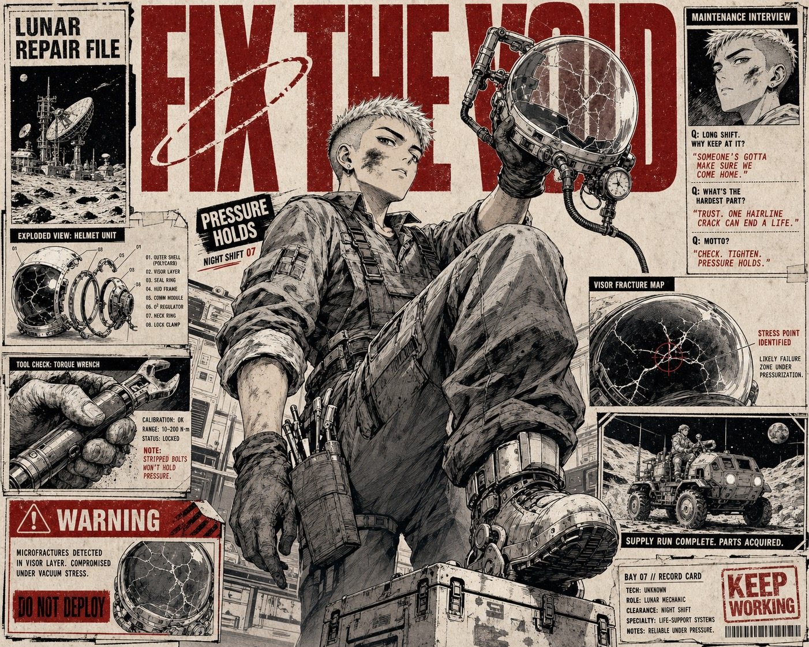

# Crimson Ink Manga Dossier



A high-density manga editorial dossier poster built from one dramatically foreshortened illustrated hero, oversized distressed condensed headlines, modular newspaper sidebars, monochrome comic insets, and a strict crimson-black-warm-paper palette.

## Copy Prompt

Default case: `lunar-mechanic`

```text
Use the "Crimson Ink Manga Dossier" visual style as the locked style.

Create a 16:9 image.

Subject: an original young lunar mechanic with a close-cropped silver undercut and grease-marked cheek
Action: bracing one boot on a service crate while lifting a cracked astronaut helmet above shoulder height
Prop / product: a scratched transparent space helmet with exposed repair clamps and a small oxygen gauge
Location: an improvised moon-base repair bay
Background: lunar antenna silhouettes, exploded helmet diagrams, wrench closeups, a tiny rover manga inset, maintenance interview columns, and warning cards
Main text: FIX THE VOID
Secondary text: LUNAR REPAIR FILE / PRESSURE HOLDS / NIGHT SHIFT 07
Accent symbol: broken orbit ring
Styling: bulky original utility overalls, rolled sleeves, magnetic boots, no recognizable mission patches or logos

Style direction:
A high-density manga editorial dossier poster built from one dramatically foreshortened
illustrated hero, oversized distressed condensed headlines, modular newspaper sidebars,
monochrome comic insets, and a strict crimson-black-warm-paper palette.

Keep visible:
- One dominant hand-drawn manga character occupies roughly two thirds of the frame and breaks across surrounding editorial panels.
- Dramatic low-angle or close wide-angle perspective with strong foreground foreshortening and a confident upward gaze.
- Oversized uppercase condensed sans-serif headline spans the upper field, partially hidden behind the hero and cropped by the edges.
- Dense asymmetrical magazine-newspaper layout with narrow side columns, boxed dossiers, pull quotes, captions, and small comic insets.
- Restricted palette of deep crimson red, carbon black, warm off-white paper, and grayscale illustration, with red used as the sole chromatic accent.

Avoid:
Makima, Chainsaw Man, Control Devil, Devil Hunter, Denji, red braided office woman, golden
concentric eyes, black business suit and tie, palm-reaching pose, source quotes, Tokyo Tower,
copied skyline, copied manga panels, copied layout, franchise logo, publisher mark, anime title
lock, recognizable copyrighted character, celebrity likeness, official uniform, brand mark,
signature, watermark, username, QR code, app UI, glossy full-color anime screenshot, photoreal
portrait, 3D render, soft pastel, watercolor, clean vector infographic, corporate brochure,
rainbow palette, excessive glitch, excessive noise, heavy blur, chaotic splatter, malformed
hands, duplicate limbs, unreadable giant headline, random glyph clutter, low resolution

Do not copy source content, real logos, watermarks, platform UI, QR codes, or exact
reference layouts. Keep the visual system, but change the subject, text, and scene.
```

## Full Style

- [Open style.json](../../styles/crimson-ink-manga-dossier/style.json)
- [Open style folder](../../styles/crimson-ink-manga-dossier/)

<!-- Generated by scripts/generate-copy-prompts.py. Do not edit manually. -->
