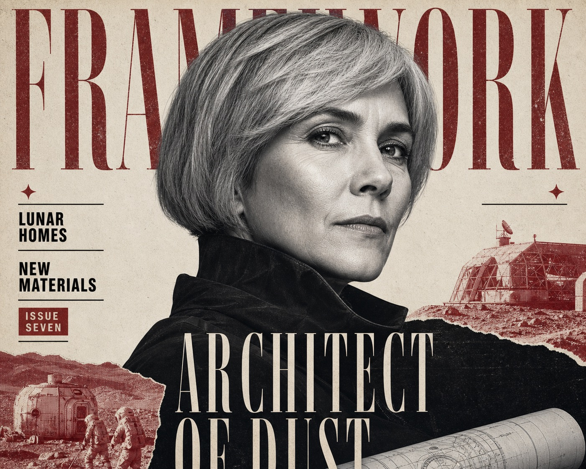

# Crimson Noir Newsprint Editorial



A prestige culture-magazine cover system built from one monumental grayscale portrait, narrow Didone display type, condensed editorial callouts, selective deep-crimson documentary fragments, and a visibly fibrous newsprint finish.

## Copy Prompt

Default case: `lunar-habitat-architect`

```text
Use the "Crimson Noir Newsprint Editorial" visual style as the locked style.

Create a 16:9 image.

Subject: a fictional middle-aged woman architect with a short silver bob and distinctly original non-celebrity facial features
Action: turning slightly toward camera with a calm analytical gaze
Prop / product: a rolled lunar-habitat blueprint visible only at the lower edge of frame
Location: a conceptual editorial studio presented as a flat bone-paper cover field
Background: small crimson duotone fragments of modular moon habitats, textured regolith, and gloved construction crews
Main text: ARCHITECT OF DUST
Secondary text: LUNAR HOMES / NEW MATERIALS / ISSUE SEVEN
Accent symbol: a small four-point diamond star
Styling: a matte black technical jacket with a sculptural high collar and no insignia

Style direction:
A prestige culture-magazine cover system built from one monumental grayscale portrait, narrow
Didone display type, condensed editorial callouts, selective deep-crimson documentary fragments,
and a visibly fibrous newsprint finish.

Keep visible:
- Prestige editorial-cover hierarchy with an oversized top masthead, one dominant central portrait, and a dark typography-heavy lower zone.
- A single close-cropped grayscale head-and-shoulders portrait occupies most of the frame and partially occludes the masthead.
- The subject sits slightly off center, leaving narrow asymmetric side gutters for tightly stacked editorial copy.
- The background remains a flat warm bone-white paper field with no scenic depth; secondary fragments enter only as layered print collage.
- The palette stays strictly warm off-white, soot black, grayscale, and deep crimson, with crimson used as a selective signal rather than a broad fill.

Avoid:
Recognizable celebrity or public figure; copied face, hairstyle, pose, wardrobe pins, masthead,
publication name, original English or Vietnamese copy, Oscar or best-actor framing, gaming
awards, AI filmmaking, war-film premise, exact red film-still collage, logo, watermark,
signature, username, platform mark, QR code, barcode, price, full-color skin, neon, broad
gradients, glossy advertising retouch, chrome, 3D type, deep environment, wide cinematic scene,
multiple equal subjects, smiling lifestyle photography, rounded playful typography, script font,
sparse minimalist cover, blocked eyes, muddy face, unreadable text, excessive scratches, heavy
glitch, random extra letters.

Do not copy source content, real logos, watermarks, platform UI, QR codes, or exact
reference layouts. Keep the visual system, but change the subject, text, and scene.
```

## Full Style

- [Open style.json](../../styles/crimson-noir-newsprint-editorial-style/style.json)
- [Open style folder](../../styles/crimson-noir-newsprint-editorial-style/)

<!-- Generated by scripts/generate-copy-prompts.py. Do not edit manually. -->
