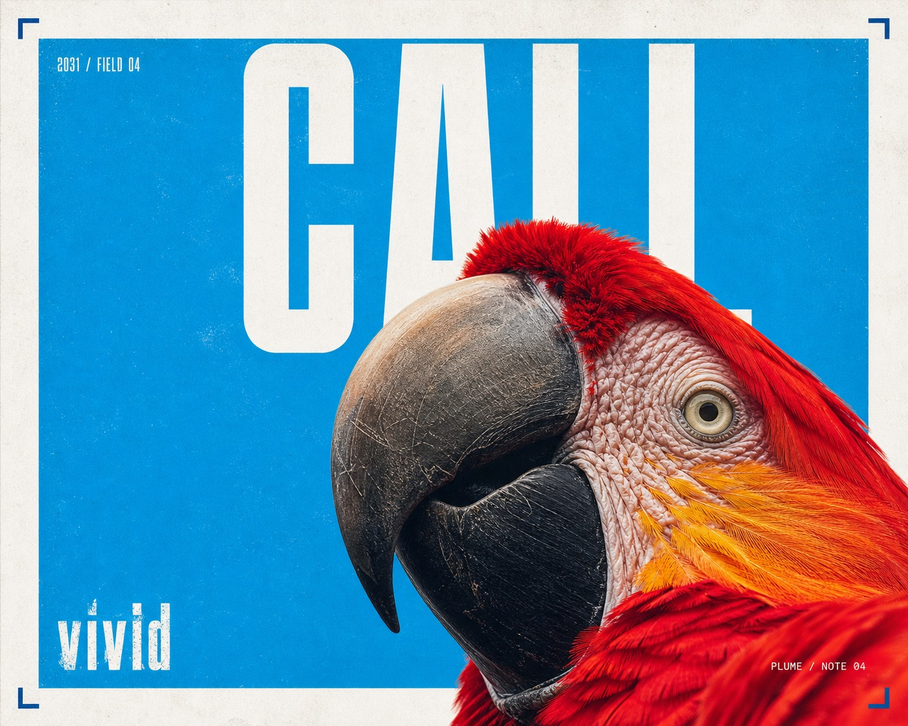

# Cyan Grain Macro Megatype Poster



A sparse experimental editorial poster system built from one radically enlarged macro photograph, a saturated cyan field, monumental white geometric letterforms that interlock with the subject, wide white margins, compact technical metadata, and tactile analog print grain.

## Copy Prompt

Default case: `scarlet-parrot-profile`

```text
Use the "Cyan Grain Macro Megatype Poster" visual style as the locked style.

Create a 16:9 image.

Subject: a scarlet macaw shown as one enormous feathered profile
Action: tilting its head upward so the curved beak and cheek feathers interrupt the display letters
Prop / product: one sharply defined charcoal beak and a small pale eye ring
Location: a minimal daylight studio with no visible habitat
Background: an uninterrupted cyan field with three tiny deep-blue registration brackets
Main text: CALL
Secondary text: 2031 / field note 04 / vivid
Accent symbol: a tiny right-angle corner bracket
Styling: natural scarlet, coral, and muted gold plumage with highly tactile feather detail

Style direction:
A sparse experimental editorial poster system built from one radically enlarged macro
photograph, a saturated cyan field, monumental white geometric letterforms that interlock with
the subject, wide white margins, compact technical metadata, and tactile analog print grain.

Keep visible:
- One tactile photographic subject is enlarged to an extreme macro scale and cropped aggressively by two or three canvas edges.
- The camera sits unusually close and slightly below or beside the subject, emphasizing surface texture, silhouette, and physical presence rather than a complete body view.
- A saturated cyan-to-sky-blue rectangular field occupies most of the active image area while a broad clean white outer margin remains visible.
- One very short word appears as enormous white geometric condensed sans-serif letterforms spanning the upper third, with deliberate gaps and partial occlusion by the subject.
- The subject overlaps the megatype and blue field as one continuous photographic mass; typography and photography interlock rather than sit in separate bands.

Avoid:
hamster, guinea pig, rodent, tan-and-white small pet, source chin-up pose, pink rodent nose,
HUG, simplicity, 2025, 12mm, source date, source numbering, creator handle, design credit,
signature, logo, trademark, watermark, username, QR code, platform UI, second subject, crowd,
full scene, dense collage, price burst, promotional sticker, gradient, glossy 3D, vector
illustration, cinematic lighting, lens flare, neon palette, full-bleed borderless image, long
body copy, outlined type, drop shadow, illegible word, malformed anatomy, extra limbs, excessive
grain, heavy scratches, chromatic glitch, blur, compression artifacts

Do not copy source content, real logos, watermarks, platform UI, QR codes, or exact
reference layouts. Keep the visual system, but change the subject, text, and scene.
```

## Full Style

- [Open style.json](../../styles/cyan-grain-macro-megatype-poster-style/style.json)
- [Open style folder](../../styles/cyan-grain-macro-megatype-poster-style/)

<!-- Generated by scripts/generate-copy-prompts.py. Do not edit manually. -->
