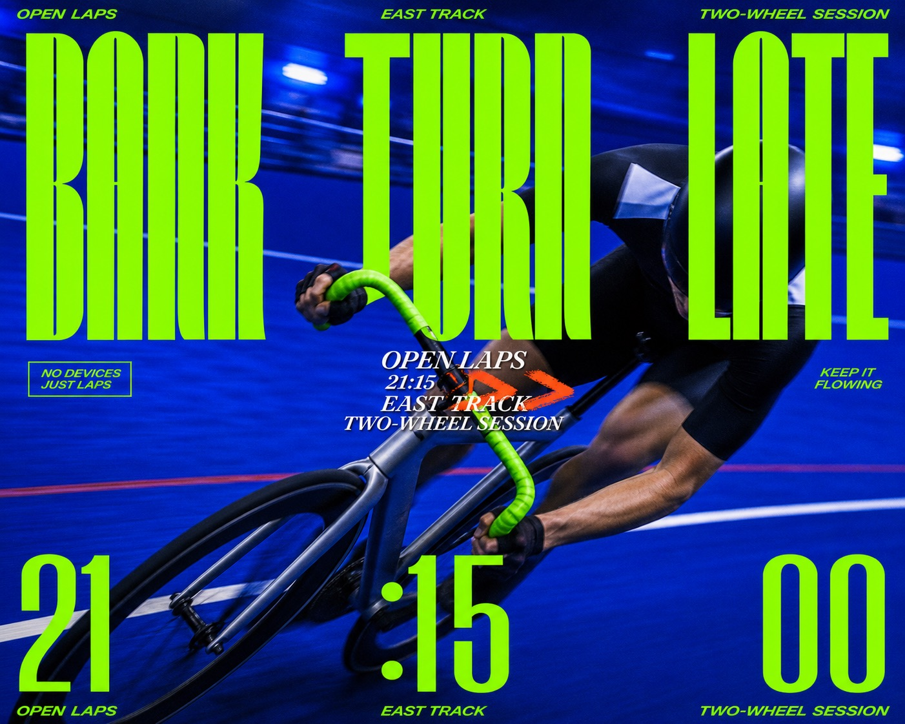

# Electric Cobalt Motion Type Poster



A high-energy community-event poster system that combines one full-bleed motion-smeared photograph, a cobalt-blue field, fluorescent green ultra-condensed display type, a compact white-and-orange center lockup, oversized lower-edge numerals, and deliberately imperfect analog print texture.

## Copy Prompt

Default case: `velodrome-turn`

```text
Use the "Electric Cobalt Motion Type Poster" visual style as the locked style.

Create a 16:9 image.

Subject: an anonymous track cyclist
Action: leaning through a steep banked turn with shoulders low and wheels sweeping sideways
Prop / product: a matte silver fixed-gear bicycle with blank surfaces and acid-green bar tape
Location: an indoor cobalt-painted velodrome during an evening open session
Background: blurred lane markings, a low safety rail, and soft blue venue lights
Main text: BANK / TURN / LATE
Secondary text: OPEN LAPS / 21:15 / EAST TRACK / TWO-WHEEL SESSION
Accent symbol: double-chevron speed smear
Styling: brand-neutral black cycling skinsuit with a small white shoulder panel and no logos

Style direction:
A high-energy community-event poster system that combines one full-bleed motion-smeared
photograph, a cobalt-blue field, fluorescent green ultra-condensed display type, a compact
white-and-orange center lockup, oversized lower-edge numerals, and deliberately imperfect analog
print texture.

Keep visible:
- One full-bleed photographic poster with a single dominant moving subject cropped tightly by multiple frame edges.
- Strong directional motion smear follows the subject's gesture while the overall silhouette remains readable and energetic.
- Saturated cobalt and ultramarine blue occupy most of the photographic field, with no gradient background treatment.
- Fluorescent spring-green display lettering provides the dominant graphic contrast, supported by white and one concentrated orange-red accent.
- Oversized ultra-condensed curvilinear display type sits directly on the photograph, with tall narrow letters, sharp waistlines, tight spacing, and dramatic vertical scale.

Avoid:
source runner, sprint race, four-kilometer run, white racing vest, ponytail runner, sauna, cold
plunge, breathwork, summer fragrance event, copied source headline, copied date or time, copied
venue or URL, copied center wordmark, orange runner silhouette, source mascot, brand names,
sponsor logos, real event marks, watermarks, signatures, usernames, QR codes, platform UI,
identifiable celebrity, protected athlete likeness, crisp frozen pose, tiny distant subject,
generic centered title, wide empty border, rounded card, radial zoom blur, cyberpunk lighting,
neon gradient, vaporwave grid, 3D chrome, glossy CGI, vector-only subject, sticker pack, torn
paper, heavy halftone, graffiti wall, paint splashes, uncontrolled orange palette, muddy
compression, excessive digital noise, malformed anatomy, extra limbs, grotesque face, long
illegible paragraphs

Do not copy source content, real logos, watermarks, platform UI, QR codes, or exact
reference layouts. Keep the visual system, but change the subject, text, and scene.
```

## Full Style

- [Open style.json](../../styles/electric-cobalt-motion-type-poster-style/style.json)
- [Open style folder](../../styles/electric-cobalt-motion-type-poster-style/)

<!-- Generated by scripts/generate-copy-prompts.py. Do not edit manually. -->
