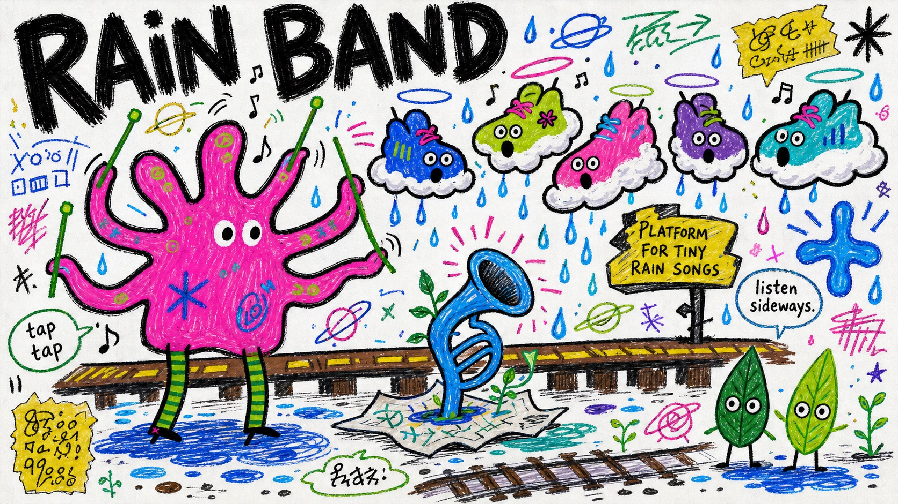

# Fantasy Scribble Mascot Poster Style



A raw hand-drawn fantasy poster system with oversized uneven lettering, neon marker mascot shapes, thick black outlines, loose scribble decorations, and dense childlike collage energy on a white paper field.

## Copy Prompt

Default case: `rocket-garden-parade`

```text
Use the "Fantasy Scribble Mascot Poster Style" visual style as the locked style.

Create a 16:9 image.

Subject: a crooked turquoise rocket-bird mascot with three tiny window eyes and noodle legs
Action: marching sideways while releasing little seed comets
Prop / product: a hand-drawn watering can shaped like a crescent moon
Location: an imaginary garden parade drawn on blank white paper
Background: tiny sprouts, orbit rings, loose stars, bent arrows, two small pebble creatures, and scribbled blue puddles
Main text: MOON SEEDS
Secondary text: plant the small bright noise
Accent symbol: wobbly spiral star
Styling: raw mascot body with hot pink patches, green striped legs, and no realistic clothing

Style direction:
A raw hand-drawn fantasy poster system with oversized uneven lettering, neon marker mascot
shapes, thick black outlines, loose scribble decorations, and dense childlike collage energy on
a white paper field.

Keep visible:
- White paper field with the image treated like a scanned handmade poster rather than a polished digital illustration.
- Huge irregular hand-painted headline letters occupying the top or one dominant edge of the composition.
- Thick, uneven, dry-brush black outlines around characters, props, text, and many decorative marks.
- Flat marker-fill color blocks using electric cyan, saturated blue, hot pink, neon lime, deep green, and small brown or purple accents.
- Childlike fantasy mascot anatomy with playful distortion, blunt legs, long ears, floating eyes, and simplified facial dots.

Avoid:
platform UI, username, follow button, phone status bar, watermark, signature, QR code, logo,
exact source wording, blue long-eared source creature, yellow bear source figure, pink star
source figure, green heart source emblem, plant-in-mouth source motif, polished vector cartoon,
anime, 3D render, photorealism, smooth gradient, cinematic lighting, clean commercial
typography, perfect alignment, comic panels, realistic environment, product photo

Do not copy source content, real logos, watermarks, platform UI, QR codes, or exact
reference layouts. Keep the visual system, but change the subject, text, and scene.
```

## Full Style

- [Open style.json](../../styles/fantasy-scribble-mascot-poster-style/style.json)
- [Open style folder](../../styles/fantasy-scribble-mascot-poster-style/)

<!-- Generated by scripts/generate-copy-prompts.py. Do not edit manually. -->
