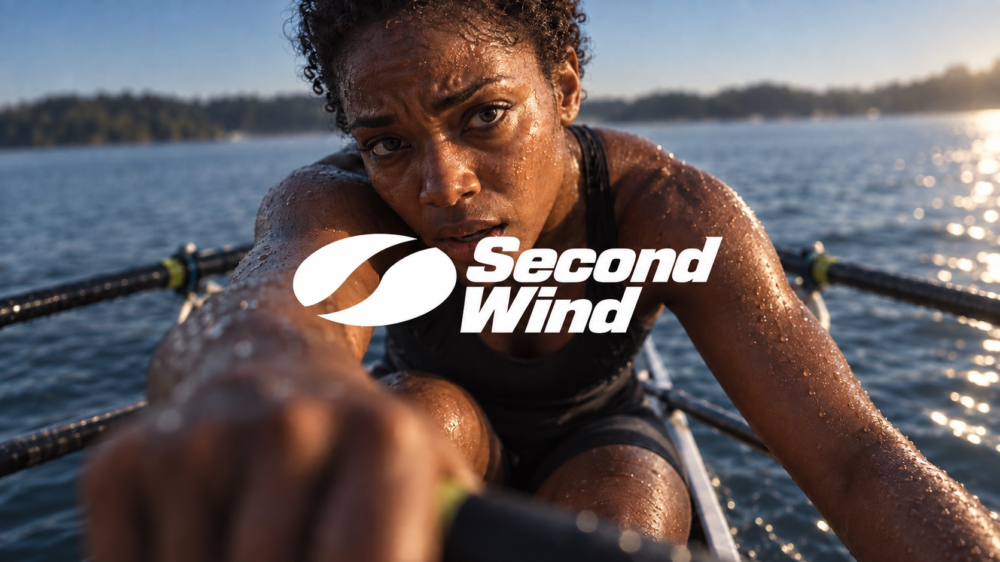

# Felt Motion Brand Campaign — Set 02



An intimate sports photograph captures one bodily state through moody warm light, deep natural shadow and pronounced selective focus. A prominent white original logo and tight two-line wordmark overlap the optical center of the photograph.

## Copy Prompt

Default case: `last-stroke`

```text
Use the "Felt Motion Brand Campaign — Set 02" visual style as the locked style.

Create a 16:9 image.

Subject: an adult woman sculler with deep brown skin and short natural curls, wearing a plain nearly black sleeveless rowing suit, sitting low in a narrow rowing shell on muted blue water after dawn
Action: [your The single bodily state captured in selective focus]
Prop / product: [your Original white logo overlapping the optical center]
Location: [your Moody warm-light sports environment]
Background: [your Deep natural shadow and defocused surroundings]
Main text: [your Tight two-line wordmark]
Secondary text: [your No extra copy beyond the wordmark]
Accent symbol: [your Prominent original white logo]
Styling: [your Sport clothing remaining in the focused plane]

Style direction:
An intimate sports photograph captures one bodily state through moody warm light, deep natural
shadow and pronounced selective focus. A prominent white original logo and tight two-line
wordmark overlap the optical center of the photograph.

Keep visible:
- [CORE] One full-bleed, physically believable sports photograph captures an intimate bodily state: exertion, breath, water, heat, pressure or recovery. The felt moment drives the image.
- [CORE] Bring the camera unusually close to the athlete, with an off-axis view and strong near/far scale. Use pronounced selective focus: the nearer eye and a small patch of skin or water are resolved, while the nearer forearm, farther shoulder and background melt into optical softness. Let a blurred foreground shape fill a meaningful part of the lower frame.
- [CORE] Create the atmospheric depth of an underexposed sunlit film photograph: warm amber skin highlights against substantial deep natural shadow, muted blue sky or water, a gentle bloom around wet highlights and restrained fine grain. Keep irregular real sweat, water, flushed skin and damp hair. Preserve shadow volume and smooth optical softness instead of uniform digital microdetail.
- [CORE] Overlay one prominent, tightly joined white logo-and-wordmark unit directly across the photograph optical center. Let it overlap the lower cheek or chin as well as the upper body, rather than sitting as a small label entirely below the face. Keep the important eye or eyes readable.
- [CORE] The original logo sits immediately beside a tightly stacked two-line heavy italic sans-serif wordmark. The lockup is one graphic unit, with the photograph visually dominant. Keep the letters clean white and the two exact words in title case.

Avoid:
pixel blocks, glitch, scanlines, cyberpunk, neon gel lights, studio spotlights, digital
particles, glitter, giant headline, separate text panel, side-by-side ad layout, subtitle,
footer, text at frame edge, vertical lettering, flat lighting, plasticky skin, uniform fake
sweat, illustration, copied source logo, Modern Human, registered mark, malformed hands, extra
limbs, stretched image, small logo, small wordmark, clinical digital sharpness, HDR, uniformly
sharp foreground and face, flat high-key exposure, blanket gaussian blur

Do not copy source content, real logos, watermarks, platform UI, QR codes, or exact
reference layouts. Keep the visual system, but change the subject, text, and scene.
```

## Full Style

- [Open style.json](../../styles/felt-motion-brand-campaign-set-02/style.json)
- [Open style folder](../../styles/felt-motion-brand-campaign-set-02/)

<!-- Generated by scripts/generate-copy-prompts.py. Do not edit manually. -->
