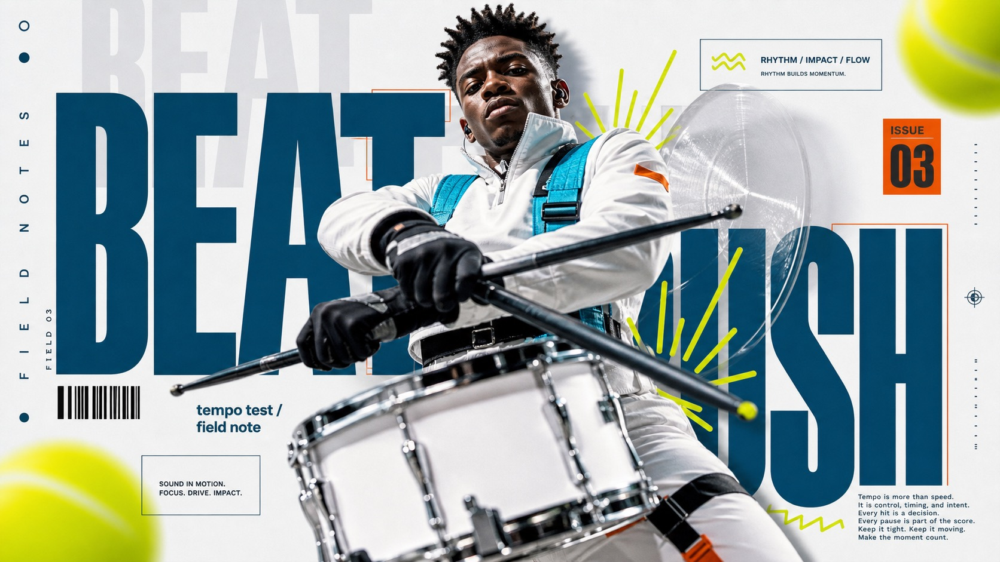

# Ice Cyan Megatype Action Poster Style



A kinetic editorial action poster style built from an ice-white canvas, oversized deep-cyan condensed typography, pale gray ghost text layers, a central cutout action photograph, neon chartreuse motion blurs, small barcode and registration marks, and sparse magazine-style microcopy.

## Copy Prompt

Default case: `studio-dancer-leap`

```text
Use the "Ice Cyan Megatype Action Poster Style" visual style as the locked style.

Create a 16:9 image.

Subject: a contemporary dancer suspended mid-leap with arms extended and both feet angled away from the camera
Action: twisting diagonally through the type stack while a ribbon streamer and sleeve sweep toward the viewer
Prop / product: translucent ribbon streamer trailing from the wrist
Location: minimal ice-white rehearsal studio treated as a poster field
Background: pale gray ghost words, cropped deep-cyan headline blocks, abstract chartreuse motion blurs, tiny barcode strip
Main text: MOVE LOUD
Secondary text: rhythm issue / daily form
Accent symbol: lime radial burst with a short wavy underline
Styling: silver-white technical warmup set with cyan seam trim and a small burnt-orange sleeve tab, no orange socks

Style direction:
A kinetic editorial action poster style built from an ice-white canvas, oversized deep-cyan
condensed typography, pale gray ghost text layers, a central cutout action photograph, neon
chartreuse motion blurs, small barcode and registration marks, and sparse magazine-style
microcopy.

Keep visible:
- Ice-white or very pale gray poster field with generous clean negative space around the action stack.
- Huge ultra-condensed all-caps typography in deep petrol cyan, cropped by the frame and partially hidden behind the subject.
- Very large pale gray ghost words repeat behind the main headline as translucent vertical and horizontal background structure.
- One central photographic cutout action subject overlaps the type, with dramatic foreshortening and a limb, tool, or prop pushing toward the viewer.
- Layered collage depth: ghost type at the rear, deep-cyan headline in the middle, subject cutout in front, and small graphic marks above all layers.

Avoid:
tennis player, tennis racket, tennis ball, tennis court premise, Challenge Yourself text, Daily
Poster Design text, 2025 date, copied motivational footer paragraph, white tennis outfit,
headband, orange tennis socks, seated swing pose, visible shoe sole copied from source,
recognizable athlete, protected logo, tournament mark, brand wordmark, watermark, username, QR
code, platform UI, dense product catalog layout, price tags, flat vector-only poster, 3D render,
manga page, comic halftone panel, gritty grunge flyer, distorted hands, extra limbs, illegible
typography, random logo-like marks, muddy digital noise, compression artifacts, low-resolution
texture

Do not copy source content, real logos, watermarks, platform UI, QR codes, or exact
reference layouts. Keep the visual system, but change the subject, text, and scene.
```

## Full Style

- [Open style.json](../../styles/ice-cyan-megatype-action-poster-style/style.json)
- [Open style folder](../../styles/ice-cyan-megatype-action-poster-style/)

<!-- Generated by scripts/generate-copy-prompts.py. Do not edit manually. -->
