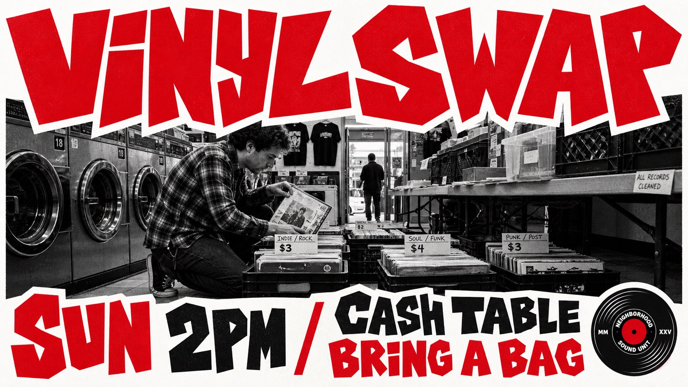

# Jagged Red Street Photo Event Poster Style



A high-impact street event poster system combining a black-and-white documentary photo core, oversized jagged red and black display lettering, thick white sticker-like gutters, and sparse three-color print energy.

## Copy Prompt

Default case: `after-hours-arcade-rally`

```text
Use the "Jagged Red Street Photo Event Poster Style" visual style as the locked style.

Create a 16:9 image.

Subject: two friends carrying a boxed tabletop arcade controller through a doorway
Action: stepping into a basement venue after dark
Prop / product: corded arcade controller and a short stack of flyers
Location: narrow downtown alley outside a basement game room
Background: brick doorway, old wall lamp, bicycle rack, distant pedestrians, bright pavement highlights
Main text: BUTTON MASH NIGHT
Secondary text: SAT 8PM / BASEMENT ROOM / ALL AGES
Accent symbol: small fictional lightning badge
Styling: casual hoodies, work pants, canvas sneakers, documentary streetwear silhouettes

Style direction:
A high-impact street event poster system combining a black-and-white documentary photo core,
oversized jagged red and black display lettering, thick white sticker-like gutters, and sparse
three-color print energy.

Keep visible:
- Poster built from a central black-and-white documentary photograph plus oversized display type above and below.
- Dominant headline letters are jagged, hand-cut, angular, and irregular, with chunky wedge-shaped strokes.
- Palette stays tightly limited to bright red, near-black, white, and grayscale photography.
- Large red letterforms use thick white outlines or gutters so they read like cut paper pasted over the photo.
- Black lettering is used as a secondary type layer, usually smaller, dense, and blocky.

Avoid:
skateboarding, skateboard, skate contest, skater trick, crouching filmer, original street
corner, bakery storefront, parked car composition from source, Game of Skate, Friday 6PM,
Everyone Welcome, Itavally, The Arshmates, real logo, real brand mark, watermark, signature, QR
code, username, platform interface, glossy 3D render, corporate flyer, clean vector-only poster,
comic book illustration, full-color photograph, rainbow palette, beige vintage paper, neon
gradient, script font, serif poster font, tiny unreadable text, warped letters, muddy halftone,
compression artifacts, accidental digital noise

Do not copy source content, real logos, watermarks, platform UI, QR codes, or exact
reference layouts. Keep the visual system, but change the subject, text, and scene.
```

## Full Style

- [Open style.json](../../styles/jagged-red-street-photo-event-poster-style/style.json)
- [Open style folder](../../styles/jagged-red-street-photo-event-poster-style/)

<!-- Generated by scripts/generate-copy-prompts.py. Do not edit manually. -->
