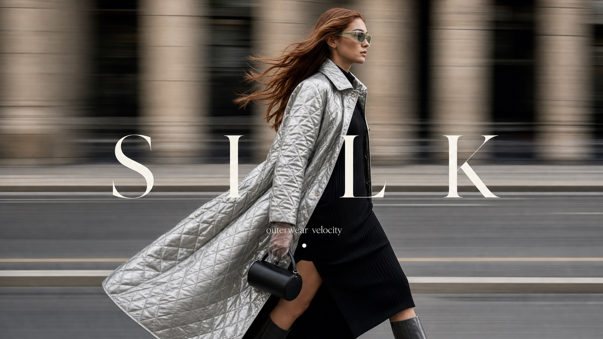

# Kinetic Luxury Street Fashion Cover Style



A premium street-fashion magazine cover style built from side-profile walking photography, horizontal motion-blurred architecture, one dominant luxury garment, wind-shaped hair, restrained urban neutrals, and oversized wide-spaced serif cover typography. It preserves the kinetic editorial grammar of the reference while changing the model identity, wardrobe, prop, headline, and story details.

## Copy Prompt

Default case: `crimson-wool-walking-cover`

```text
Use the "Kinetic Luxury Street Fashion Cover Style" visual style as the locked style.

Create a 16:9 image.

Subject: a poised fashion model with short dark hair moving past a stone townhouse facade
Action: walking in a controlled side-profile stride while the camera pans with her
Prop / product: small dark espresso crescent bag and thin black sunglasses with no visible logo
Location: quiet European avenue with pale stone blocks and a recessed window line
Background: horizontal smears of limestone wall, asphalt bands, black window rectangles, and a soft curb stripe
Main text: TEMPO
Secondary text: winter motion issue
Accent symbol: tiny ivory dot separator below the headline
Styling: deep crimson textured wool cocoon coat over black straight trousers, matte leather gloves, and polished black loafers

Style direction:
A premium street-fashion magazine cover style built from side-profile walking photography,
horizontal motion-blurred architecture, one dominant luxury garment, wind-shaped hair,
restrained urban neutrals, and oversized wide-spaced serif cover typography. It preserves the
kinetic editorial grammar of the reference while changing the model identity, wardrobe, prop,
headline, and story details.

Keep visible:
- High-end realistic fashion editorial photography, not illustration, collage, or catalog rendering.
- Single model or one dominant model cropped large from thigh to head, moving laterally through the frame.
- Side-profile or three-quarter walking pose with calm luxury expression and deliberate street-stride energy.
- Strong horizontal motion blur in the background, as if the camera is panning with the subject.
- Sharp subject against blurred stone, window, pavement, and street bands, with readable fabric texture.

Avoid:
source woman, copied face, copied sunglasses, copied exact side profile, emerald green textured
leather jacket, matching green handbag, black trousers from reference, exact beige facade, exact
dark doorway, exact hair sweep, exact walking hand position, VOLUME text, creator signature,
watermark, social handle, QR code, real brand logo, monogram, readable store name, e-commerce
catalog shot, runway crowd, studio portrait, flat poster collage, cartoon, vector art, 3D
render, neon cyberpunk, heavy flash nightlife, overstuffed props, shopping bags, price labels,
distorted anatomy, broken hands, warped face, plastic skin, blurry garment, low-resolution
output, oversaturated color wash, unreadable text occupying the face.

Do not copy source content, real logos, watermarks, platform UI, QR codes, or exact
reference layouts. Keep the visual system, but change the subject, text, and scene.
```

## Full Style

- [Open style.json](../../styles/kinetic-luxury-street-fashion-cover-style/style.json)
- [Open style folder](../../styles/kinetic-luxury-street-fashion-cover-style/)

<!-- Generated by scripts/generate-copy-prompts.py. Do not edit manually. -->
