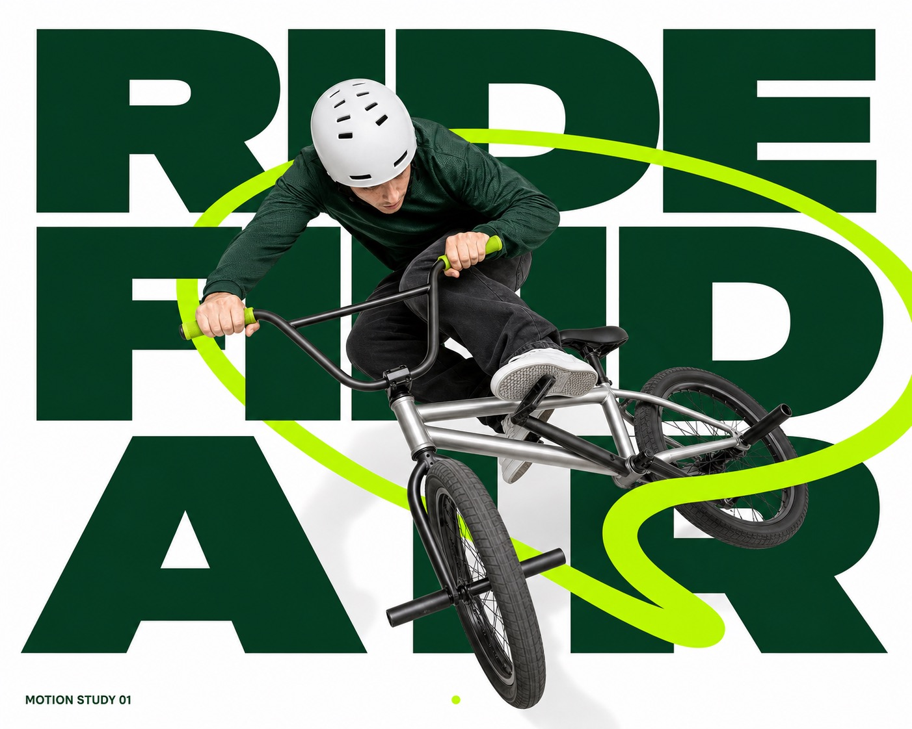

# Lime Loop Megatype Action Poster



A high-energy studio action-poster system combining an overhead wide-angle photographic subject, enormous stacked dark-green display type, a continuous fluorescent-lime motion loop, clean white negative space, and crisp commercial lighting.

## Copy Prompt

Default case: `airborne-bmx-turn`

```text
Use the "Lime Loop Megatype Action Poster" visual style as the locked style.

Create a 16:9 image.

Subject: an unbranded BMX rider
Action: whipping the bicycle sideways in a compact airborne turn while looking toward the landing
Prop / product: a matte silver BMX bicycle with one fluorescent-lime grip
Location: a seamless high-key photo studio
Background: the giant stacked headline, the single lime orbit, and a soft bicycle shadow
Main text: RIDE FIND AIR
Secondary text: MOTION STUDY 01
Accent symbol: small centered dot
Styling: deep green technical jersey, charcoal trousers, plain white helmet, and unbranded shoes

Style direction:
A high-energy studio action-poster system combining an overhead wide-angle photographic subject,
enormous stacked dark-green display type, a continuous fluorescent-lime motion loop, clean white
negative space, and crisp commercial lighting.

Keep visible:
- Bright white or very pale gray seamless studio field with generous clean negative space and no environmental clutter.
- Three stacked rows of enormous ultra-heavy dark forest-green sans-serif words acting as the poster's architectural background.
- A single photoreal action subject is seen from a steep overhead wide-angle perspective and appears to surge diagonally toward the viewer.
- The subject is large, foreshortened, sharply cut out, and layered in front of some letters while other graphic elements cross the body.
- One thick fluorescent-lime continuous ribbon or orbit sweeps through the frame in a broad loop, creating both foreground and background overlaps.

Avoid:
tennis player, tennis serve, tennis racket, tennis ball, tennis court, net, GAME SET MATCH,
copied lime path, copied pose, copied face, green shirt with white tennis skirt, real brand
logo, sportswear mark, tournament mark, watermark, username, signature, QR code, multiple
people, audience, stadium, outdoor landscape, busy scene, collage panels, stickers, UI elements,
multiple ribbons, lightning, flames, particles, splashes, gradient background, dark cinematic
lighting, painterly illustration, comic art, halftone, grunge, retro distress, 3D character,
fisheye face distortion, heavy motion blur, noisy texture, compression artifacts, malformed
anatomy, unreadable headline

Do not copy source content, real logos, watermarks, platform UI, QR codes, or exact
reference layouts. Keep the visual system, but change the subject, text, and scene.
```

## Full Style

- [Open style.json](../../styles/lime-loop-megatype-action-poster-style/style.json)
- [Open style folder](../../styles/lime-loop-megatype-action-poster-style/)

<!-- Generated by scripts/generate-copy-prompts.py. Do not edit manually. -->
