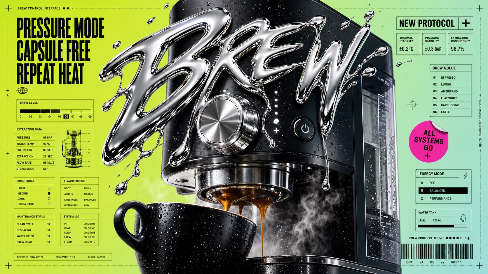

# Liquid Chrome Clearance Poster Style



A high-impact commercial poster system built around glossy liquid-chrome 3D typography, extreme editorial crop, acid-lime to mint gradients, black condensed sale-interface typography, micro technical markings, barcode-like metadata, and a dense grid of retail control panels.

## Copy Prompt

Default case: `rain-courier-drop`

```text
Use the "Liquid Chrome Clearance Poster Style" visual style as the locked style.

Create a 16:9 image.

Subject: a helmeted night bicycle courier with a reflective delivery bag, cropped from shoulder to wheel with no visible identifiable face
Action: leaning into a fast turn as chrome droplets streak across the delivery bag and handlebar
Prop / product: matte black electric cargo bike with reflective rain shell and sealed courier pack
Location: synthetic wet street corner reduced to a bright studio poster field
Background: route-status boxes, tiny map grid fragments, barcode blocks, shipment category rows, target reticles, dotted margin guides, and compliance-style labels
Main text: RUSH
Secondary text: same hour protocol / packed cold / zone 08
Accent symbol: target reticle
Styling: black technical rainwear, glossy helmet visor, reflective strips, utilitarian courier equipment

Style direction:
A high-impact commercial poster system built around glossy liquid-chrome 3D typography, extreme
editorial crop, acid-lime to mint gradients, black condensed sale-interface typography, micro
technical markings, barcode-like metadata, and a dense grid of retail control panels.

Keep visible:
- One dominant photoreal subject or product crop occupies the center while interface typography and panels wrap around the edges.
- The largest visual element is glossy liquid-chrome 3D lettering or a chrome splash that overlaps the subject and casts bright metallic highlights.
- Background uses an acid-lime, chartreuse, mint, or pale aqua gradient with high clean brightness rather than dark cinematic atmosphere.
- Black typography is heavy, condensed, uppercase, tightly stacked, and arranged like clearance retail signage or technical sale UI.
- Layout is dense but gridded: margin rules, registration ticks, crosshair targets, small panels, category lists, status bars, coordinate text, and barcode blocks.

Avoid:
Do not recreate the original close-up right-facing human profile, curly hair, SALE lettering,
LIQUIDATION text, 70 percent discount language, SS-24 label, original category list, original
barcode numbers, original coordinates, original pink sticker wording, original protocol card,
watermarks, usernames, platform marks, QR codes, brand logos, clean minimalist ads, beige
lifestyle photography, flat vector art, painterly illustration, soft corporate UI, or generic
product mockup lighting.

Do not copy source content, real logos, watermarks, platform UI, QR codes, or exact
reference layouts. Keep the visual system, but change the subject, text, and scene.
```

## Full Style

- [Open style.json](../../styles/liquid-chrome-clearance-poster-style/style.json)
- [Open style folder](../../styles/liquid-chrome-clearance-poster-style/)

<!-- Generated by scripts/generate-copy-prompts.py. Do not edit manually. -->
