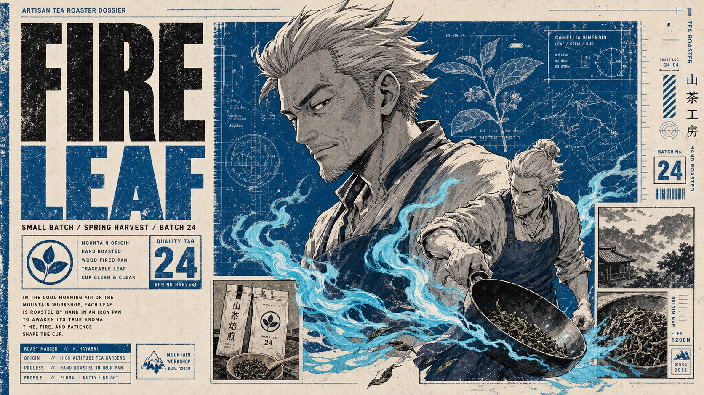

# Manga Dossier Blueprint Poster



A distressed manga character-dossier poster system with cream paper margins, oversized condensed typography, grayscale ink hero portraits, cobalt-blue technical panels, cyan kinetic effects, small inset frames, catalog labels, and editorial annotation rails.

## Copy Prompt

Default case: `night-courier`

```text
Use the "Manga Dossier Blueprint Poster" visual style as the locked style.

Create a 16:9 image.

Subject: a young urban bicycle courier with wind-tossed hair and a focused half-smile
Action: leaning forward with one hand extended while a smaller action pose skids across the foreground
Prop / product: weathered messenger bag, compact bike light, and folded delivery map
Location: rainy elevated train district at midnight
Background: faint rail map lines, wet street reflections reduced to blue diagram marks, small inset frame of a bicycle wheel, catalog stripes
Main text: NIGHT COURIER
Secondary text: district run / route 07 / signal clear
Accent symbol: winged wheel emblem
Styling: cropped technical jacket, fingerless gloves, patched courier pants, wind-swept streetwear silhouette

Style direction:
A distressed manga character-dossier poster system with cream paper margins, oversized condensed
typography, grayscale ink hero portraits, cobalt-blue technical panels, cyan kinetic effects,
small inset frames, catalog labels, and editorial annotation rails.

Keep visible:
- Layered editorial dossier layout with a dominant grayscale manga ink portrait, a smaller dynamic full-body figure, boxed inset panels, narrow annotation rails, and asymmetrical negative space.
- Warm off-white paper base with visible speckles, scuffs, worn ink, photocopy grain, and distressed screenprint edges.
- Limited palette led by charcoal black, cool grays, deep cobalt blue, desaturated navy, and bright cyan accents; color appears in panels, type, and kinetic energy marks rather than full-scene realism.
- Oversized condensed all-caps sans-serif headline blocks with weathered ink texture, stacked title hierarchy, and compact microcopy labels in small uppercase type.
- Manga/anime illustration treatment with confident black linework, crosshatching, cel-shaded grayscale faces, angular hair or clothing shapes, and crisp contour drawing.

Avoid:
photorealistic portrait, 3D render, glossy game art, smooth vector minimalism, soft gradients,
cinematic lens flare, heavy bokeh, realistic full environment, pirate imagery, phoenix bird,
skull-and-crossbones, franchise logo, copied anime character, copied source text, signature,
watermark, username, QR code, platform logo, exact source layout tracing

Do not copy source content, real logos, watermarks, platform UI, QR codes, or exact
reference layouts. Keep the visual system, but change the subject, text, and scene.
```

## Full Style

- [Open style.json](../../styles/manga-dossier-blueprint-poster/style.json)
- [Open style folder](../../styles/manga-dossier-blueprint-poster/)

<!-- Generated by scripts/generate-copy-prompts.py. Do not edit manually. -->
