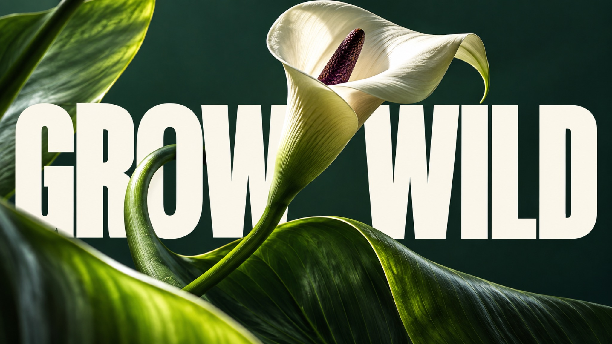

# Monumental Editorial — Set 02



A cross-domain extension of monumental sports editorial typography: clean giant condensed white lettering collides with tactile botanical, musical, food, and chrome-product photography, each in a distinct palette and spatial arrangement.

## Copy Prompt

Default case: `grow-wild`

```text
Use the "Monumental Editorial — Set 02" visual style as the locked style.

Create a 16:9 image.

Subject: A sculptural botanical still life: one ivory calla lily with a dark plum spadix, two huge glossy folded green leaves, and long curved stems. Real botanical materials at extravagant macro scale; no human figure.
Action: [your How the tactile subject collides with giant condensed type]
Prop / product: [your Botanical, musical, food or chrome object in the photograph]
Location: [your Distinct spatial field for this domain]
Background: [your Deep shapes that hold the monumental white lettering]
Main text: GROW WILD
Secondary text: [your No extra copy beyond the giant headline]
Accent symbol: [your Giant condensed white lettering]
Styling: [your Surfaces, hands or materials visible in the photograph]

Style direction:
A cross-domain extension of monumental sports editorial typography: clean giant condensed white
lettering collides with tactile botanical, musical, food, and chrome-product photography, each
in a distinct palette and spatial arrangement.

Keep visible:
- [CORE] Premium photographic editorial poster with one strongly art-directed focal subject at an extreme, tactile scale.
- [CORE] Monumental heavy condensed uppercase sans-serif headline, white or cream, with clean graphic edges and clear complete words.
- [CORE] Deliberate shared depth between image and typography: precise overlaps, a meaningful gap, a counter, or a reflection integrates them into one composition.
- [CORE] Dramatic directional light and high tonal contrast reveal the subject material and shape without flattening the photographic detail.
- [CORE] Sparse hierarchy: one subject relationship, one short headline, large simple background fields, and decisive scale contrast.

Avoid:
basketball player, sports campaign subject, runner, skater, diver, dancer, athlete uniform,
original identity, Nike swoosh, old slogans, warm sepia grade across all cases, distressed
typography, gritty paper overlay, interchangeable title layout, misspelling, extra punctuation,
illegible primary headline, extra text, brand logo, watermark, duplicated objects, malformed
hands, impossible instrument grip, implausible chair structure

Do not copy source content, real logos, watermarks, platform UI, QR codes, or exact
reference layouts. Keep the visual system, but change the subject, text, and scene.
```

## Full Style

- [Open style.json](../../styles/monumental-editorial-set-02/style.json)
- [Open style folder](../../styles/monumental-editorial-set-02/)

<!-- Generated by scripts/generate-copy-prompts.py. Do not edit manually. -->
