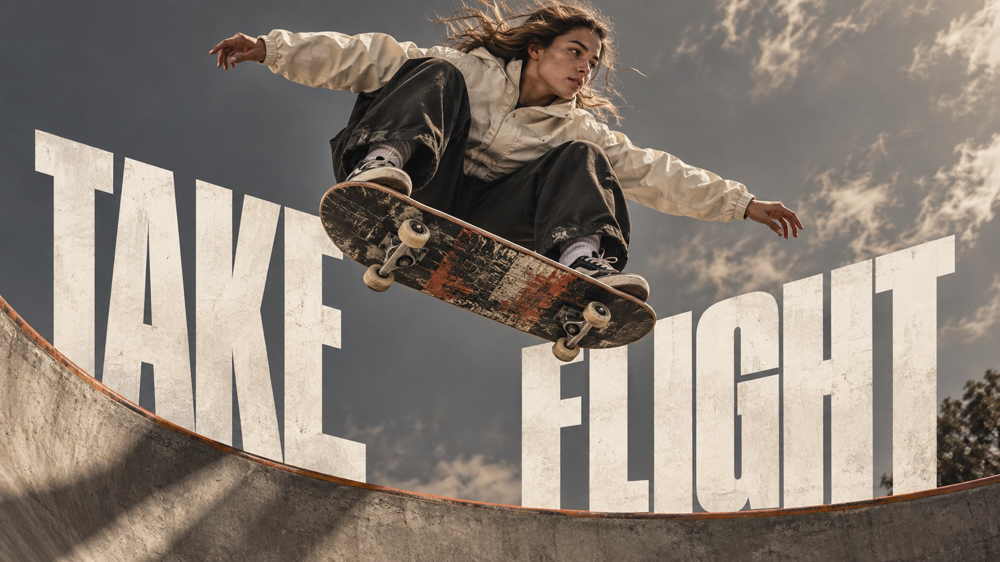

# Monumental Sport Editorial



A premium campaign-poster system built from lifelike athletic photography, monumental condensed white typography, warm stone neutrals, deep black shapes, and precise image-type collisions.

## Copy Prompt

Default case: `skater-take-flight`

```text
Use the "Monumental Sport Editorial" visual style as the locked style.

Create a 16:9 image.

Subject: a woman skateboarder
Action: caught at the peak of a high aerial above a concrete bowl, board sharply visible beneath her feet
Prop / product: [your Sport object that collides with the monumental type]
Location: [your Warm stone-neutral athletic field]
Background: [your Deep black shapes around the type and body]
Main text: TAKE FLIGHT
Secondary text: [your No extra copy beyond the condensed white headline]
Accent symbol: [your Monumental condensed white lettering]
Styling: cream windbreaker, dark trousers, and scuffed skate shoes

Style direction:
A premium campaign-poster system built from lifelike athletic photography, monumental condensed
white typography, warm stone neutrals, deep black shapes, and precise image-type collisions.

Keep visible:
- [CORE] Premium contemporary sports-editorial campaign art: tactile, lifelike photography presents a human body in a decisive moment of effort as a sculptural focal point.
- [CORE] Monumental uppercase sans-serif typography with very heavy, narrow proportions and clean, decisive silhouettes; the exact headline is a major visual mass and stays readable.
- [CORE] Photography and lettering share the same visual plane: purposeful overlap, occlusion, or interlocking makes the image and headline feel designed together.
- [CORE] Restrained tonal architecture built from warm taupe or stone, bone white, charcoal or near-black, and a small controlled rust-orange accent.
- [CORE] Directional hard or firm studio light creates deep shaped shadows and crisp separation while preserving believable skin, fabric, rubber, water, or concrete texture.

Avoid:
the specific source woman or her likeness, side-profile face, pulled-back dark hair, gold hoop
earrings, white hoodie from source, orange basketball, exact source pose, Nike swoosh, any real
brand or team logo, source headline, Caitlin, Clark, original fixed layout, duplicated athlete,
malformed anatomy, extra limbs, broken hands, unreadable or misspelled headline, changed
headline wording, extra readable copy, pseudo-text, watermark, signature, QR code, app
interface, clutter, overprocessed skin, plastic gloss, excessive grain, fake distressed print,
unrelated neon palette, decorative effects that obscure the action

Do not copy source content, real logos, watermarks, platform UI, QR codes, or exact
reference layouts. Keep the visual system, but change the subject, text, and scene.
```

## Full Style

- [Open style.json](../../styles/monumental-sport-editorial/style.json)
- [Open style folder](../../styles/monumental-sport-editorial/)

<!-- Generated by scripts/generate-copy-prompts.py. Do not edit manually. -->
