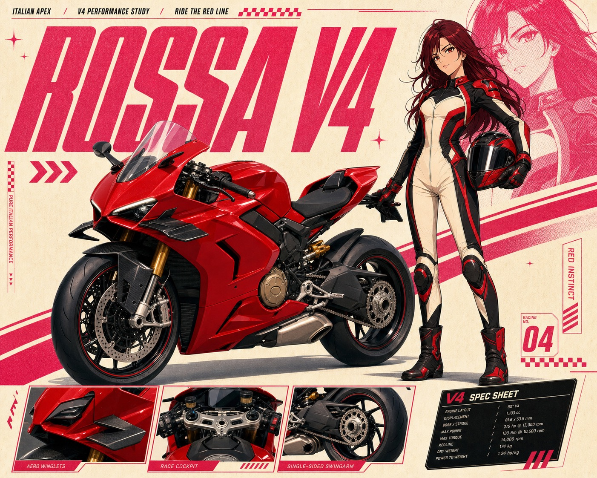

# Pink Anime Motorcycle Spec Poster Style



A dense motorsport dossier poster system that pairs one original anime rider with one hero motorcycle. Each poster combines a glossy three-quarter product view, a full-body cel-shaded character, oversized italic model-code typography, a pale cream and hot-magenta editorial grid, a monochrome halftone character echo, a three-panel detail strip, and a compact technical specification card. The series keeps one visual grammar while changing the motorcycle, rider styling, accent color, text, and performance details in every case.

## Copy Prompt

Default case: `ducati-panigale-v4`

```text
Use the "Pink Anime Motorcycle Spec Poster Style" visual style as the locked style.

Create a 16:9 image.

Subject: an original adult anime Italian track rider with long dark auburn hair and a focused confident expression
Action: standing beside the motorcycle with one hand resting lightly near the tail and the other holding a de-badged full-face helmet at her hip
Prop / product: a de-badged Ducati Panigale V4-inspired Italian red superbike with sharp twin-eye fairing, sculpted fuel tank, visible single-sided swingarm, black wheels, and no manufacturer logo
Location: warm cream studio racing dossier with a faint premium paddock atmosphere
Background: magenta halftone rider echo, diagonal red speed bands, checkered micro-strip, close-up panels of winglet fairing, cockpit, and single-sided rear wheel, plus a black fictional V4 specification card
Main text: ROSSA V4
Secondary text: ITALIAN APEX / V4 PERFORMANCE STUDY / RIDE THE RED LINE
Accent symbol: red triple-chevron and small checkered strip
Styling: original black and cream racing-fashion suit with restrained red panels, short fitted jacket, tall track boots, no copied patches or logos

Style direction:
A dense motorsport dossier poster system that pairs one original anime rider with one hero
motorcycle. Each poster combines a glossy three-quarter product view, a full-body cel-shaded
character, oversized italic model-code typography, a pale cream and hot-magenta editorial grid,
a monochrome halftone character echo, a three-panel detail strip, and a compact technical
specification card. The series keeps one visual grammar while changing the motorcycle, rider
styling, accent color, text, and performance details in every case.

Keep visible:
- Dense premium motorsport dossier hierarchy on a warm cream page with controlled negative space in the upper-left and around the outer margins.
- One hero motorcycle dominates the lower-middle in a dramatic front three-quarter view, with glossy semi-real materials, crisp fairing edges, and a low soft studio shadow.
- One full-body original cel-shaded anime rider stands beside and overlaps the motorcycle, creating a clean photo-illustration hybrid silhouette.
- Oversized italic condensed sans model-code typography occupies the upper-left, using black and hot magenta with tight tracking and aggressive horizontal scale.
- A large monochrome hot-magenta halftone echo of the rider sits behind the live character as a cropped editorial watermark shape.

Avoid:
copied source character, recognizable source face, source salute pose, source goggles and
costume, source umbrella, source Mercedes-AMG GT3, four-wheel race car, copied pink livery,
copied title, copied slogans, copied specification values, exact layout tracing, manufacturer
logo, sponsor logo, team badge, creator signature, watermark, username, QR code, platform mark,
app mark, multiple motorcycles, photoreal person, live-action photography, gritty night street,
cinematic scenery, cyberpunk neon, sparse minimalism, painterly fantasy, rough manga page,
storyboard sketch, heavy grunge, malformed motorcycle, extra wheel, fused limb, extra limb,
illegible paragraph text, low resolution, excessive noise

Do not copy source content, real logos, watermarks, platform UI, QR codes, or exact
reference layouts. Keep the visual system, but change the subject, text, and scene.
```

## Full Style

- [Open style.json](../../styles/pink-anime-motorcycle-spec-poster-style/style.json)
- [Open style folder](../../styles/pink-anime-motorcycle-spec-poster-style/)

<!-- Generated by scripts/generate-copy-prompts.py. Do not edit manually. -->
