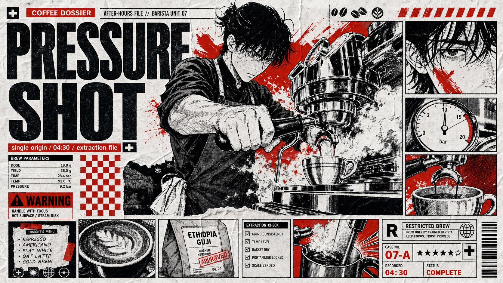

# Red Black Manga Tabloid Poster Style



A dense black, white, and scarlet manga tabloid poster system with oversized condensed type, cropped ink characters, editorial metadata blocks, halftone shading, red spot-color shock graphics, and folded photocopy paper texture.

## Copy Prompt

Default case: `night-courier-dossier`

```text
Use the "Red Black Manga Tabloid Poster Style" visual style as the locked style.

Create a 16:9 image.

Subject: an adult bicycle courier with wind-tossed hair and a messenger bag
Action: turning sharply while gripping a folded delivery manifest
Prop / product: creased city map, small radio pager, and stamped parcel label
Location: rainy back-alley delivery route implied through cropped sign fragments
Background: red vertical speed bars, black inset face crops, tiny route icons, warning label blocks, and broken streetlight silhouettes
Main text: MIDNIGHT RUN
Secondary text: route 07 / fragile cargo / no delay
Accent symbol: ✦
Styling: black courier jacket, reflective tape strips, fingerless gloves, and scuffed messenger gear

Style direction:
A dense black, white, and scarlet manga tabloid poster system with oversized condensed type,
cropped ink characters, editorial metadata blocks, halftone shading, red spot-color shock
graphics, and folded photocopy paper texture.

Keep visible:
- White crumpled-paper base with visible fold creases, photocopy wear, and imperfect poster grain.
- Strict black, white, and scarlet palette, with scarlet used as spot-color shocks, fills, stripes, eyes, marks, and panel accents.
- Oversized heavy condensed sans-serif display typography that dominates the top or bottom of the layout.
- Dense editorial collage layout with multiple manga panels, inset facial crops, captions, ratings, labels, icons, and metadata strips.
- Central subject area uses large cropped manga-style ink drawing with flat paper depth rather than cinematic perspective.

Avoid:
No recognizable source characters, no original names or titles, no copied pose, no copied panel
arrangement, no watermark, no username, no QR code, no brand logo, no glossy 3D, no
photorealism, no full-color anime painting, no soft pastel palette, no corporate minimal poster,
no cinematic blur, no clean vector flatness, no rendered prompt text artifacts.

Do not copy source content, real logos, watermarks, platform UI, QR codes, or exact
reference layouts. Keep the visual system, but change the subject, text, and scene.
```

## Full Style

- [Open style.json](../../styles/red-black-manga-tabloid-poster-style/style.json)
- [Open style folder](../../styles/red-black-manga-tabloid-poster-style/)

<!-- Generated by scripts/generate-copy-prompts.py. Do not edit manually. -->
