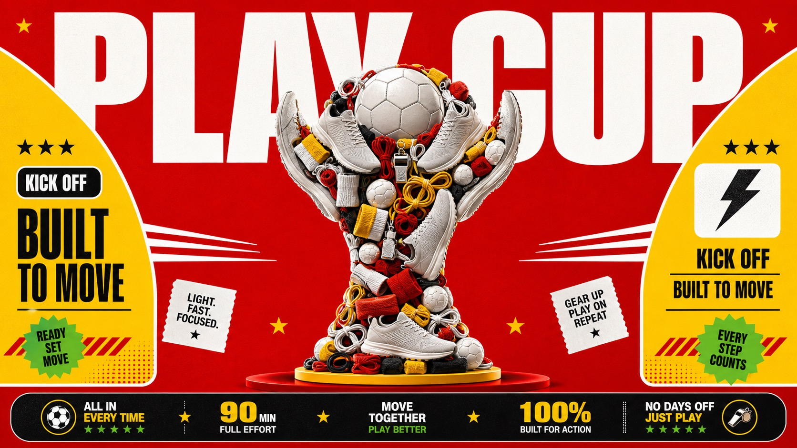

# Red Yellow Product Trophy Collage Style



A fast-food billboard inspired product collage system with saturated red and yellow poster blocks, oversized condensed typography, glossy cutout products, and a central world-champion trophy silhouette assembled from representative unbranded product objects.

## Copy Prompt

Default case: `fast-food-feast-trophy`

```text
Use the "Red Yellow Product Trophy Collage Style" visual style as the locked style.

Create a 16:9 image.

Subject: a celebratory product sculpture shaped like a world-champion trophy
Action: formed from layered food cutouts that stack upward into a clear cup silhouette
Prop / product: unbranded burgers, plain red fry cartons with no logos, soft-drink cups, nuggets, sauce tubs, pickle chips, and sesame buns
Location: flat red studio poster set
Background: yellow top headline slab, rounded arch-like corner blocks, white cutout sparks, narrow footer strip
Main text: FEAST CUP
Secondary text: new lineup / hot and bright
Accent symbol: star spark
Styling: no people; food photographed as clean glossy cutout objects

Style direction:
A fast-food billboard inspired product collage system with saturated red and yellow poster
blocks, oversized condensed typography, glossy cutout products, and a central world-champion
trophy silhouette assembled from representative unbranded product objects.

Keep visible:
- Saturated red background field with warm yellow structural panels, white type, and small green or black accent marks.
- Commercial fast-food poster hierarchy: oversized headline band, centered product sculpture, compact footer strip, and strong grid alignment.
- Central trophy silhouette assembled from many cutout products, with globe-like top, narrow waist, upward side curves, and flared base.
- Glossy studio product photography with crisp cutout edges, simplified shadows, and flat poster-like depth.
- Dense product clustering inside the trophy shape while the surrounding poster keeps generous negative space.

Avoid:
official logos, brand wordmarks, official slogans, exact packaging trade dress, exact FIFA World
Cup trophy replica, tournament names, sponsor marks, celebrity athletes, national flags, team
crests, stadium crowd, mascot, QR code, barcode, watermark, username, app UI, fake endorsement,
cluttered menu board, unreadable tiny text, low resolution, blur, distorted product shapes,
malformed text

Do not copy source content, real logos, watermarks, platform UI, QR codes, or exact
reference layouts. Keep the visual system, but change the subject, text, and scene.
```

## Full Style

- [Open style.json](../../styles/red-yellow-product-trophy-collage-style/style.json)
- [Open style folder](../../styles/red-yellow-product-trophy-collage-style/)

<!-- Generated by scripts/generate-copy-prompts.py. Do not edit manually. -->
