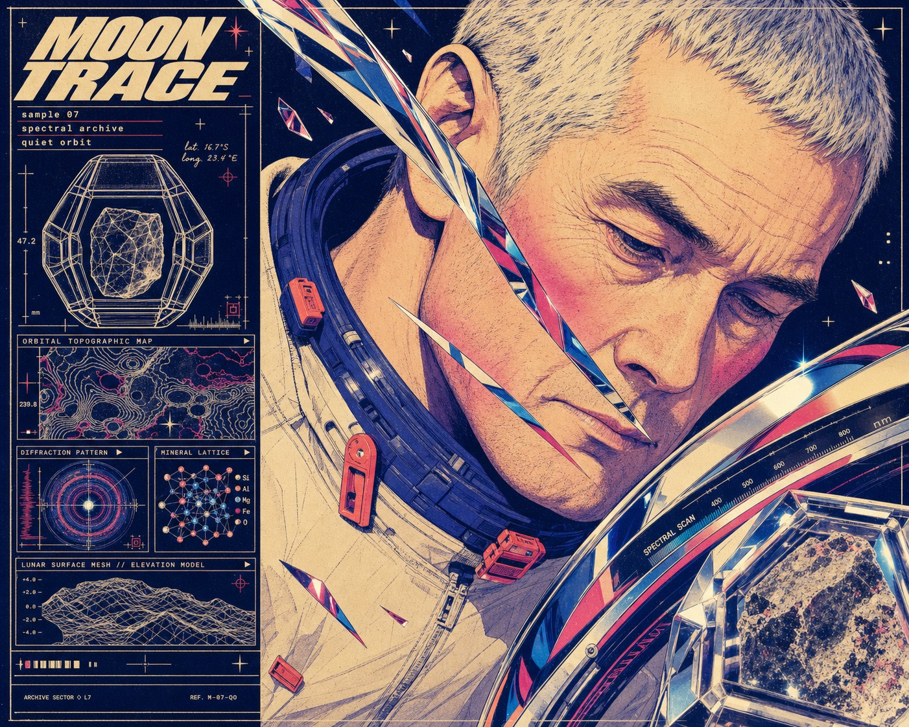

# Retro Future Chrome Portrait Dossier



A retro-futurist editorial portrait system built from an asymmetric technical dossier sidebar, an edge-cropped posterized face, liquid-chrome interruptions, modular grid lines, optical diagrams, and coarse halftone print grain in midnight indigo, warm cream, hot magenta, cobalt, and coral.

## Copy Prompt

Default case: `lunar-geologist`

```text
Use the "Retro Future Chrome Portrait Dossier" visual style as the locked style.

Create a 16:9 image.

Subject: an older lunar geologist with silver cropped hair and a calm weathered face
Action: tilting toward a mineral scanner while studying a luminous sample just outside the frame
Prop / product: a faceted moon-rock specimen capsule and a curved spectral scanner
Location: an abstract orbital mineral archive rendered as dossier graphics rather than a literal room
Background: wireframe crater sample, orbital contour map, diffraction rings, mineral lattice panel, and a low terrain mesh
Main text: MOON TRACE
Secondary text: sample 07 / spectral archive / quiet orbit
Accent symbol: four-point locator star
Styling: indigo pressure collar, cream technical fabric, small coral fasteners, no helmet

Style direction:
A retro-futurist editorial portrait system built from an asymmetric technical dossier sidebar,
an edge-cropped posterized face, liquid-chrome interruptions, modular grid lines, optical
diagrams, and coarse halftone print grain in midnight indigo, warm cream, hot magenta, cobalt,
and coral.

Keep visible:
- Asymmetric editorial split with a narrow technical dossier column occupying roughly one third of the frame and a dominant portrait field occupying the remaining two thirds.
- An extreme close-up portrait cropped decisively by multiple frame edges, with the face much larger than life and very little empty space.
- Flat posterized illustration rather than photography: clean ink-like contours, simplified tonal planes, selective airbrushed blush, and sharp screen-print separations.
- Midnight indigo is the structural base; warm cream carries skin and type; hot magenta, cobalt blue, coral orange, and small pale-yellow highlights create electric contrast.
- Liquid-chrome or polished alloy shapes cut across the portrait as reflective ribbons, shards, visors, or object fragments with navy, cyan, magenta, and cream reflections.

Avoid:
photoreal portrait, generic 3D render, clean vector infographic, minimalist white layout, pastel
lifestyle palette, cinematic background, centered conventional bust, tiny distant subject,
generic floating HUD, exact source face, eye spiral, copied chrome paths, copied torus
wireframe, copied optical squares, copied headline, signature, artist credit, logo, watermark,
username, QR code, platform UI, brand mark, rainbow palette, excessive blur, uncontrolled
glitch, muddy shadows, low resolution, unreadable headline, duplicated eyes, extra facial
features, distorted anatomy, malformed hands

Do not copy source content, real logos, watermarks, platform UI, QR codes, or exact
reference layouts. Keep the visual system, but change the subject, text, and scene.
```

## Full Style

- [Open style.json](../../styles/retro-future-chrome-portrait-dossier/style.json)
- [Open style folder](../../styles/retro-future-chrome-portrait-dossier/)

<!-- Generated by scripts/generate-copy-prompts.py. Do not edit manually. -->
