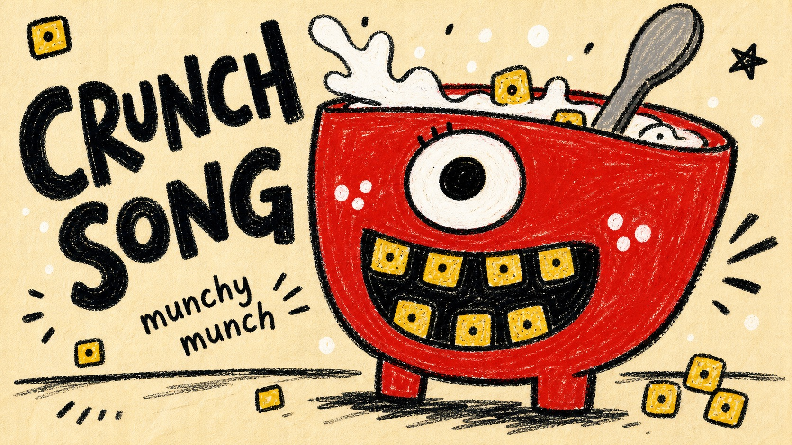

# Rough Marker Monster Poster Style



A naive children's poster system built from thick black marker outlines, rough crayon-pastel color fills, cream paper grain, oversized goofy creature forms, and chunky hand-lettered black text.

## Copy Prompt

Default case: `steam-kettle-giggle`

```text
Use the "Rough Marker Monster Poster Style" visual style as the locked style.

Create a 16:9 image.

Subject: a huge teal kettle-character with one big white eye and a lopsided open mouth
Action: puffing steam while giggling at the viewer
Prop / product: a tiny red mug and three crooked steam curls
Location: empty cream paper poster with only an implied tabletop line
Background: small black steam hatches, white cheek dots, tiny orange rectangles, and faint paper speckle
Main text: chunky black hand lettering reading SIP IT SLOW
Secondary text: small uneven handwritten tag reading hot hot
Accent symbol: tiny orange burst mark
Styling: object-character styling with blunt spout, round belly, and rough marker fill

Style direction:
A naive children's poster system built from thick black marker outlines, rough crayon-pastel
color fills, cream paper grain, oversized goofy creature forms, and chunky hand-lettered black
text.

Keep visible:
- Cream paper background with warm tint, subtle speckle, and no realistic environment.
- Thick black marker or oil-pastel keylines with scratchy edges, wobble, and uneven pressure.
- One huge simplified character or object-character fills most of the frame and is cropped boldly.
- Flat childlike construction with no realistic perspective, no 3D modeling, and no polished vector edges.
- Saturated marker fills show visible grain, small white gaps, and rough hand-colored texture.

Avoid:
green dinosaur, dragon head, long neck dinosaur, yellow back spikes, copied source teeth, copied
source jaw, copied source eye angle, Look at me and eat it, Coky it, exact source text layout,
source signature, watermark, creator name, username, QR code, platform logo, brand logo,
realistic dinosaur, clean vector mascot, polished digital cartoon, comic panel, watercolor, 3D
render, photorealistic background, glossy lighting, dense scene, exact source composition

Do not copy source content, real logos, watermarks, platform UI, QR codes, or exact
reference layouts. Keep the visual system, but change the subject, text, and scene.
```

## Full Style

- [Open style.json](../../styles/rough-marker-monster-poster-style/style.json)
- [Open style folder](../../styles/rough-marker-monster-poster-style/)

<!-- Generated by scripts/generate-copy-prompts.py. Do not edit manually. -->
