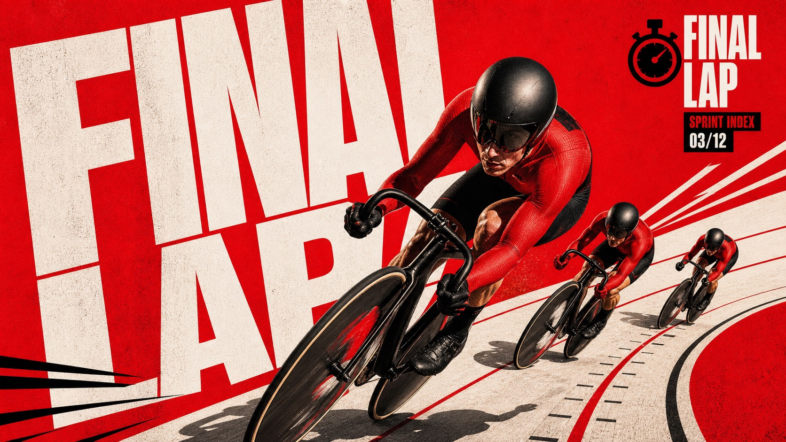

# Scarlet Megatype Action Collage Style



A high-impact action poster system built from a saturated scarlet field, oversized diagonal block typography, layered photographic cutout subjects, hard graphic shadows, compact editorial text blocks, and controlled print grain. It feels like a premium campaign key art poster for speed, pressure, and team momentum without preserving the original sports team, logo, phrase, or exact scene.

## Copy Prompt

Default case: `rooftop-courier`

```text
Use the "Scarlet Megatype Action Collage Style" visual style as the locked style.

Create a 16:9 image.

Subject: a helmeted urban bike courier with two supporting runners
Action: launching across a wet rooftop ledge while reaching forward through rain spray
Prop / product: matte black messenger tube and reflective delivery satchel
Location: downtown rooftop relay route at dusk
Background: tilted white runway blocks, scarlet negative space, red vector speed streaks, distant roof vents reduced to black silhouettes
Main text: NIGHT RUN
Secondary text: URBAN RELAY 07/24
Accent symbol: solid black compass-star icon
Styling: scarlet shell jacket, black compression layers, reflective tape, clean shoes, no logos

Style direction:
A high-impact action poster system built from a saturated scarlet field, oversized diagonal
block typography, layered photographic cutout subjects, hard graphic shadows, compact editorial
text blocks, and controlled print grain. It feels like a premium campaign key art poster for
speed, pressure, and team momentum without preserving the original sports team, logo, phrase, or
exact scene.

Keep visible:
- Dominant saturated scarlet red field with warm off-white geometric ground shapes and sparse black accents.
- Oversized condensed uppercase wordforms run diagonally through the poster and are cropped by the frame.
- Layered photographic cutout subjects appear at different scales, with one heroic foreground figure and smaller supporting figures.
- The main figure uses low wide-angle perspective, aggressive foreshortening, and limbs or props reaching toward the viewer.
- Photo subjects are high contrast, red-black graded, sharply cut out, and integrated into a flat poster field.

Avoid:
Canada, maple leaf, soccer, football player, soccer ball, national team kit, real sports
federation logo, Nike swoosh, TRUE NORTH, CANADA text, 16/48, source jersey numbers, real
athlete likeness, copied pose, copied layout, watermark, signature, QR code, social UI, platform
logo, 3D render, flat vector illustration, cartoon mascot, comic ink page, painterly fantasy,
crowded marketplace, decorative sticker collage, pastel palette, rainbow palette, blue cinematic
color grade, muddy noise, illegible typography, smeared faces, low-resolution compression
artifacts

Do not copy source content, real logos, watermarks, platform UI, QR codes, or exact
reference layouts. Keep the visual system, but change the subject, text, and scene.
```

## Full Style

- [Open style.json](../../styles/scarlet-megatype-action-collage-style/style.json)
- [Open style folder](../../styles/scarlet-megatype-action-collage-style/)

<!-- Generated by scripts/generate-copy-prompts.py. Do not edit manually. -->
