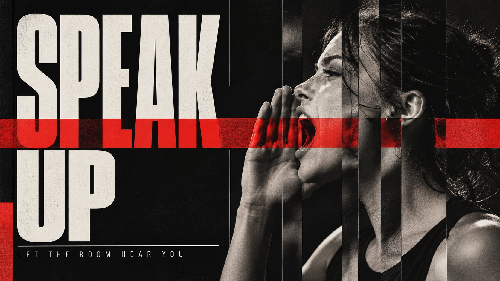

# Slice Signal Editorial



Restrained, sharp experimental editorial posters built from oversized condensed headlines, black-white-and-scarlet blocks, and photographic subjects interrupted by vertical slices.

## Copy Prompt

Default case: `speak-up`

```text
Use the "Slice Signal Editorial" visual style as the locked style.

Create a 16:9 image.

Subject: A young adult woman in a strong side profile, face and shoulders lit against near-black, one hand cupped beside her mouth
Action: [your How the photographic subject is interrupted by vertical slices]
Prop / product: [your Scarlet block or sliced photographic fragment]
Location: [your Black, white and scarlet editorial field]
Background: [your Vertical slice interruptions and hard color planes]
Main text: SPEAK UP
Secondary text: LET THE ROOM HEAR YOU
Accent symbol: [your Scarlet signal block]
Styling: [your Clothing remaining in the sliced photographic subject]

Style direction:
Restrained, sharp experimental editorial posters built from oversized condensed headlines,
black-white-and-scarlet blocks, and photographic subjects interrupted by vertical slices.

Keep visible:
- [CORE] Oversized uppercase condensed grotesk display type is a primary structural element, with forceful narrow proportions and strong contrast against quieter fields; keep at least one complete phrase readable.
- [CORE] Treat a realistic photographic person, object, or scene with narrow vertical shutter-like slices that selectively shift, stretch, repeat, or interrupt image bands while leaving the subject recognizable.
- [CORE] Build a stark palette from near-black, cool off-white, and one decisive signal-red accent; vary their proportions while keeping the overall contrast sharp.
- [CORE] Use hard rectangular fields, abrupt horizontal cuts, and fine divider lines to organize the image like a tightly edited print poster.
- [CORE] Pair the giant display title with a restrained secondary line in small clean sans-serif or slim italic lettering; it remains subordinate and intentional.

Avoid:
No source wording, copied poster layout, source-person identity, gossip scene, logos, brand
names, watermarks, extra text, misspelled headline, pseudo-lettering, QR codes, UI, random
glitch blocks, full-frame pixel noise, heavy grunge, sepia aging, unreadable face, or dense
slices that erase the subject.

Do not copy source content, real logos, watermarks, platform UI, QR codes, or exact
reference layouts. Keep the visual system, but change the subject, text, and scene.
```

## Full Style

- [Open style.json](../../styles/slice-signal-editorial/style.json)
- [Open style folder](../../styles/slice-signal-editorial/)

<!-- Generated by scripts/generate-copy-prompts.py. Do not edit manually. -->
