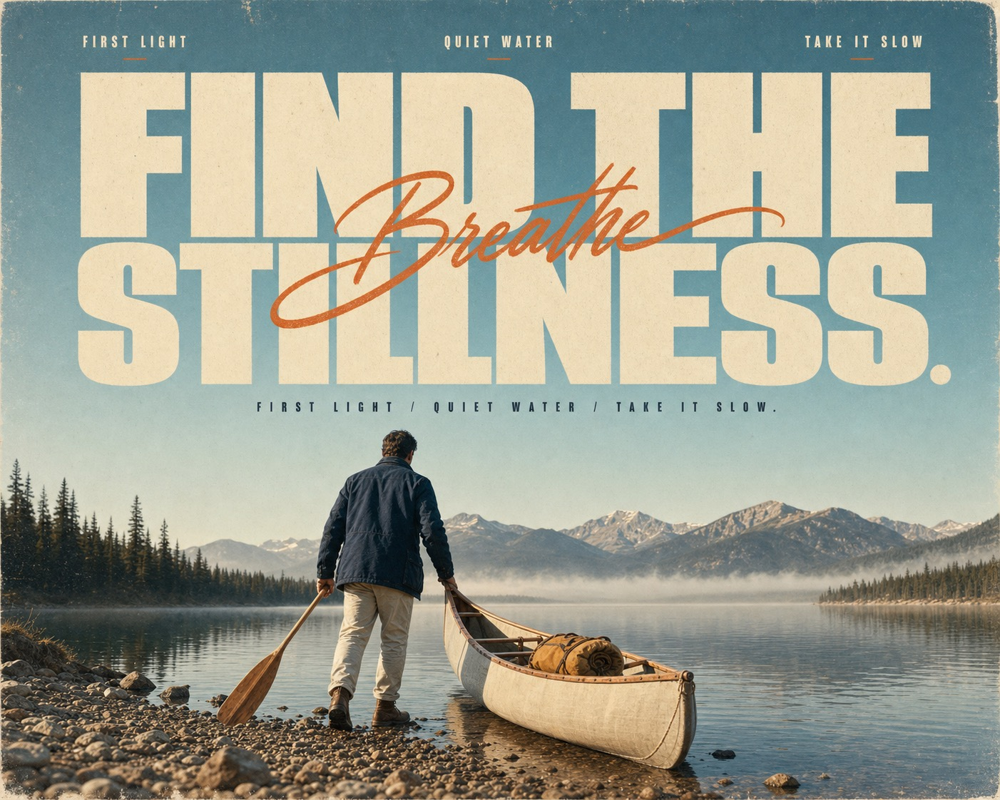

# Sun-Faded Scenic Editorial Poster



A nostalgic scenic editorial poster system that combines enormous warm-ivory condensed headlines, one flowing tangerine script accent, tiny travel-magazine microcopy, and a low-angle analog photograph beneath a broad cyan sky with sun-faded film grain.

## Copy Prompt

Default case: `Misty Lake Launch`

```text
Use the "Sun-Faded Scenic Editorial Poster" visual style as the locked style.

Create a 16:9 image.

Subject: a solo paddler with a cream canvas canoe
Action: guiding the canoe into still water at first light
Prop / product: a wooden paddle and rolled ochre dry bag
Location: a misty alpine lake shore
Background: silver water, distant pine ridge, low morning haze, pebbled shallows, and a clean level horizon
Main text: FIND THE STILLNESS
Secondary text: FIRST LIGHT / QUIET WATER / TAKE IT SLOW
Accent symbol: Breathe
Styling: sun-faded navy field jacket, cream trousers, and simple brown boots

Style direction:
A nostalgic scenic editorial poster system that combines enormous warm-ivory condensed
headlines, one flowing tangerine script accent, tiny travel-magazine microcopy, and a low-angle
analog photograph beneath a broad cyan sky with sun-faded film grain.

Keep visible:
- A two-zone poster hierarchy: oversized typography dominates the upper half while one full-width scenic photograph anchors the lower half.
- The headline uses monumental warm-ivory ultra-condensed sans lettering, stacked in two block lines with very tight spacing.
- A single large tangerine-orange calligraphic word crosses the center of the block headline as a lively contrasting layer.
- Three tiny editorial caption islands sit across the top margin, with bold condensed words mixed with delicate italic connective words.
- A small centered all-caps subtitle sits below the display headline and above the photographic subject.

Avoid:
Do not recreate the orange vintage two-door coupe, rear three-quarter car pose, chrome bumper,
license plate, grassy parked-car field, tree line, original headline, original captions, return-
to-the-road premise, signature, watermark, logo, username, brand mark, QR code, glossy
commercial automotive ad, HDR, night scene, neon, studio lighting, illustration, cartoon, vector
poster, 3D render, metallic or beveled type, drop shadows, dense collage, multiple photo panels,
stickers, price bursts, UI chrome, clutter, severe chromatic aberration, blocky compression, or
excessive noise.

Do not copy source content, real logos, watermarks, platform UI, QR codes, or exact
reference layouts. Keep the visual system, but change the subject, text, and scene.
```

## Full Style

- [Open style.json](../../styles/sun-faded-scenic-editorial-poster/style.json)
- [Open style folder](../../styles/sun-faded-scenic-editorial-poster/)

<!-- Generated by scripts/generate-copy-prompts.py. Do not edit manually. -->
