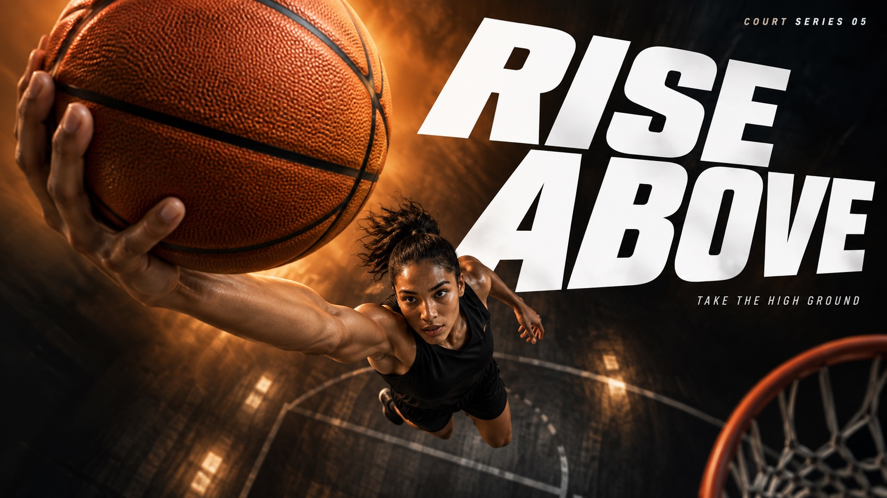

# Velocity Type Sport — Part 2



Continues Velocity Type Sport's near-to-far athletic photography, giant white oblique lettering, dark fields with a single-color light haze and selective motion blur, now with basketball, snowboarding, kayaking and boxing.

## Copy Prompt

Default case: `rise-above`

```text
Use the "Velocity Type Sport — Part 2" visual style as the locked style.

Create a 16:9 image.

Subject: An adult female basketball player in a plain black sleeveless basketball jersey and plain shorts, leaping high with one arm extended overhead carrying a single orange basketball. A sparse dark indoor basketball space recedes below her; no other players.
Action: [your The athlete's peak moment of force, shot extreme near-to-far]
Prop / product: [your Sport gear or contact point pushed into the extreme foreground]
Location: [your Dark vignetted field, court or arena for the chosen sport]
Background: [your Near-black gradient lit by one bright single-color haze]
Main text: RISE ABOVE
Secondary text: [your Short series line and small support copy]
Accent symbol: [your Giant white oblique headline cutting through the athlete]
Styling: [your Unbranded performance sportswear for the chosen sport]

Style direction:
Continues Velocity Type Sport's near-to-far athletic photography, giant white oblique lettering,
dark fields with a single-color light haze and selective motion blur, now with basketball,
snowboarding, kayaking and boxing.

Keep visible:
- [CORE] Photographic athletic action uses an extreme near-to-far scale jump: one physically connected piece of equipment or body part dominates the foreground while the athlete recedes into depth.
- [CORE] Monumental white heavyweight oblique sans-serif typography cuts through the composition; the athlete occludes selected letter areas without destroying the exact headline.
- [CORE] A near-black edge field opens into a luminous single-hue atmospheric band behind the action, producing sharp white-type contrast and dark sculptural human form.
- [CORE] Directional photographic motion softness and colored atmospheric streaks carry the force vector while the critical contact point or equipment retains selective detail.
- [FLEX] Let each sport determine the spatial structure: a spherical basketball raised above a receding jumper, a broad snowboard underside passing overhead, a paddle slicing a luminous water wedge, or a compact boxing fist crossing the frame. Keep the established series language while changing its content and force geometry.

Avoid:
Nike logo, swoosh, PEGASUS42, JUST DO IT, original running-shoe hero, logo-like symbols, extra
text, extra punctuation, watermark, QR code, duplicate limbs, disconnected equipment, fused
fingers, fake sharpness, halftone, paper grain, random particles, busy stadium, border, poster
mockup, small timid headline, unreadable headline, generic repeated layout, Part 1 sports or
headlines, branded ball, printed snowboard underside, jersey number, chest emblem, glove logo

Do not copy source content, real logos, watermarks, platform UI, QR codes, or exact
reference layouts. Keep the visual system, but change the subject, text, and scene.
```

## Full Style

- [Open style.json](../../styles/velocity-type-sport-part-02/style.json)
- [Open style folder](../../styles/velocity-type-sport-part-02/)

<!-- Generated by scripts/generate-copy-prompts.py. Do not edit manually. -->
