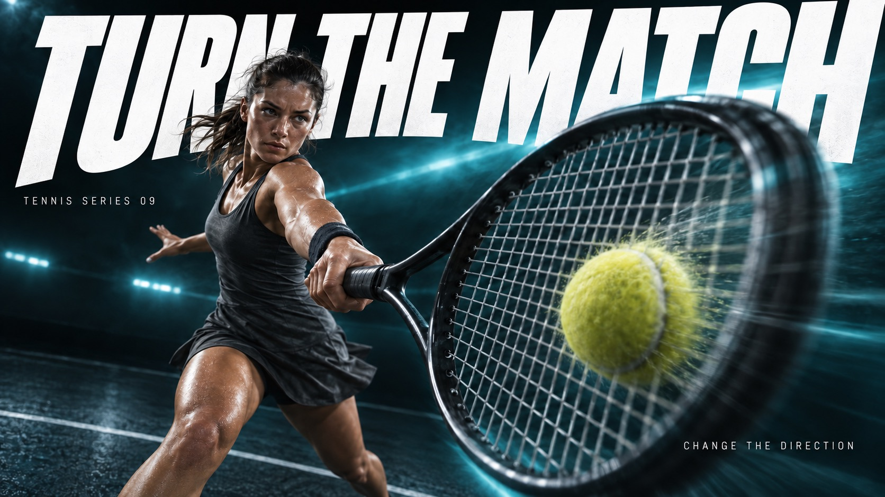

# Velocity Type Sport — Part 3



Continues the near-to-far sports photography, giant white oblique type, near-black backgrounds and single-color haze, switching to tennis, still rings, speed skating and archery to show four force structures: net, ring, blade and bowstring.

## Copy Prompt

Default case: `turn-the-match`

```text
Use the "Velocity Type Sport — Part 3" visual style as the locked style.

Create a 16:9 image.

Subject: An adult female tennis player in plain graphite tennis clothing executing a powerful one-handed forehand, with her free arm used for balance. She holds one unmarked graphite tennis racket; a single yellow tennis ball approaches the string bed. The court is dark and sparse.
Action: [your The athlete's peak moment of force, shot extreme near-to-far]
Prop / product: [your Sport gear or contact point pushed into the extreme foreground]
Location: [your Dark vignetted field, court or arena for the chosen sport]
Background: [your Near-black gradient lit by one bright single-color haze]
Main text: TURN THE MATCH
Secondary text: [your Short series line and small support copy]
Accent symbol: [your Giant white oblique headline cutting through the athlete]
Styling: [your Unbranded performance sportswear for the chosen sport]

Style direction:
Continues the near-to-far sports photography, giant white oblique type, near-black backgrounds
and single-color haze, switching to tennis, still rings, speed skating and archery to show four
force structures: net, ring, blade and bowstring.

Keep visible:
- [CORE] Photographic athletic action uses an extreme near-to-far scale jump: one physically connected piece of equipment or body part dominates the foreground while the athlete recedes into depth.
- [CORE] Monumental white heavyweight oblique sans-serif typography cuts through the composition; the athlete occludes selected letter areas without destroying the exact headline.
- [CORE] A near-black edge field opens into a luminous single-hue atmospheric band behind the action, producing sharp white-type contrast and dark sculptural human form.
- [CORE] Directional photographic motion softness and colored atmospheric streaks carry the force vector while the critical contact point or equipment retains selective detail.
- [FLEX] Let each sport determine the spatial structure: a tennis string grid sweeping past the lens, a wooden ring anchoring a receding gymnast, a long thin skating blade slicing an ice plane, or a taut bowstring and recurved bow framing an archer. Continue the established series language while changing content and force geometry.

Avoid:
Nike logo, swoosh, PEGASUS42, JUST DO IT, original running-shoe hero, logo-like symbols, extra
text, extra punctuation, watermark, QR code, duplicate limbs, disconnected equipment, fused
fingers, fake sharpness, halftone, paper grain, random particles, busy stadium, border, poster
mockup, small timid headline, unreadable headline, generic repeated layout, Part 1 sports or
headlines, branded ball, printed snowboard underside, jersey number, chest emblem, glove logo,
previous eight sports, basketball, snowboard, kayak, boxing gloves, extra racket, missing
strings, broken straps, extra rings, duplicated skate runners, duplicated bowstring,
disconnected arrow

Do not copy source content, real logos, watermarks, platform UI, QR codes, or exact
reference layouts. Keep the visual system, but change the subject, text, and scene.
```

## Full Style

- [Open style.json](../../styles/velocity-type-sport-part-03/style.json)
- [Open style folder](../../styles/velocity-type-sport-part-03/)

<!-- Generated by scripts/generate-copy-prompts.py. Do not edit manually. -->
