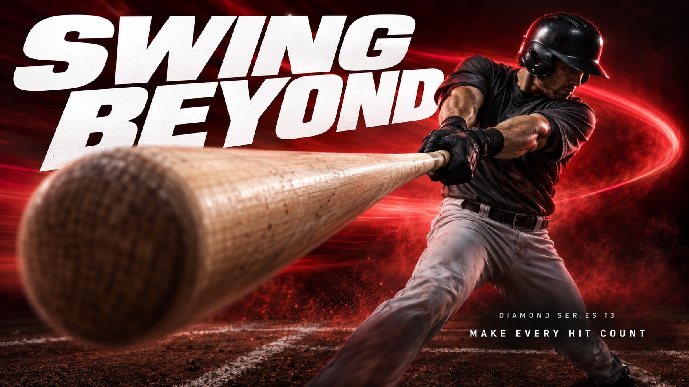

# Velocity Type Sport — Part 4



Continues the strong-perspective sports photography, giant white oblique type, near-black field and single-color haze, using a baseball swing, a barbell lift, barrel-wave surfing and a rhythmic-gymnastics ribbon to show four spatial structures: cylinder, heavy plates, wave tube and flexible curve.

## Copy Prompt

Default case: `swing-beyond`

```text
Use the "Velocity Type Sport — Part 4" visual style as the locked style.

Create a 16:9 image.

Subject: An adult male baseball batter in an unmarked charcoal jersey, plain trousers and black protective batting helmet, executing a powerful two-handed swing with one plain wooden baseball bat. His legs are planted in a sparse dark batting area.
Action: [your The athlete's peak moment of force, shot extreme near-to-far]
Prop / product: [your Sport gear or contact point pushed into the extreme foreground]
Location: [your Dark vignetted field, court or arena for the chosen sport]
Background: [your Near-black gradient lit by one bright single-color haze]
Main text: SWING BEYOND
Secondary text: [your Short series line and small support copy]
Accent symbol: [your Giant white oblique headline cutting through the athlete]
Styling: [your Unbranded performance sportswear for the chosen sport]

Style direction:
Continues the strong-perspective sports photography, giant white oblique type, near-black field
and single-color haze, using a baseball swing, a barbell lift, barrel-wave surfing and a
rhythmic-gymnastics ribbon to show four spatial structures: cylinder, heavy plates, wave tube
and flexible curve.

Keep visible:
- [CORE] Photographic athletic action uses an extreme near-to-far scale jump: one physically connected piece of equipment or body part dominates the foreground while the athlete recedes into depth.
- [CORE] Monumental white heavyweight oblique sans-serif typography cuts through the composition; the athlete occludes selected letter areas without destroying the exact headline.
- [CORE] A near-black edge field opens into a luminous single-hue atmospheric band behind the action, producing sharp white-type contrast and dark sculptural human form.
- [CORE] Directional photographic motion softness and colored atmospheric streaks carry the force vector while the critical contact point or equipment retains selective detail.
- [FLEX] Let each sport determine the spatial structure: a wooden baseball bat foreshortened toward the lens, a near barbell weight plate framing a loaded lift, a surfboard nose inside a curling wave tunnel, or a continuous satin ribbon sweeping near the camera while its gymnast recedes. Continue the established series language with distinct subject, material and force geometry.

Avoid:
Nike logo, swoosh, PEGASUS42, JUST DO IT, original running-shoe hero, logo-like symbols, extra
text, extra punctuation, watermark, QR code, duplicate limbs, disconnected equipment, fused
fingers, fake sharpness, halftone, paper grain, random particles, busy stadium, border, poster
mockup, small timid headline, unreadable headline, generic repeated layout, Part 1 sports or
headlines, branded ball, printed snowboard underside, jersey number, chest emblem, glove logo,
previous eight sports, basketball, snowboard, kayak, boxing gloves, extra racket, missing
strings, broken straps, extra rings, duplicated skate runners, duplicated bowstring,
disconnected arrow, Part 3 sports or headlines, tennis racket, gymnastics rings, speed skate,
recurve bow, disconnected bat, weight plate logos, extra barbell, floating feet, detached
surfboard, duplicate ribbon strips, tangled ribbon

Do not copy source content, real logos, watermarks, platform UI, QR codes, or exact
reference layouts. Keep the visual system, but change the subject, text, and scene.
```

## Full Style

- [Open style.json](../../styles/velocity-type-sport-part-04/style.json)
- [Open style folder](../../styles/velocity-type-sport-part-04/)

<!-- Generated by scripts/generate-copy-prompts.py. Do not edit manually. -->
