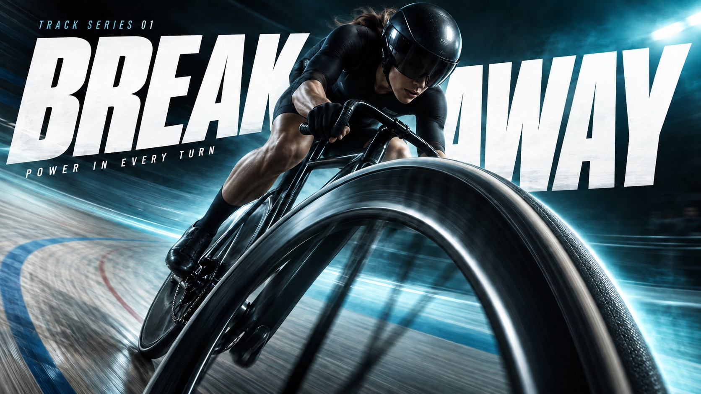

# Velocity Type Sport



Extreme near-to-far sports photography interlocked with giant white oblique type, a dark vignetted gradient lit by a bright colored haze, and close-up gear or contact points that express each sport's force and direction.

## Copy Prompt

Default case: `break-away`

```text
Use the "Velocity Type Sport" visual style as the locked style.

Create a 16:9 image.

Subject: An adult female track cyclist in a plain black skinsuit and unmarked aerodynamic helmet, banking a real track bicycle into a high-speed turn.
Action: [your The athlete's peak moment of force, shot extreme near-to-far]
Prop / product: [your Sport gear or contact point pushed into the extreme foreground]
Location: [your Dark vignetted field, court or arena for the chosen sport]
Background: [your Near-black gradient lit by one bright single-color haze]
Main text: BREAK AWAY
Secondary text: [your Short series line and small support copy]
Accent symbol: [your Giant white oblique headline cutting through the athlete]
Styling: [your Unbranded performance sportswear for the chosen sport]

Style direction:
Extreme near-to-far sports photography interlocked with giant white oblique type, a dark
vignetted gradient lit by a bright colored haze, and close-up gear or contact points that
express each sport's force and direction.

Keep visible:
- [CORE] Photographic athletic action uses an extreme near-to-far scale jump: one physically connected piece of equipment or body part dominates the foreground while the athlete recedes into depth.
- [CORE] Monumental white heavyweight oblique sans-serif typography cuts through the composition; the athlete occludes selected letter areas without destroying the exact headline.
- [CORE] A near-black edge field opens into a luminous single-hue atmospheric band behind the action, producing sharp white-type contrast and dark sculptural human form.
- [CORE] Directional photographic motion softness and colored atmospheric streaks carry the force vector while the critical contact point or equipment retains selective detail.
- [FLEX] Let each sport determine the spatial structure: circular banked wheel, vertical gripping tension, lateral water crossing, or needle-like fencing thrust; avoid one interchangeable athlete layout.

Avoid:
Nike logo, swoosh, PEGASUS42, JUST DO IT, original running-shoe hero, logo-like symbols, extra
text, extra punctuation, watermark, QR code, duplicate limbs, disconnected equipment, fused
fingers, fake sharpness, halftone, paper grain, random particles, busy stadium, border, poster
mockup, small timid headline, unreadable headline, generic repeated layout

Do not copy source content, real logos, watermarks, platform UI, QR codes, or exact
reference layouts. Keep the visual system, but change the subject, text, and scene.
```

## Full Style

- [Open style.json](../../styles/velocity-type-sport/style.json)
- [Open style folder](../../styles/velocity-type-sport/)

<!-- Generated by scripts/generate-copy-prompts.py. Do not edit manually. -->
