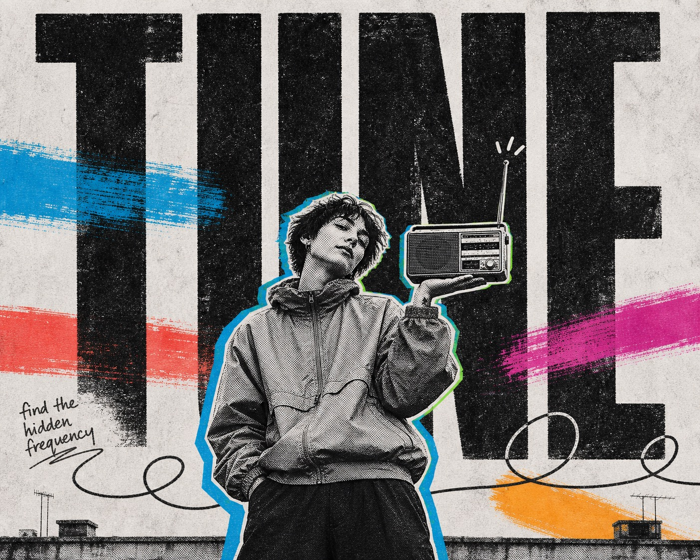

# Xerox Neon Editorial Collage



A high-impact editorial poster system combining an oversized distressed black headline, one monochrome halftone photo cutout, electric cyan and green registration shadows, horizontal fluorescent paint swashes, loose marker scribbles, and a pale photocopied paper field.

## Copy Prompt

Default case: `rooftop-radio-balance`

```text
Use the "Xerox Neon Editorial Collage" visual style as the locked style.

Create a 16:9 image.

Subject: a young rooftop radio host
Action: tilting their head while balancing a compact portable radio on one raised palm
Prop / product: an unbranded rectangular portable radio
Location: an implied city rooftop reduced to a flat editorial poster field
Background: two tiny antenna ticks and broad torn paint swashes
Main text: TUNE
Secondary text: find the hidden frequency
Accent symbol: a long looping signal line
Styling: an unbranded oversized windbreaker and plain dark trousers

Style direction:
A high-impact editorial poster system combining an oversized distressed black headline, one
monochrome halftone photo cutout, electric cyan and green registration shadows, horizontal
fluorescent paint swashes, loose marker scribbles, and a pale photocopied paper field.

Keep visible:
- A single oversized monochrome photographic cutout occupies the lower center and overlaps the headline.
- One huge condensed uppercase word spans nearly the full width behind the subject as the dominant background architecture.
- Headline letters are dry-brushed, eroded, irregular, and nearly black rather than clean digital type.
- The base is a pale gray-white photocopied paper field with visible dot grain and softly mottled fibers.
- The subject is rendered in hard black, white, and gray halftone with newspaper-like posterization and no smooth skin tones.

Avoid:
identifiable celebrity, famous athlete, football, soccer ball, Argentina jersey, number ten
jersey, national-team crest, GOAT headline, copied slogan, copied pose, creator signature,
watermark, username, QR code, platform logo, brand logo, sponsor mark, multiple people, detailed
scenery, sticker overload, long paragraph, glossy 3D type, chrome, gradient, neon glow, smooth
vector edges, cinematic lighting, realistic depth, full-color skin, beauty retouching, excessive
random noise, illegible headline, muddy silhouette

Do not copy source content, real logos, watermarks, platform UI, QR codes, or exact
reference layouts. Keep the visual system, but change the subject, text, and scene.
```

## Full Style

- [Open style.json](../../styles/xerox-neon-editorial-collage-style/style.json)
- [Open style folder](../../styles/xerox-neon-editorial-collage-style/)

<!-- Generated by scripts/generate-copy-prompts.py. Do not edit manually. -->
