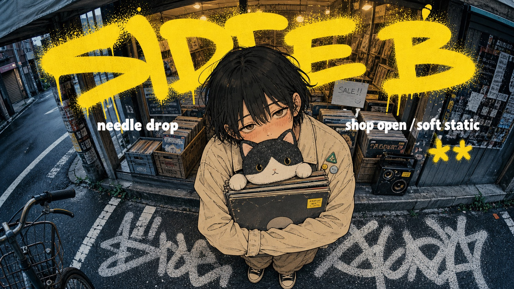

# Yellow Graffiti Fisheye Manga Street Poster Style



A hybrid street-poster system combining a cool fisheye urban photo base, a large manga ink cutout subject, oversized sprayed yellow graffiti type, compact white caption hits, pavement tag texture, and soft anxious character emotion.

## Copy Prompt

Default case: `night-laundromat-run`

```text
Use the "Yellow Graffiti Fisheye Manga Street Poster Style" visual style as the locked style.

Create a 16:9 image.

Subject: an adult laundromat attendant with tired eyes and a canvas laundry bag
Action: hugging the laundry bag to their chest while stepping onto a wet sidewalk
Prop / product: canvas laundry bag, receipt strip, and a small detergent box with no brand text
Location: narrow late-night laundromat entrance on a side street
Background: round washer windows, cool fluorescent window glow, curb stripes, puddled asphalt, taped paper notices, and bent street railings
Main text: SPIN LATE
Secondary text: wash all night / cold street / last load
Accent symbol: !!
Styling: oversized cardigan, cuffed work pants, canvas sneakers, simple apron, and soft anxious manga expression

Style direction:
A hybrid street-poster system combining a cool fisheye urban photo base, a large manga ink
cutout subject, oversized sprayed yellow graffiti type, compact white caption hits, pavement tag
texture, and soft anxious character emotion.

Keep visible:
- Cool blue-gray fisheye street-photo base with wide-angle distortion, slight horizon tilt, storefront machines, curb lines, road markings, and compressed urban detail.
- One oversized manga cutout subject sits in the foreground, centered and close to camera, with a large head and upper body, small foreshortened feet, and top-down lens exaggeration.
- Manga rendering uses clean dark brown and black linework, simple shaded clothing folds, soft peach skin, blush hatching, and muted emotional facial expression.
- The photo background remains realistic and desaturated while the subject is flatter, warmer, and inked, creating a clear collage contrast between real street and drawn figure.
- The upper third carries a huge sprayed yellow graffiti headline, thick and loose, with rounded strokes, drips, dot overspray, and partial overlap behind the subject.

Avoid:
No copied source character, no bashful fists pose, no school uniform romance scene, no vending-
machine recreation, no exact Japanese captions, no copied yellow tag, no copied pavement word,
no watermark, no username, no QR code, no brand logo, no real storefront sign, no franchise
title, no pure photoreal portrait, no full anime-only scene, no 3D render, no glossy vector
poster, no dense tabloid panel collage, no luxury minimalism, no cinematic bokeh, no rendered
prompt text artifacts.

Do not copy source content, real logos, watermarks, platform UI, QR codes, or exact
reference layouts. Keep the visual system, but change the subject, text, and scene.
```

## Full Style

- [Open style.json](../../styles/yellow-graffiti-fisheye-manga-street-poster-style/style.json)
- [Open style folder](../../styles/yellow-graffiti-fisheye-manga-street-poster-style/)

<!-- Generated by scripts/generate-copy-prompts.py. Do not edit manually. -->
